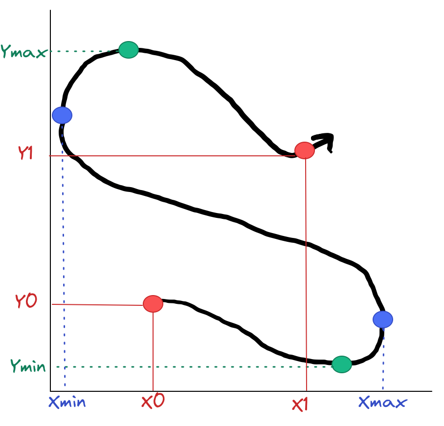
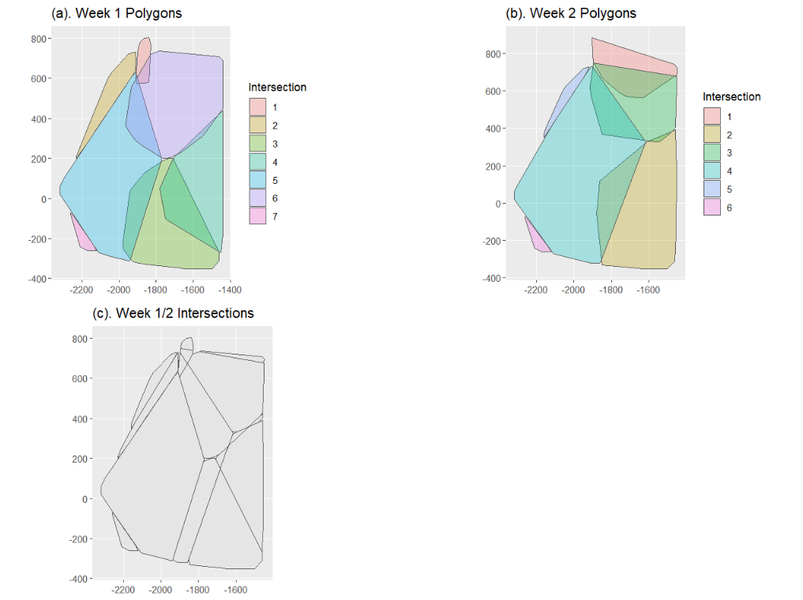
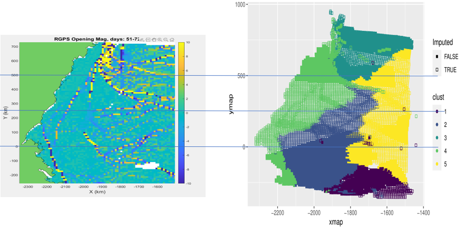
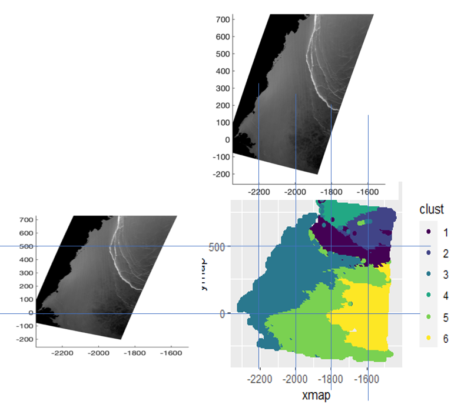

```{r setup, include = F}
knitr::opts_chunk$set(
  echo = F, eval = T, message = F, warning = F,
  fig.width = 6, fig.height = 4,  fig.align = 'center',
  out.width = "\\linewidth", dpi = 300, 
  tidy = T, tidy.opts=list(width.cutoff=45),
  fig.pos = "tbp",
  out.extra = ""
)
```


```{r load-packages, include = F}

library(knitr)
library(FNN)
library(expss)
library(reshape2)
library(sf)
library(ggpubr)
library(tidyverse)
library(fields)
library(crosstalk)
library(plotly)
library(factoextra)
library(sp)
library(GpGp)
library(mvtnorm)
library(expss)
library(FNN)
library(gridExtra)
library(RColorBrewer)
library(kableExtra)
library(zoo)
library(INLA)

```

```{r load-functions, include = T}

## Needed Functions
bbox_summary <- function(df) {
  # Function takes data frame with k, xmap, ymap
  # and returns a bounding box and trajectory
  df <- arrange(df, k) # sort by k
  df %>%
    summarize(
      x = mean(xmap), y = mean(ymap),
      xmin = min(xmap), xmax = max(xmap),
      ymin = min(ymap), ymax = max(ymap),
      xbox = xmax - xmin,
      ybox = ymax - ymin,
      dx = xmap[n()] - xmap[1],
      dy = ymap[n()] - ymap[1],
      angle = atan2(dy, dx),
      kmin = min(k),
      kmax = max(k),
      npts = n(),
    )
}

getmode <- function(v) {
  uniqv <- unique(v)
  uniqv[which.max(tabulate(match(v, uniqv)))]
}
#New Cluster Membership based on 10 NN

lonely <- function(frame, tf){
  anim_p <- filter(frame, t == tf)[,c(1,5,6,9,10)]
  anim_p <- anim_p %>% group_by(gpid) %>% summarise(xmap_m = mean(xmap),ymap_m = mean(ymap),clust_m = mean(as.numeric(clust))) #Averaging to deal with mult observations at a t value
  colnames(anim_p) <- c("gpid", "xmap", "ymap", "clust")
  n = n_distinct(anim_p$gpid)
  test=get.knn(anim_p[,c(2,3)], k=10)
  df_new<- rownames_to_column(anim_p, "index")
  df_new <- data.frame(df_new,test[1])
  df_new1<- vlookup(df_new$nn.index.1,df_new,5,1)
  df_new2<- vlookup(df_new$nn.index.2,df_new,5,1)
  df_new3<- vlookup(df_new$nn.index.3,df_new,5,1)
  df_new4<- vlookup(df_new$nn.index.4,df_new,5,1)
  df_new5<- vlookup(df_new$nn.index.5,df_new,5,1)
  df_new6<- vlookup(df_new$nn.index.6,df_new,5,1)
  df_new7<- vlookup(df_new$nn.index.7,df_new,5,1)
  df_new8<- vlookup(df_new$nn.index.8,df_new,5,1)
  df_new9<- vlookup(df_new$nn.index.9,df_new,5,1)
  df_new10<- vlookup(df_new$nn.index.10,df_new,5,1)
  df_new <- data.frame(df_new, df_new1, df_new2, df_new3, df_new4, df_new5, df_new6, df_new7, df_new8, df_new9, df_new10)
  data <- data.frame(NA_col = rep(NA,n))
  for (i in 1:n){
    x = getmode(df_new[i,c(16:25)])
    data[i,] <- x
  }
  df_new <- data.frame(df_new,data)
  df_new <- df_new[,c(1:5,26)]
  anim_plot <- df_new %>%
    ggplot(aes(x = xmap, y = ymap, group = gpid, ids = gpid,
               color = factor(NA_col), fill = factor(NA_col))) + 
    geom_point() + 
    #scale_shape_manual("Imputed", values = c("FALSE" = 15, "TRUE" = 0)) + 
    scale_color_viridis_d() + 
    scale_fill_viridis_d() + ggtitle("test")
  
  plotly::ggplotly(anim_plot)
  new <- df_new[,-c(5)]
  colnames(new) <- c("index", "gpid", "xmap", "ymap", "clust")
  return(new)
}

#Getting Polygons
#Get Data into the format that we need. 
polygon_data2 <- function(frame){
  my.sf.point <- st_as_sf(x = frame, 
                          coords = c("xmap", "ymap"))
  polys = st_sf(
    aggregate(
      my.sf.point$geometry,
      list(my.sf.point$n),
      function(g){
        st_cast(st_combine(g),"POLYGON")
      }
    ))
  #Should be final data frame needed
  y <- st_cast(polys, "MULTIPOLYGON")
  return(y)
}
#Get coordinates of the polygons
coordinates2 <- function(frame, n){
  coord <- frame[,c(3,4)]
  ConvexHull = chull(coord)
  x <- data.frame(coord[ConvexHull,],n )
  return(x)
}

#Getting Intersections
get_int <- function(timeframe,a,b) {
  intersections_pp <- st_intersection(a, b) %>% mutate(int_name = paste0(Group.1, "-", Group.1.1))
  points <-st_as_sf(timeframe, coords = c("xmap", "ymap"))
  polyg <-intersections_pp$geometry
  z <- st_intersects(polyg,points) #Return index of points within each intersection
  FrameData <- lapply(z, function(x) as.data.frame(x))
  new<- melt(FrameData)[,-1] #gives list of index and intersection group
  colnames(new) <- c("index", "intersection")
  n <- merge(timeframe, new, by = "index")[,-1] #Data frame of 
  df_n <- subset(timeframe,!(timeframe$gpid%in%n$gpid))[,-1] 
  return(n) #If want data set of gpids and intersections
} #If want data set of gpids and intersections

get_int2 <- function(timeframe,a,b) {
  intersections_pp <- st_intersection(a, b) %>% mutate(int_name = paste0(Group.1, "-", Group.1.1))
  points <-st_as_sf(timeframe, coords = c("xmap", "ymap"))
  polyg <-intersections_pp$geometry
  return(polyg)
}

int_plot <- function(timeframe,a,b){
  intersections_pp <- st_intersection(a, b) %>% mutate(int_name = paste0(Group.1, "-", Group.1.1))
  ggplot() + #If want to plot the clusters
  geom_sf(data = intersections_pp) + ggtitle ("(c). Week 1/2 Intersections")
  #, aes(fill = int_name))
}

nn_df <- function(d, t, og_df){
  d_t <- filter(d, t==t)
  d_new<- rownames_to_column(d_t, "index")
  g <- knn(d_t[,1:2], og_df[,5:6], cl = d_t$cluster, k=1)
  indices <- attr(g, "nn.index")
  og_new <- data.frame(og_df,indices) #get 6th column with nn index
  og_new$ux<- vlookup(og_new$indices,d_new,6,1)
  og_new$uy<- vlookup(og_new$indices,d_new,7,1)
  og_new$xnew <- og_new$xnew+ og_new$ux
  og_new$ynew <- og_new$ynew+ og_new$uy
  og_new$t <- og_new$t+1
  final <- og_new[,-7]
  return(final)
}

week1 <- function(x_ini_disp, y_ini_disp, rho_x, rho_y, init_grid){
q_t1 <- data.frame(xmap = x_ini_disp+cg$xmap, ymap = y_ini_disp+cg$ymap, t = cg$t+1, cluster = cg$cluster) #, gpid = 1:400)
q_t2 <- data.frame(xmap = (rho_x*(q_t1$xmap-cg$x)) + q_t1$xmap, ymap = (rho_y*(q_t1$ymap-cg$y)) + q_t1$ymap, t = q_t1$t+1, cluster = cg$cluster) #, gpid = 1:400)
q_t3 <- data.frame(xmap = (rho_x*(q_t2$xmap-q_t1$xmap)) + q_t2$xmap, ymap = (rho_y*(q_t2$ymap-q_t1$ymap)) + q_t2$ymap, t = q_t2$t+1, cluster = cg$cluster) #, gpid = 1:400)
q_t4 <- data.frame(xmap = (rho_x*(q_t3$xmap-q_t2$xmap)) + q_t3$xmap, ymap = (rho_y*(q_t3$ymap-q_t2$ymap)) + q_t3$ymap, t = q_t3$t+1, cluster = cg$cluster) #, gpid = 1:400)
q_t5 <- data.frame(xmap = (rho_x*(q_t4$xmap-q_t3$xmap)) + q_t4$xmap, ymap = (rho_y*(q_t4$ymap-q_t3$ymap)) + q_t4$ymap, t = q_t4$t+1, cluster = cg$cluster) #, gpid = 1:400)
q_t6 <- data.frame(xmap = (rho_x*(q_t5$xmap-q_t4$xmap)) + q_t5$xmap, ymap = (rho_y*(q_t5$ymap-q_t4$ymap)) + q_t5$ymap, t = q_t5$t+1, cluster = cg$cluster) #, gpid = 1:400)

all_w1 <- rbind(cg,q_t1,q_t2,q_t3,q_t4,q_t5,q_t6)
return(all_w1)
}

```


```{r sim-inter-functions}

polygon_sim <- function(tp, preds){
feat_t1 <- filter(preds, t == tp)
feat_t1_og <- rownames_to_column(feat_t1, "index")
points <- st_as_sf(feat_t1, coords = c("xmap", "ymap"))
q_smallest <- filter(feat_t1_og, clust == 1)
###1###
coord <- q_smallest[,c(6,7)]
ConvexHull = chull(coord)
coord_1 <- data.frame(coord[ConvexHull,],1)
my.sf.point <- st_as_sf(x = coord_1, 
                        coords = c("xmap", "ymap"))
polys = st_sf(
  aggregate(
    my.sf.point$geometry,
    list(my.sf.point$X1),
    function(g){
      st_cast(st_combine(g),"POLYGON")
    }
  ))
#Should be final data frame needed
y1 <- st_cast(polys, "MULTIPOLYGON")
polyg <- y1$geometry
z <- st_intersects(polyg,points)
z_idex <- data.frame(z[1])
colnames(z_idex) <- "index"
df <- merge(z_idex, feat_t1_og, by= "index")
df2 <- subset(feat_t1_og,!(feat_t1_og$gpid%in%df$gpid))
###2###
coord2 <- df2[,c(6,7)]
ConvexHull2 = chull(coord2)
coord_2 <- data.frame(coord2[ConvexHull2,],2)
my.sf.point2 <- st_as_sf(x = coord_2, 
                         coords = c("xmap", "ymap"))
polys2 = st_sf(
  aggregate(
    my.sf.point2$geometry,
    list(my.sf.point2$X2),
    function(g){
      st_cast(st_combine(g),"POLYGON")
    }
  ))
#Should be final data frame needed
y2 <- st_cast(polys2, "MULTIPOLYGON")
polyg2 <- y2$geometry
z2 <- st_intersects(polyg2,points)
z_idex2 <- data.frame(z2[1])
colnames(z_idex2) <- "index"
df3 <- merge(z_idex2, df2, by= "index")
df4 <- subset(df2,!(df2$gpid%in%df3$gpid))
y = rbind(y1, y2)
return(y)
}

grid_tp_sim <- function(frame, tp, m){
  time_og <- filter(frame, t==tp)
  pts <- st_as_sf(time_og, coords = c("xmap", "ymap")) 
  grid_50 <- st_make_grid(m, cellsize = c(5, 5)) %>% 
    st_sf(grid_id = 1:length(.))
  grid_lab <- st_centroid(grid_50) %>% cbind(st_coordinates(.))
  pts_grd <- pts %>% st_join(grid_50, join = st_intersects) %>% as.data.frame
  all_pts_grd <- left_join(pts_grd,grid_lab,by= "grid_id")
  all_pts_grd2 <- all_pts_grd %>% distinct(gpid, .keep_all= TRUE)
  g1 <- all_pts_grd2[,c(1,6,8,7,9,10,11)]
  g1 <- rownames_to_column(g1, "index")
  return(g1)
}

sim_known <- function(m,int, tp, grid,w){
  int1 <- filter(m, intersection == int)[,-c(2,3,4,5,6,7)]
  int_t1 <- right_join(grid, int1, by = "gpid")
  anim_t1 <- filter(w, t == tp)
  int_t1_2 <- inner_join(int_t1, anim_t1, by = "gpid")
  final_int_t1 <- int_t1_2[,c(2,4,10,11,14,15,17)]
  t1_notimputed =  filter(final_int_t1, !is.na(xmap))
  colnames(t1_notimputed) <- c("gpid", "gpid_id", "intersection", "obs_time", "xmap","ymap", "clust")
  return(t1_notimputed)
}

sim_estimate <- function(m, int, tp, grid, w){
  int1 <- filter(m, intersection == int)[,-c(2,3,4,5,6,7)]
  int_t1 <- right_join(grid, int1, by = "gpid")
  anim_t1 <- filter(w, t == tp)
  int_t1_2 <- inner_join(int_t1, anim_t1, by = "gpid")
  t1_imputed =  filter(int_t1_2, is.na(xmap))
  final_int_t1 <- t1_imputed[,c(2,4,6,7,10,11,17)]
  colnames(final_int_t1) <- c("gpid", "gpid_id",  "xmap","ymap", "intersection", "obs_time", "clust")
  return(final_int_t1)
}

#Getting Coverage Probability 

lat_sim2 <- function(int, m, m_new, tp, frame, frame2){
  grid <- grid_tp_sim(frame2,tp,m)
  known1 <- sim_known(m_new,int,tp-1,grid,frame)
  known2 <- sim_known(m_new,int,tp,grid, frame)
  known3 <- sim_known(m_new,int,tp+1,grid, frame)
  known4 <- sim_known(m_new,int,tp+2,grid, frame)
  if(nrow(known3) ==0){known <- rbind(known1, known2, known4)}
  else(known <- rbind(known1, known2, known3))
  loc <- known[,c("xmap","ymap", "obs_time")] ## locations that I will use to fit the model with time (xmap, ymap,obs_time)
  locs<-as.matrix(loc)                                ## convert them into matrix
  X <- matrix(c(rep(1,nrow(locs)),locs[,3]), ncol = 2, byrow=FALSE)
  ## intercept
  N <- nrow(known)
  Y <- known[,5]
  fit <- fit_model(Y,locs[,1:2], X, "exponential_isotropic", max_iter = 1000, convtol = 1e-04,reorder = TRUE, m_seq = c(10,min(30,N-1)), silent = TRUE) #needs to go to number of rows - 1
  known_grd <- sim_estimate(m_new,int,tp,grid, frame)
  known_grd2 <- filter(known_grd, !is.na(gpid_id))
  locs_pred <- as.matrix(known_grd2[,c("xmap", "ymap","obs_time")]) # Would need to create obs_time when don't have them (round number?)
  colnames(locs_pred) <- c("xmap", "ymap", "obs_time")
  X_pred <- matrix(c(rep(1,nrow(locs_pred)),locs_pred[,3]), ncol = 2, byrow=FALSE)
  ncondsim <- 30
  sims <- cond_sim(fit = fit, locs_pred = locs_pred[,1:2], X_pred = X_pred, covparms = fit$covparms, covfun_name = fit$covfun_name, y_obs = fit$y,locs_obs = fit$locs
                   ,X_obs= fit$X, beta=fit$betahat, m = 10, reorder = TRUE, nsims = ncondsim)
  ##for prediction
  pred_grid<-predictions(fit,locs_pred[,1:2], X_pred,covparms = fit$covparms, covfun_name = fit$covfun_name, 
                         y_obs = fit$y,locs_obs = fit$locs
                         ,X_obs= fit$X, beta=fit$betahat, m = 10, reorder = TRUE)
  
  b <- list(sims,pred_grid)
  return(b)
}

long_sim2 <- function(int, m, m_new, tp, frame, frame2){
  grid <- grid_tp_sim(frame2,tp,m)
  known1 <- sim_known(m_new,int,tp-1,grid,frame)
  known2 <- sim_known(m_new,int,tp,grid, frame)
  known3 <- sim_known(m_new,int,tp+1,grid, frame)
  known4 <- sim_known(m_new,int,tp+2,grid, frame)
  if(nrow(known3) ==0){known <- rbind(known1, known2, known4)}
  else(known <- rbind(known1, known2, known3))
  loc <- known[,c("xmap","ymap", "obs_time")] ## locations that I will use to fit the model with time (xmap, ymap,obs_time)
  locs<-as.matrix(loc)                                ## convert them into matrix
  X <- matrix(c(rep(1,nrow(locs)),locs[,3]), ncol = 2, byrow=FALSE)
  ## intercept
  N <- nrow(known)
  Y <- known[,6]
  fit <- fit_model(Y,locs[,1:2], X, "exponential_isotropic", max_iter = 1000, convtol = 1e-04,reorder = TRUE, m_seq = c(10,min(30,N-1)), silent = TRUE) #needs to go to number of rows - 1
  known_grd <- sim_estimate(m_new,int,tp,grid, frame)
  known_grd2 <- filter(known_grd, !is.na(gpid_id))
  locs_pred <- as.matrix(known_grd2[,c("xmap", "ymap","obs_time")]) # Would need to create obs_time when don't have them (round number?)
  colnames(locs_pred) <- c("xmap", "ymap", "obs_time")
  X_pred <- matrix(c(rep(1,nrow(locs_pred)),locs_pred[,3]), ncol = 2, byrow=FALSE)
  ncondsim <- 30
  sims <- cond_sim(fit = fit, locs_pred = locs_pred[,1:2], X_pred = X_pred, covparms = fit$covparms, covfun_name = fit$covfun_name, y_obs = fit$y,locs_obs = fit$locs
                   ,X_obs= fit$X, beta=fit$betahat, m = 10, reorder = TRUE, nsims = ncondsim)
  ##for prediction
  pred_grid<-predictions(fit,locs_pred[,1:2], X_pred,covparms = fit$covparms, covfun_name = fit$covfun_name, 
                         y_obs = fit$y,locs_obs = fit$locs
                         ,X_obs= fit$X, beta=fit$betahat, m = 10, reorder = TRUE)
  b <- list(sims,pred_grid)
  return(b)
}

all_pred <- NULL
pred_cv <- NULL
all_lat2 <- function(df, df2, int_list, int_df){
  for (r in 1:7){
    for (i in 1:4){
      tryCatch({
        pred = lat_sim2(i,int_list,int_df,r,df, df2)
        sd_df <- sd_pred_sim(pred[[1]],pred[[2]])
        grid_t <- grid_tp_sim(df2,r,int_list)
        known2 <- sim_estimate(int_df,i,r,grid_t, df)
        known3 <- filter(known2, !is.na(gpid_id))
        df_p = data.frame(sd_df, i, r, known3$gpid)
        pred_cv = rbind.data.frame(pred_cv, df_p)}, error=function(e){return(NA)})
    }
    #all_pred <- rbind.data.frame(all_pred,pred_cv)
  }
  return(pred_cv)
}

all_long2 <- function(df, df2, int_list, int_df){
  for (r in 1:7){
    for (i in 1:4){
      tryCatch({
        pred = long_sim2(i,int_list,int_df,r,df, df2)
        sd_df <- sd_pred_sim(pred[[1]],pred[[2]])
        grid_t <- grid_tp_sim(df2,r,int_list)
        known2 <- sim_estimate(int_df,i,r,grid_t, df)
        known3 <- filter(known2, !is.na(gpid_id))
        df_p = data.frame(sd_df, i, r, known3$gpid)
        pred_cv = rbind.data.frame(pred_cv, df_p)}, error=function(e){return(NA)})
    }
    #all_pred <- rbind.data.frame(all_pred,pred_cv)
  }
  return(pred_cv)
}


sd_pred_sim <- function(sim, pred_df){
  v <- NULL
  pred_df2 <- data.frame(pred_df)
  sum_squares <- rep(0,nrow(sim))
  for(j in 1:30){
    v <- sim[,j] #fill in Known with estimated
    sum_squares <- sum_squares + (pred_df - v)^2
  }
  pred_rmse <- sqrt(1/30*sum_squares)
  pred_df2$sd <- pred_rmse
  pred_df2$lc <- pred_df2$pred_df - (2*pred_rmse)
  pred_df2$uc <- pred_df2$pred_df + (2*pred_rmse)
  return(pred_df2)
}


```

```{r sim-function-noint, message=FALSE, warning = FALSE}

#Make A Polygon of The Data?

polyg_noint <- function(df, tp){
feat_t1 <- filter(df, t == tp)
feat_t1_og <- rownames_to_column(feat_t1, "index")
points <- st_as_sf(feat_t1, coords = c("xmap", "ymap"))
coord <- feat_t1_og[,c(6,7)]
ConvexHull = chull(coord)
coord_1 <- data.frame(coord[ConvexHull,],1)
my.sf.point <- st_as_sf(x = coord_1, 
                        coords = c("xmap", "ymap"))
polys = st_sf(
  aggregate(
    my.sf.point$geometry,
    list(my.sf.point$X1),
    function(g){
      st_cast(st_combine(g),"POLYGON")
    }
  ))
#Should be final data frame needed
op <- st_cast(polys, "MULTIPOLYGON")
poly <- op$geometry #(p)- polygon of the whole dataset
return(poly)
}

## Get Grid of The Polygon
grid_tp_sim_noint <- function(frame, tp, p){
  time_og <- filter(frame, t==tp)
  pts <- st_as_sf(time_og, coords = c("xmap", "ymap")) 
  grid_50 <- st_make_grid(p, cellsize = c(5, 5)) %>% 
    st_sf(grid_id = 1:length(.))
  grid_lab <- st_centroid(grid_50) %>% cbind(st_coordinates(.))
  pts_grd <- pts %>% st_join(grid_50, join = st_intersects) %>% as.data.frame
  all_pts_grd <- left_join(pts_grd,grid_lab,by= "grid_id")
  all_pts_grd2 <- all_pts_grd %>% distinct(gpid, .keep_all= TRUE)
  g1 <- all_pts_grd2[,c(1,6,8,7,9,10,11)]
  g1 <- rownames_to_column(g1, "index")
  return(g1)
}


#Get Known Data


sim_known_noint <- function(tp, grid,w){
  anim_t1 <- filter(w, t == tp)
  int_t1 <- right_join(grid, anim_t1, by = "gpid")
  final_int_t1 <- int_t1[,c(1,4,9,12,13,15)]
  t1_notimputed =  filter(final_int_t1, !is.na(xmap))
  colnames(t1_notimputed) <- c("gpid", "gpid_id","obs_time", "xmap","ymap", "clust")
  return(t1_notimputed)
}


#Get Estimate Data

sim_estimate_noint <- function(tp, grid, w){
  anim_t1 <- filter(w, t == tp)
  int_t1 <- right_join(grid, anim_t1, by = "gpid")
  t1_imputed =  filter(int_t1, is.na(xmap))
  final_int_t1 <- t1_imputed[,c(2,4,6,7,9,15)]
  colnames(final_int_t1) <- colnames(final_int_t1) <- c("gpid", "gpid_id",  "xmap","ymap", "obs_time", "clust")
  return(final_int_t1)
}


lat_sim_noint <- function(tp, frame, frame2){
  p = polyg_noint(frame2, tp)
  grid <- grid_tp_sim_noint(frame2,tp,p)
  known1 <- sim_known_noint(tp-1,grid,frame)
  known2 <- sim_known_noint(tp,grid, frame)
  known3 <- sim_known_noint(tp+1,grid, frame)
  known4 <- sim_known_noint(tp+2,grid, frame)
  if(nrow(known3) ==0){known <- rbind(known1, known2, known4)}
  else(known <- rbind(known1, known2, known3))
  loc <- known[,c("xmap","ymap", "obs_time")] ## locations that I will use to fit the model with time (xmap, ymap,obs_time)
  locs<-as.matrix(loc)                                ## convert them into matrix
  X <- matrix(c(rep(1,nrow(locs)),locs[,3]), ncol = 2, byrow=FALSE)                ## intercept
  N <- nrow(known)
  Y <- known[,4]
  fit <- fit_model(Y,locs[,1:2], X, "exponential_isotropic", max_iter = 1000, convtol = 1e-04,reorder = TRUE, m_seq = c(10,min(30,N-1)), silent = TRUE) #needs to go to number of rows - 1
  known_grd <- sim_estimate_noint(tp,grid, frame)
  known_grd2 <- filter(known_grd, !is.na(gpid_id))
  locs_pred <- as.matrix(known_grd2[,c("xmap", "ymap","obs_time")]) # Would need to create obs_time when don't have them (round number?)
  colnames(locs_pred) <- c("xmap", "ymap", "obs_time")
  X_pred <- matrix(c(rep(1,nrow(locs_pred)),locs_pred[,3]), ncol = 2, byrow=FALSE)
  pred_grid<-predictions(fit,locs_pred[,1:2], X_pred,covparms = fit$covparms, covfun_name = fit$covfun_name, 
                         y_obs = fit$y,locs_obs = fit$locs
                         ,X_obs= fit$X, beta=fit$betahat, m = 10, reorder = TRUE)
  return(pred_grid) 
}

long_sim_noint <- function(tp, frame, frame2){
  p = polyg_noint(frame2, tp)
  grid <- grid_tp_sim_noint(frame2,tp,p)
  known1 <- sim_known_noint(tp-1,grid,frame)
  known2 <- sim_known_noint(tp,grid, frame)
  known3 <- sim_known_noint(tp+1,grid, frame)
  known4 <- sim_known_noint(tp+2,grid, frame)
  if(nrow(known3) ==0){known <- rbind(known1, known2, known4)}
  else(known <- rbind(known1, known2, known3))
  loc <- known[,c("xmap","ymap", "obs_time")] ## locations that I will use to fit the model with time (xmap, ymap,obs_time)
  locs<-as.matrix(loc)                                ## convert them into matrix
  X <- matrix(c(rep(1,nrow(locs)),locs[,3]), ncol = 2, byrow=FALSE)                ## intercept
  N <- nrow(known)
  Y <- known[,5]
  fit <- fit_model(Y,locs[,1:2], X, "exponential_isotropic", max_iter = 1000, convtol = 1e-04,reorder = TRUE, m_seq = c(10,min(30,N-1)), silent = TRUE) #needs to go to number of rows - 1
  known_grd <- sim_estimate_noint(tp,grid, frame)
  known_grd2 <- filter(known_grd, !is.na(gpid_id))
  locs_pred <- as.matrix(known_grd2[,c("xmap", "ymap","obs_time")]) # Would need to create obs_time when don't have them (round number?)
  colnames(locs_pred) <- c("xmap", "ymap", "obs_time")
  X_pred <- matrix(c(rep(1,nrow(locs_pred)),locs_pred[,3]), ncol = 2, byrow=FALSE)
  pred_grid<-predictions(fit,locs_pred[,1:2], X_pred,covparms = fit$covparms, covfun_name = fit$covfun_name, 
                         y_obs = fit$y,locs_obs = fit$locs
                         ,X_obs= fit$X, beta=fit$betahat, m = 10, reorder = TRUE)
  return(pred_grid) 
}

#Loop Through Each Time Point

pred_all <- NULL
all_sim_lat_noint <- function(df, df2){
  for (r in min(df$t):max(df$t)){
    tryCatch({
      pred = lat_sim_noint(r,df, df2)
      pred_df = data.frame(pred,r)
      p = polyg_noint(df2, r)
      grid_t <- grid_tp_sim_noint(df2,r,p)
      known2 <- sim_estimate_noint(r,grid_t, df)
      pred_df = data.frame(x = pred, t=r, gpid = known2$gpid)
      pred_all = rbind(pred_all, pred_df)}, error=function(e){cat("ERROR :",conditionMessage(e), "\n")})
  }
  return(pred_all)
}

all_sim_long_noint <- function(df, df2){
  for (r in min(df$t):max(df$t)){
    tryCatch({
      pred = long_sim_noint(r,df, df2)
      pred_df = data.frame(pred,r)
      p = polyg_noint(df2, r)
      grid_t <- grid_tp_sim_noint(df2,r,p)
      known2 <- sim_estimate_noint(r,grid_t, df)
      pred_df = data.frame(y = pred, t=r, gpid = known2$gpid)
      pred_all = rbind(pred_all, pred_df)}, error=function(e){cat("ERROR :",conditionMessage(e), "\n")})
  }
  return(pred_all)
}

```


```{r load-data}

datn = read.delim("data/lagrange_n.dat",sep="")
gpidn = unique(datn[,1]) #3364
colnames(datn) <- c("gpid","k","obs_time","xmap","ymap")
datn["location"] <- rep("n", 51926)
dato = read.delim("data/lagrange_o.dat",sep="")
gpido = unique(dato[,1]) #1941
colnames(dato) <- c("gpid","k","obs_time","xmap","ymap")
dato["location"] <- rep("o", 26106)
datp = read.delim("data/lagrange_p.dat",sep="")
gpidp = unique(datp[,1]) #2034
colnames(datp) <- c("gpid","k","obs_time","xmap","ymap")
datp["location"] <- rep("p", 26382)
datq = read.delim("data/lagrange_q.dat",sep="")
gpidq = unique(datq[,1]) #1472
colnames(datq) <- c("gpid","k","obs_time","xmap","ymap")
datq["location"] <- rep("q", 21033)

dat <- rbind(datn, dato, datp, datq)
gpid=unique(dat[,1]) #8811
n = length(gpid)
dat$t = floor(dat$obs_time) 
t = sort(unique(dat[,"t"]))
dat_time = split(dat,dat[,"t"]) 
tmp <- map2_df(dat_time, 1:length(dat_time), function(x, y) mutate(x, i = y))

```


# Introduction {#intro}

Sea ice in the Arctic Ocean acts as an insulator between the warm ocean and the cooler atmosphere [@peterson_evaluating_2011]. However, sea ice is constantly changing and moving due to dynamic processes, including wind and ocean currents, which causes ice cracks, also called leads, in the ice to form [@peterson_evaluating_2011; @hoffman_detection_2019; @hutter_leads_2019]. When a lead forms in the sea ice it provides a significant source of heat and moisture into the atmosphere, which reduces the overall sea ice concentration, and warms the regional atmospheric boundary layer [@key_detectability_1993; @reiser_new_2020]. Additionally, the formation of leads has an affect on atmosphere and ocean chemical exchanges, which include carbon dioxide and mercury [@hoffman_detection_2019]. Thus, the state of the sea ice, including lead characteristics, provides important information for weather prediction, climate models, and ocean models [@reiser_new_2020]. When leads form, this may be an indicator of climate change, and may also be a driver of climate change due to the release of warmer air [@peterson_evaluating_2011].

Current methods to determine the location of leads generally involve either the use of thermal infrared satellite data or the calculation of ice deformation. Thermal methods tend to use thermal channels from the Advanced Very High Resolution Radiometer (AVHRR), as the surface temperatures between a lead and the surrounding sea ice are different [@key_detectability_1993]. Using thermal channels from the AVHRR is highly dependent on clear skies, as clouds can also give a higher temperature reading and may be mistaken for a lead. Methods have been suggested to reduce the impact of clouds. @willmes_pan-arctic_2015 used only clear sky pixels from the Moderate Resolution Imagery Spectroradtiometer (MODIS). However, MODIS has issues with low and thin clouds. Hence, a fuzzy cloud artifact filter was used to remove any remaining clouds, but there is a trade-off between parameterization and error rates. @rohrs_algorithm_2012 suggested using passive microwave data as clouds are transparent at microwave wavelengths. However, microwave data lacks wide spatial coverage and has coarse resolution making detecting narrow leads impossible [@hoffman_detection_2019].

Deformation methods to locate leads is determined by the motion of sea ice. These methods use NASA's RADARSTAT Geophysical Processing System (RGPS), which uses synthetic aperture radar (SAR) images to track the trajectory of points on Arctic sea ice. To track trajectories, points are initially assigned to a vertex of a grid cell on sea ice, which is tracked over time using the SAR satellite images. Then the deformation of the ice is calculated within each grid cell, where areas of high deformation may be denoted as leads [@peterson_evaluating_2011]. These methods can provide additional information about a lead, such as size and deformation. However, satellites only pass over the same area every three to six days, so we do not have a complete set of space-time observations to calculate deformation. Additionally, the error in the deformation calculations may be strongly underestimated as the grid cells may become distorted due to movement, which affects deformation calculations [@bouillon_producing_2015].

<!--

When working with static spatio-temporal data, interpolation involves the estimation of unknown data at a location and time of interest. Two main strategies exist for this type of interpolation: reduction and extension. Reduction methods reduce spatio-temporal data interpolation into a series of spatial interpolation steps, in which space and time are assumed independent [@li_interpolation_2004; @appice_using_2013]. This approach only works well if the locations are sampled at the same times. Therefore, any of the common spatial interpolation methods can be used: kriging, inverse distance weighting (IDW), and trend surfaces [@li_interpolation_2004]. Extension methods extend the spatial problem into a one higher dimension problem, with the third dimension representing time [@li_interpolation_2004; @li_fast_2014].
-->

Satellite-derived data used to monitor dynamic items, such as the ocean surface, can have large missing data rates either due to the sampling rate of atmospheric conditions [@fablet_data-driven_2017]. Thus, if we want to have complete gridded data, interpolation is necessary. When working with dynamic data the spatio-temporal dynamics need to be reconstructed in order to interpolate. In optimal interpolation, the covariance function of the spatio-temporal field-dynamics is used. The interpolated field is a result of a linear combination of the observations, assuming stationarity [@fablet_data-driven_2017; @ouala_neural_2018]. Additionally, due to large amounts of data being collected, data driven methods have become popular. For example, data assimilation involves the construction of a dynamical systems made using the data [@li_variational_2015; @fablet_data-driven_2017; @ouala_neural_2018].

<!--
A trajectory is defined as a chronological sequence of locations, where there is a continuous mapping from the time dimension to a two-dimensional plane [@yuan_review_2017; @alowayr_reivew_2021]. Trajectory data may be collected at small time intervals or irregular time intervals, so interpolation is used to overcome this. Popular methods for trajectory interpolation generally have been grouped into four categories: linear [@wentz_comparison_2003; @long_kinematic_2016], kinematic [@long_kinematic_2016], curve [@tremblay_interpolation_2006], and random walks [@wentz_comparison_2003; @technitis_b_2015]. 
-->

Often when working with data relating to the environment, a simple global mean and covariance function is inaccurate as the relationships between variables may change over space. Hence, when developing a non-stationary spatio-temporal model, the mean and covariance function should have different parameters depending on the region. Therefore, a non-stationary model can be developed, either through a Gaussian Process or Bayesian Hierarchical framework, where the covariance function parameters varies by different regions [@guinness_nonstationary_2013; @SALVANA2020100411]. 

Our proposed method for lead detection uses the movement of the sea ice. However, we want to use the knowledge that sea ice movement is not consistent, as the underlying process will cause the sea ice to move differently depending on the location resulting in leads [@peterson_evaluating_2011]. Thus, we aim to determine lead location by finding clusters of similar movement, where the boundaries between the clusters are the location of leads. Additionally, using the information gained from clustering, we developed a non-stationary spatio-temporal interpolation method to estimate missing points along a trajectory. Within a cluster, all trajectories move in a similar fashion, so would expect a missing point to move similarly to observed points in the cluster. Hence, we can then create a completely gridded data set that can be used to calculate deformation. 

# Data {#data}

Data on the movement of the sea ice comes from NASA's RADARSTAT Geophysical Processing System (RGPS). RGPS data is useful as it is independent of cloud coverage and has broad spatial coverage. Trajectories of around 30,000 points are tracked by RGPS using sequential synthetic aperture radar (SAR) images on the Arctic sea ice [@lindsay_radarsat_2003]. To track these points, an initial grid is created at the start of the study period where each cell dimension is 10 km on a side [@kwok_seasonal_2002]. The vertex of each cell is assigned an identifier $g$. In each SAR image, the points are found again using area-based and feature-based tracking [@peterson_evaluating_2011]. The trajectories of each identifier $g$ form a set of all trajectories $\mathcal{G} =\left\{g_1,...,g_n\right\}$, where $g_j = \left\{\textbf{s}_{jt}: t \in \mathcal{T}_j\right\}$. The location of $g_j$ is represented as $\textbf{s}_{jt} = (x_{jt}, y_{jt})^T$ or a set of latitude and longitude. Most $g_j$ are tracked in three day intervals, however sampling can be irregular [@peterson_evaluating_2011]. Thus, $\mathcal{T}_j \subset \left\{1,...,T\right\}$ is a collection of time points where identifier $g_j$ is observed. We focus on the Beaufort region, which has n = 8811 and $T$=22.


```{r trajectories, fig.cap = "Plot of observed trajectories of sea ice movement. Each trajecotry is rperesented by a line with an arrow to indicate the direction of movement. To help visually distinguish the individual trajectories, multiple colors were used for the trajectories", cache=TRUE, message=FALSE, warning = FALSE, out.height="30%", out.width = "80%"}
colnames(tmp) <- c("gpid", "k", "obs_time", "x", "y", "location", "t", "i") #Why did I do this?

tmp2 <- tmp %>% highlight_key(~gpid)

ggplot(tmp2, aes(x = x, y = y, group = gpid, 
                      hoverinfo = NULL,
                      color = factor(gpid %% 10))) + 
  geom_path(arrow = arrow(length = unit(0.7, "mm")), alpha = .4) + 
  scale_color_viridis_d() +
  theme(legend.position="none")

colnames(tmp) <- c("gpid", "k", "obs_time", "xmap", "ymap", "location", "t", "i")
```


Since we want to detect leads only using movement data, it is first important to visualize the movement. Thus, a plot of the trajectory of each $g_j$ is found in \cref{fig:trajectories}. This figure shows that groups of trajectories appear to move with similar patterns. For instance, at the top of \cref{fig:trajectories}, a group of trajectories are traveling upwards, while in the middle a group is traveling from right to left. Visualizing the movement led to the idea of clustering similar trajectories, since the similar movement happens in continguous patches. The movement of each trajectory can be summarized by creating a bounding box around the trajectory. This allows for the creation of features that can be used in a clustering algorithm, and it circumnavigates the missing data issue. After the bounding box features are created, the trajectories are grouped with other that have similar features. Leads are considered to be location on the boundary between groups, as these groups are moving differently.  


# Methods {#methods}

## Spatio-Temporal Clustering: Bounding Box

```{r bb-pic, fig.scap="Bounding Example", fig.cap= "Picture of points used to calculate features of our Bounding Box", out.width="50%", include=FALSE}


```


### Bounding Box Features

A bounding box is a rectangle that encompasses a trajectory. We created a bounding box around each trajectory $g_j$ to derive features that represent it's movement. Features of the bounding box include:

 + Distance traveled between the maximum and minimum location of a coordinate, representing total displacement.
 + The above coordinates may not always correspond to the first and last day of the time frame. Hence, the difference in each coordinate from the latest to earliest location, representing displacement in time.
 + The angle of change, representing the direction of movement of the trajectory, found using displacement in time.
 + To ensure some geographic continuity, we also include the average coordinate values for each trajectory. We want clusters to be contiguous, since the focus is one the cluster boundaries. 

A bounding box can be created around a whole trajectory, or for smaller sub-trajectories. Sub-trajectories may provide more information when adequate data is available for the clustering process. A balance between ensuring data completeness and capturing sufficient movement is essential. If creating a bounding box for a sub-trajectory, for instance by week, the features from the previous week may be included as inputs into the clustering algorithm. This is done to ensure some consistency between consecutive time frames, as previous movement may impact current movement. After all of the different features are calculated, the values are then standardized to give each feature similar weight in the clustering process.   

### K-Means Clustering

We partitioned $n$ trajectories into $k$ clusters using k-means clustering, with $k$ being a pre-specified number. The goal of this method is to minimize the squared Euclidean distance between the features of an observation and the centroid vector of a cluster, which is made up of the average features of the cluster members [@steinley_kmeans_2006]. This method requires each observation to be assigned a cluster, which is beneficial as we want to know what group each trajectory is more similar to. However, a drawback of k-means is that the number of clusters must be known and specified prior to clustering. We determine the number of clusters using the silhouette statistic, which compares within cluster distances to between cluster distances [@kodinariya_2013]. We also tried agglomerative hierarchical clustering, which led to similar results. Ice movement is a dynamic process, so within each time interval we may expect a different number of clusters. Thus, we allow the number of clusters to vary over different time intervals by calculating the silhouette statistic separately for each time interval.


## Spatio-Temporal Interpolation

### Finding Spatio-Temporal Neighbors

```{r int-plot, fig.cap= "(a). Polygons of week 1 clusters (b). Polygons of week 2 clusters (c). Intersection polygons of the overlap of week 1 and week 2 polygons", message=FALSE, warning = FALSE, out.width="70%", include=FALSE}



```


Due to the data collection method, the data is susceptible to be missing in spatial chunks due to the path of the satellite. Hence, we want to be able to interpolate the missing points to have completely gridded data. This can be challenging due to the lack of close neighbors, as all of the observations around a point may also be missing. Additionally, some interpolation methods are not available due to the non-stationarity of the data. 

Our proposed method for interpolating missing locations involves finding and using the spatio-temporal neighbors of the missing $g_j$. The clusters determined by the bounding box features are used to identify these spatio-temporal neighbors. The creation of the clusters is determined by similar movements, so we can use the information given to us by these clusters to interpolate. Meaning, if we know how observed points move in a cluster at a specific time, we can assume a missing point in the same cluster would move similarly. In this method, new clusters are created for each week. The idea is that the intersection of one week's clusters with the week before and week after would create groups. Each member of a group is then a spatio-temporal neighbor of the other members, as they are in a similar geographic location over time.   
  
The first step in finding these intersections is to turn each cluster into a polygon. A polygon is created by finding the boundary coordinates of each of the clusters. In a sequential manner, a polygon is created around each cluster, generally starting with one on the top edge of the sea ice followed, by neighboring clusters until there is a polygon for each cluster. After each polygon is created, then all of the $g_j$ located within this polygon are removed from the data set, even if the $g_j$ was assigned to a different cluster. This was done to reduce the amount of polygon overlapping.
  
Once we create the polygons for each week, we can find the intersection of polygons for different weeks to define spatio-temporal neighbors. The coordinates of the overlapping polygon create an intersection, where the coordinates also form a polygon. Each $g_j$ is then assigned to an intersection based on which intersection contains its first observed location of the week. All of the points within that intersection are considered to be spatio-temporal neighbors since they are located in a similar geographic region over time. For example, if we want to interpolate missing data in Week 1, we would first find its spatio-temporal neighbors. Since it is the first week, there is no previous week information, so we can only use Week 2 to find neighbors. Next, we identify the coordinates for the intersecting polygons for these two weeks. Then, the $g_j$ located in each intersecting polygon are spatio-temporal neighbors and will be used to create a model for interpolation in each of the intersecting polygons.  <!--\cref{fig:int-plot} shows this process with (a) and (b) showing the polygons of the clusters for Week 1 and Week 2 respectively, and (c) showing the intersections of the polygons. Some of the intersection polygons are not shown due to duplicate intersections (caused by overlapping polygons), but each $g_j$ is only assigned to one intersection. --> If a $g_j$ is not found in an intersection, it is then removed from the data during this process, which is a potential area for improvement. This tends to only happen for $g_j$ along the border of the sea ice. Spatio-temporal neighbors for Week 3 are found using a similar process, with just Week 2, as this was the last week in the data set. Creating the intersecting polygons for Week 2 involved the intersection of it's polygons with both Week 1 and Week 3.  
  
To use this interpolation method, a spatial grid encompassing the ice sheet is created for each day. The grid is used in our model as an estimation of the initial locations of missing $g_j$, where the model will adjust this location using its known neighbors. The size of our grid cells was chosen to restrict the number of $g_j$ located in a cell to four, similar to the grid used to track the trajectories. The centroid of the cell was used to estimate each $g_j$, so each of the $g_j$ located in that cell would have the same initial estimate. We do not want to use these as the final estimate of our missing locations as it does not take into account movement. Once the grid was created for initial location estimates of the missing data, a univariate and bivariate approach were both developed. 


### Univariate Interpolation


To develop a univariate model for $x$ and $y$, we utilized a Gaussian Process. A  stochastic process, $\left\{H(s): s \in D \subset R^2\right\}$ is a Gaussian Process, $H(s) \sim GP(0,c(.|.))$,  if all it's finite-dimensional distributions are Gaussian. This means that for $\left\{s_1,...,s_n\right\}$, $h$ = $(h_1,...,h_n)^T \sim MVN(0, \Sigma_{\theta})$. We specified the covariance function as the exponential isotropic covariance function. It is defined as $$\Sigma_{\theta}(s) = \sigma^2\exp\left\{||x-y||/\phi\right\} \quad (1).$$ The parameters in the covariance function are $\sigma^2$ (variance) and $\phi$ (spatial range). The spatial range is a smoothness parameter that relates to dependence over space. Through testing of our method we found that there is not much difference between using a spatial only covariance function versus a spatio-temporal covariance function as time range used to estimate the model is three days. The joint density for a finite number of locations can be written as a product of conditional densities, $f(h_1,...,h_n) = f(h_1)\prod^n_{i=2} f(h_{i}|h_{1},...,h_{i-1})$ This is a computationally complex process due to the inversion of $\Sigma_{\theta}$ that is necessary in the likelihood for the covariance parameter estimates.

Hence, @vecchia1988estimation developed an approximation to speed up these calculations, where the joint density of the Gaussian Process is now written as a product of conditional distributions that use only a subset of the data. In other words, the joint density is now written as $f(h_1,...,h_n) = f(h_1)\prod^n_{i=2} f(h_i|h_{n(i)})$ $\\$
where $n(i)$ are the neighbors of observation $i$ [@vecchia1988estimation]. The neighbors chosen greatly affects the approximation. @guinness_permutation_2018 introduced a new ordering method to find neighbors, which sorted the data by sequentially picking the next point that has the maximum minimum distance to all previously selected points. Additionally, a grouping method was introduced, where data is partitioned into blocks and each block's input to the likelihood can be computed at the same time. Further @guinness_gaussian_2019 provides an efficient method for applying Fisher scoring to maximize the log-likelihood. These updates were shown to further increase the accuracy of the models and lowers computation time.  

The Vecchia Approximation for a Gaussian Process, along with the updates, are implemented using the \texttt{GpGp} package in R [@gpgp_pkg]. To fit a spatial model with a fixed time effect using this package, we need to define:  
  
 + $Y$ = $x$ or $y$ (univariate response vector of the coordinates). 
 + loc = The matrix of $x$ and $y$ coordinates of the known data. Made of locations at the desired time ($t$), the day before ($t-1$), and the day after ($t+1$). 
 + $X$ = matrix of intercept and times
 + Sequence of values for number of neighbors. 

The output is the maximum Vecchia likelihood estimates for the covariance parameters. The model created by these estimates can be used to predict the unobserved locations at the time ($t$). The initial grid estimates of the coordinates are used as the starting locations in the prediction function and shifted based on the estimated model parameters. Predictions for each coordinate are made by finding the conditional expectation of the model developed.  

### Bivariate Interpolation

Additionally, we considered a joint (bivariate) response method, as when a observation is missing it is missing both coordinates. Thus, it is desirable to predict both coordinates at the same time as a joint model can take into account correlation between x and y. The Integrated Nested Laplace Approximation (INLA) can create joint response models. INLA is a Bayesian Hierarchical approach which allows for the spatio-temporal structure of the data to be taken into account in the inferential process. For spatio-temporal data defined by the process $\left\{H(s,t), (s,t) \in \mathcal{D} \in \mathcal{R}\right\}$, the linear predictor defined as, $$\eta_{i} = \sum^{M}_{m=1}\beta_{M}x_{mi} + \sum^{L}_{l=1}f_{l}(z_{li}),$$ takes on the form of a Bayesian Additive Model, where $f_{l}(z_{li})$ are unknown functions of the covariates and $\beta_{M}x_{mi}$ are linear effects of the covariates [@BLANGIARDO201333]. A subset of Bayesian additive models, latent Gaussian models, are used and assigned Gaussian priors [@MORAGA2021100440]. This is beneficial as a latent field is a Gaussian Markov Random Field with a sparse precision matrix [@BLANGIARDO201333]. Latent effects are denoted by $d$ and hyperparameters by $\theta$ = $\left\{\alpha, \beta, f\right\}$. In INLA, the main aim is to solve for the posterior marginal distributions of $d$ ($\pi(d_i|h)$) and $\theta$ $(\pi(\theta_j|h))$. Solving for the posterior marginal exploits assumptions of the model where a numerical approximation to the posterior is found through the Laplace Approximation [@rue_inla_2009]. We considered a spatio-temporal model, with random effects for each coordinate and time. Our INLA model was implemented using the R-INLA package [@rue_inla_2009; @rue_review_2017]. The form of the model used is $XY \sim I + f(x,iid) + f(y,iid) + f(t, rw1)$ where $XY$ is the joint response, $I$ is the intercept, $f(x,iid)$ and $f(y,iid)$ are random effects for the coordinates using an $iid$ model, and $f(t, rw1)$ is a random effect for time using a random walk model.

### Finding Coverage

A benefit of using a model-based approach to interpolate missing locations is that we are able to determine the uncertainty of the estimate. To do so, for the univariate model, conditional draws of the unobserved values given the observed values are used to quantify the uncertainty. This is accomplished by exploiting an advantage of Vecchia's Approximation that approximate draws from a Gaussian Process model can be made through the inverse Cholesky Factor [@guinness_permutation_2018]. Therefore, for each model, 30 simulations of predictions are conducted to calculate the standard deviation.  For our proposed bivariate method with INLA, the standard deviation of the estimates are computed using the posterior marginals. The standard deviation values can then be used to create an interval of our estimates. The intervals are found by $\hat{x} \pm (2*sd_x)$ and $\hat{y} \pm (2*sd_y)$, where $\hat{x}$ and $\hat{y}$ are the predictions, and $sd_x$ and $sd_y$ are the standard deviations of a prediction. The intervals can be used to find the proportion of intervals containing the true value, otherwsie known as coverage. 

# Simulation Study {#simulation}

## Data Simulation

To test the validity of our methods, we conducted a simulation study. The data was simulated to mimic the motion of sea ice, where the movement happens in patches that are driven by external factors. Separate grids were created to simulate the observed data and the underlying process that is causing the movement. First, to create the underlying process, a fine grid is created with each cell vertex representing a point. This grid is a 30x30 equally spaced grid, which is a total of 900 points. Next, initial cluster memberships are assigned to create patches. For simplicity, the points are assigned into two clusters, each with an equal number of points. Then, this grid is shifted seven times, to represent seven days, simulating movement in the underlying process. The movement at each time step of the grid decreases over time. This data is then used in an exponential space-time covariance function, along with defined parameter values, to simulate a covariance matrix. The exponential space-time covariance function is defined as $\Sigma_{\theta}(s,t) = \Sigma_{\theta}^{(s)} * \Sigma_{\theta}^{(t)}$ where $\Sigma_{\theta}^{(s)}$ is defined in (1) and $\Sigma_{\theta}^{(t)} = \sigma^2 exp\left\{-|t|/\tau\right\}$. The temporal range parameter, $\tau$, is a smoothness parameter related to dependence over time. The covariance function has different parameter values for each cluster. Additionally, the parameter values used for simulation also differ slightly for $x$ and $y$ within a cluster. The covariance functions and defined mean trend are then used to simulate a Gaussian Process model of the displacement for each location on the grid at a time. Hence, $$ U_{d,c}(s,t) \sim GP(\mu_{d,c}, C_{d,c}(\theta))$$ where $c$ is cluster ($c$=1 or 2) and $d$ is the grid coordinate ($d$ = $X$ or $Y$). <!--, and the parameter values for the mean ($\mu_{d,c}$) and covariance function ($C_{d,c}(\theta)$) can be found in \cref{tab:parms-table}. --> Thus, $U_{d,c}(s,t)$ gives the displacement, or movement, for each point on the underlying grid for each day.  

After the underlying process is created, a coarse grid representing the observed data is created in a similar fashion to the ice data given by satellite. This is a smaller grid that is encompassed by the underlying process. Furthermore, since it is coarser, it is made up of fewer points. Each point is represented by $(x_{t,j}, y_{t,j})$, where $t$ is the time, and $j$ is the identifier used to track the movement. The initial observed grid values would then be represented as $(x_{0,j}, y_{0,j})$. Movement of the observed points is determined by the value of the nearest point of the underlying process for that day, determined by Euclidean distance, to the observed point. Hence, $$(x_{t,j}, y_{t,j}) = (U^{X}_{t-1,c,r}, U^{Y}_{t-1,c,r}) + (x_{t-1,j}, y_{t-1,j}),$$ where $U^d_{t,c,g}$ is the underlying process for coordinate $d$ ($d$=$X$ or $Y$), cluster $c$ ($c$=1 or 2) at time $t-1$ ($t$=1,...,7), for grid value $r$, which is the closest grid location of the underling process to $(x_{t-1,j}, y_{t-1,j})$ (ie. smaller Euclidean distance). This process is continued until $t=7$ in order to obtain a final simulated data set of one weeks worth of data. <!-- \cref{fig:grids-combined} shows the initial locations for the observed data plotted on top of the underlying process along with the true cluster memberships.-->

In order to evaluate our ice crack detection and interpolation methods, three different data sets were simulated in this manner with different parameter values. A plot of the trajectories for each simulation can be found in \cref{fig:traj-wrap}.

```{r initial-grid, message=FALSE, warning = FALSE}

xmap <- seq(1,30,by = 1)
ymap <- seq(1,30,by = 1)


u_grid <- as.matrix(expand.grid(xmap,ymap)) # create grid

set.seed(4)
clust <- kmeans(u_grid,2) # clusters are straight lines
cluster <- clust$cluster

cg <- data.frame(u_grid,cluster)
cg = data.frame(xmap=cg$Var1,ymap=cg$Var2,t=0) # get data frame of inital grid with cluster

cg$cluster <- 1
cg$cluster[cg$ymap > 15.5] <- 2
```


```{r og-grid, message=FALSE, warning = FALSE}
## Observed Grid

xmap2 <- seq(5,25,by = 2) #half the number of cells as underlying
ymap2 <- seq(5,25,by = 2)

og_grid <- as.matrix(expand.grid(xmap2,ymap2)) # create grid

og <- data.frame(gpid = 1:nrow(og_grid), xmap = og_grid[,1], ymap = og_grid[,2], t = 0)

```


```{r grids-combined, message=FALSE, warning = FALSE, fig.scap = "Simulation Grids", fig.cap = "Underlying Process Grid and Observed Grid together, where the true cluster is also given.", cache=TRUE, fig.height = 5, fig.width = 9, fig.align = 'center', include=FALSE}

og_combine <- og[,-1]
og_combine$cluster <- 1
og_combine$cluster[og_combine$ymap > 15.5] <- 2
og_combine$grid <- "Observed"

cg$grid <- "Underlying"

both_grid <- rbind(og_combine, cg)
both_grid$cluster <- as.factor(both_grid$cluster)


both_grid %>%
  ggplot(aes(x = xmap, y = ymap, frame = t, color = cluster, shape = grid)) + 
  geom_point() + 
  scale_shape_manual("Grid", values = c("Observed" = 2, "Underlying" = 20)) + 
  #scale_color_viridis_d() + 
  scale_fill_manual(values = alpha(c("blue", "orange"), .5))

```


```{r ex-1, message=FALSE, warning = FALSE, cache=TRUE}
#Creating Underlying Process Grid -> U
#seems to be doing ok - make grid bigger
xmap <- seq(1,30,by = 1)
ymap <- seq(1,30,by = 1)

u_grid <- as.matrix(expand.grid(xmap,ymap)) # create grid

set.seed(4)
clust <- kmeans(u_grid,2) # clusters are straight lines
cluster <- clust$cluster

cg <- data.frame(u_grid,cluster)
cg = data.frame(xmap=cg$Var1,ymap=cg$Var2,t=0) # get data frame of inital grid with cluster

cg$cluster <- 1
cg$cluster[cg$ymap > 15.5] <- 2

#Move Grid

all_q1 <- week1(14, 14, 0.75, 0.8, cg)

covparms_c2x <- c(40,60,10,0)
covparms_c2y <- c(80,50,10,0) # y

covparms_c1x <- c(5,5,5,0)
covparms_c1y <- c(5,5,5,0)

d_c1 <- filter(all_q1, cluster == 1)
d_c2 <- filter(all_q1, cluster == 2)

set.seed(4)
sigma_clus1x <- exponential_spacetime(covparms_c1x,as.matrix(d_c1[,1:3]))
set.seed(4)
sigma_clus2x <- exponential_spacetime(covparms_c2x,as.matrix(d_c2[,1:3]))

set.seed(44)
sigma_clus1y <- exponential_spacetime(covparms_c1y,as.matrix(d_c1[,1:3]))
set.seed(44)
sigma_clus2y <- exponential_spacetime(covparms_c2y,as.matrix(d_c2[,1:3]))

#Playing with mean and covariance function -> see if can separate. 

set.seed(44)
foo1 = rmvnorm(1, rep(2,ncol(sigma_clus1x)),sigma_clus1x) #u_x,c1
set.seed(44)
foo2 = rmvnorm(1, rep(10,ncol(sigma_clus2x)),sigma_clus2x) #u_x,c2
set.seed(44)
foo3 = rmvnorm(1, rep(1.5,ncol(sigma_clus1y)),sigma_clus1y) #u_y,c1
set.seed(44)
foo4 = rmvnorm(1, rep(6,ncol(sigma_clus2y)),sigma_clus2y) #u_y,c2


d_c1$rex <- c(foo1)
d_c2$rex <- c(foo2)

d_c1$rey <- c(foo3)
d_c2$rey <- c(foo4)


d <- rbind(d_c1, d_c2)%>% arrange(t) #Final data frame for underlying distribution

xmap2 <- seq(5,25,by = 2) #half the number of cells as underlying
ymap2 <- seq(5,25,by = 2)

og_grid <- as.matrix(expand.grid(xmap2,ymap2)) # create grid

og <- data.frame(gpid = 1:nrow(og_grid), xmap = og_grid[,1], ymap = og_grid[,2], t = 0)

#Get Data - match observed value to nearest neighbor in underlying distribution

#From t = 0 to t = 1
d_t1 <- filter(d, t==0)
d_new1<- rownames_to_column(d_t1, "index")

g <- knn(d_t1[,1:2], og[,2:3], cl = d_t1$cluster, k=1)
indices <- attr(g, "nn.index")

og_new <- data.frame(og,indices)
og_new$ux <- vlookup(og_new$indices,d_new1,6,1)
og_new$uy <- vlookup(og_new$indices,d_new1,7,1)
og_new$xnew <- og_new$xmap+ og_new$ux
og_new$ynew <- og_new$ymap+ og_new$uy
og_new$t <- og_new$t+1

t_1 <- og_new[c(1,4,6,7,8,9)]
t_2 <- nn_df(d, 1, t_1)
t_3 <- nn_df(d, 2, t_2)
t_4 <- nn_df(d, 3, t_3)
t_5 <- nn_df(d, 4, t_4)
t_6 <- nn_df(d, 5, t_5)
t_7 <- nn_df(d, 6, t_6)
t_8 <- nn_df(d, 7, t_7)
t_9 <- nn_df(d, 8, t_8)
t_10 <- nn_df(d, 9, t_9)
t_11 <- nn_df(d, 10, t_10)
t_12 <- nn_df(d, 11, t_11)
t_13 <- nn_df(d, 12, t_12)
t_14 <- nn_df(d, 13, t_13)

final_t1 <- rbind(t_1, t_2, t_3, t_4, t_5, t_6, t_7,t_8, t_9, t_10, t_11, t_12, t_13, t_14) #all days - final simulated dataset


```

```{r plot-ex1, message=FALSE, warning = FALSE}

######## Plot Trajectories of gpids

#Probably need to plays with parameter values a bit more. What should this look like?

og_clust <- og
og_clust$clust <- 1
og_clust$clust[og_clust$ymap > 15.5] <- 2
og_clust$clust <- as.factor(og_clust$clust)

final_t1_2 <- full_join(og_clust[,-4], final_t1, by = "gpid")
final_t1_2$simulation <- 1

```

```{r ex-2 , cache=TRUE, message=FALSE, warning = FALSE}
#Creating Underlying Process Grid -> U
#seems to be doing ok - make grid bigger
xmap <- seq(1,30,by = 1)
ymap <- seq(1,30,by = 1)

u_grid <- as.matrix(expand.grid(xmap,ymap)) # create grid

set.seed(4)
clust <- kmeans(u_grid,2) # clusters are straight lines
cluster <- clust$cluster

cg <- data.frame(u_grid,cluster)
cg = data.frame(xmap=cg$Var1,ymap=cg$Var2,t=0) # get data frame of inital grid with cluster

cg$cluster <- 1
cg$cluster[cg$ymap > 15.5] <- 2

#Move Grid
all_q2 <- week1(10, 10, 0.75, 0.8, cg)


covparms_c2x <- c(20,20,2,0)
covparms_c2y <- c(25,20,3,0) # y

covparms_c1x <- c(1,10,5,0)
covparms_c1y <- c(2,10,7,0)


d_c1 <- filter(all_q2, cluster == 1)
d_c2 <- filter(all_q2, cluster == 2)

set.seed(4)
sigma_clus1x <- exponential_spacetime(covparms_c1x,as.matrix(d_c1[,1:3]))
set.seed(4)
sigma_clus2x <- exponential_spacetime(covparms_c2x,as.matrix(d_c2[,1:3]))

set.seed(44)
sigma_clus1y <- exponential_spacetime(covparms_c1y,as.matrix(d_c1[,1:3]))
set.seed(44)
sigma_clus2y <- exponential_spacetime(covparms_c2y,as.matrix(d_c2[,1:3]))

#Playing with mean and covariance function -> see if can separate. 
set.seed(44)
foo1 = rmvnorm(1, rep(0.5,ncol(sigma_clus1x)),sigma_clus1x) #u_x,c1
set.seed(44)
foo2 = rmvnorm(1, rep(2,ncol(sigma_clus2x)),sigma_clus2x) #u_x,c2
set.seed(44)
foo3 = rmvnorm(1, rep(2,ncol(sigma_clus1y)),sigma_clus1y) #u_y,c1
set.seed(44)
foo4 = rmvnorm(1, rep(4,ncol(sigma_clus2y)),sigma_clus2y) #u_y,c2


d_c1$rex <- c(foo1)
d_c2$rex <- c(foo2)

d_c1$rey <- c(foo3)
d_c2$rey <- c(foo4)


d <- rbind(d_c1, d_c2)%>% arrange(t) #Final data frame for underlying distribution


## Observed Grid

xmap2 <- seq(5,25,by = 2) #half the number of cells as underlying
ymap2 <- seq(5,25,by = 2)

og_grid <- as.matrix(expand.grid(xmap2,ymap2)) # create grid

og <- data.frame(gpid = 1:nrow(og_grid), xmap = og_grid[,1], ymap = og_grid[,2], t = 0)

og_clust <- og
og_clust$cluster <- 1
og_clust$cluster[og_clust$ymap > 15.5] <- 2

#Get Data - match observed value to nearest neighbor in underlying distribution

#From t = 0 to t = 1
d_t1 <- filter(d, t==0)
d_new1<- rownames_to_column(d_t1, "index")

g <- knn(d_t1[,1:2], og[,2:3], cl = d_t1$cluster, k=1)
indices <- attr(g, "nn.index")

og_new <- data.frame(og,indices)
og_new$ux <- vlookup(og_new$indices,d_new1,6,1)
og_new$uy <- vlookup(og_new$indices,d_new1,7,1)
og_new$xnew <- og_new$xmap+ og_new$ux
og_new$ynew <- og_new$ymap+ og_new$uy
og_new$t <- og_new$t+1

t_1 <- og_new[c(1,4,6,7,8,9)]
t_2 <- nn_df(d, 1, t_1)
t_3 <- nn_df(d, 2, t_2)
t_4 <- nn_df(d, 3, t_3)
t_5 <- nn_df(d, 4, t_4)
t_6 <- nn_df(d, 5, t_5)
t_7 <- nn_df(d, 6, t_6)
t_8 <- nn_df(d, 7, t_7)
t_9 <- nn_df(d, 8, t_8)
t_10 <- nn_df(d, 9, t_9)
t_11 <- nn_df(d, 10, t_10)
t_12 <- nn_df(d, 11, t_11)
t_13 <- nn_df(d, 12, t_12)
t_14 <- nn_df(d, 13, t_13)

final_t2 <- rbind(t_1, t_2, t_3, t_4, t_5, t_6, t_7,t_8, t_9, t_10, t_11, t_12, t_13, t_14) #all days - final simulated dataset

```


```{r plot-ex2, message=FALSE, warning = FALSE}
######## Plot Trajectories of gpids

#Probably need to plays with parameter values a bit more. What should this look like?

og_clust <- og
og_clust$clust <- 1
og_clust$clust[og_clust$ymap > 15.5] <- 2
og_clust$clust <- as.factor(og_clust$clust)

final_t2_2 <- full_join(og_clust[,-4], final_t2, by = "gpid")
final_t2_2$simulation <- 2

```


```{r ex-3, cache=TRUE, message=FALSE, warning = FALSE}
#Creating Underlying Process Grid -> U
#seems to be doing ok - make grid bigger
xmap <- seq(1,30,by = 1)
ymap <- seq(1,30,by = 1)

u_grid <- as.matrix(expand.grid(xmap,ymap)) # create grid

set.seed(4)
clust <- kmeans(u_grid,2) # clusters are straight lines
cluster <- clust$cluster

cg <- data.frame(u_grid,cluster)
cg = data.frame(xmap=cg$Var1,ymap=cg$Var2,t=0) # get data frame of inital grid with cluster

cg$cluster <- 1
cg$cluster[cg$ymap > 15.5] <- 2

#Move Grid
all_q3 <- week1(10, 10, 0.75, 0.8, cg)

covparms_c2x <- c(20,20,10,0)
covparms_c2y <- c(20,30,10,0) # y

covparms_c1x <- c(2,10,5,0)
covparms_c1y <- c(2,10,5,0)

d_c1 <- filter(all_q3, cluster == 1)
d_c2 <- filter(all_q3, cluster == 2)

set.seed(4)
sigma_clus1x <- exponential_spacetime(covparms_c1x,as.matrix(d_c1[,1:3]))
set.seed(4)
sigma_clus2x <- exponential_spacetime(covparms_c2x,as.matrix(d_c2[,1:3]))

set.seed(44)
sigma_clus1y <- exponential_spacetime(covparms_c1y,as.matrix(d_c1[,1:3]))
set.seed(44)
sigma_clus2y <- exponential_spacetime(covparms_c2y,as.matrix(d_c2[,1:3]))

#Playing with mean and covariance function -> see if can separate. 
set.seed(44)
foo1 = rmvnorm(1, rep(1.5,ncol(sigma_clus1x)),sigma_clus1x) #u_x,c1
set.seed(44)
foo2 = rmvnorm(1, rep(6,ncol(sigma_clus2x)),sigma_clus2x) #u_x,c2
set.seed(44)
foo3 = rmvnorm(1, rep(1,ncol(sigma_clus1y)),sigma_clus1y) #u_y,c1
set.seed(44)
foo4 = rmvnorm(1, rep(3,ncol(sigma_clus2y)),sigma_clus2y) #u_y,c2


d_c1$rex <- c(foo1)
d_c2$rex <- c(foo2)

d_c1$rey <- c(foo3)
d_c2$rey <- c(foo4)

d <- rbind(d_c1, d_c2)%>% arrange(t) #Final data frame for underlying distribution


## Observed Grid

xmap2 <- seq(5,25,by = 2) #half the number of cells as underlying
ymap2 <- seq(5,25,by = 2)

og_grid <- as.matrix(expand.grid(xmap2,ymap2)) # create grid

og <- data.frame(gpid = 1:nrow(og_grid), xmap = og_grid[,1], ymap = og_grid[,2], t = 0)


og_clust <- og
og_clust$cluster <- 1
og_clust$cluster[og_clust$ymap > 15.5] <- 2

#Get Data - match observed value to nearest neighbor in underlying distribution

#From t = 0 to t = 1
d_t1 <- filter(d, t==0)
d_new1<- rownames_to_column(d_t1, "index")

g <- knn(d_t1[,1:2], og[,2:3], cl = d_t1$cluster, k=1)
indices <- attr(g, "nn.index")

og_new <- data.frame(og,indices)
og_new$ux <- vlookup(og_new$indices,d_new1,6,1)
og_new$uy <- vlookup(og_new$indices,d_new1,7,1)
og_new$xnew <- og_new$xmap+ og_new$ux
og_new$ynew <- og_new$ymap+ og_new$uy
og_new$t <- og_new$t+1

t_1 <- og_new[c(1,4,6,7,8,9)]
t_2 <- nn_df(d, 1, t_1)
t_3 <- nn_df(d, 2, t_2)
t_4 <- nn_df(d, 3, t_3)
t_5 <- nn_df(d, 4, t_4)
t_6 <- nn_df(d, 5, t_5)
t_7 <- nn_df(d, 6, t_6)
t_8 <- nn_df(d, 7, t_7)
t_9 <- nn_df(d, 8, t_8)
t_10 <- nn_df(d, 9, t_9)
t_11 <- nn_df(d, 10, t_10)
t_12 <- nn_df(d, 11, t_11)
t_13 <- nn_df(d, 12, t_12)
t_14 <- nn_df(d, 13, t_13)

final_t3 <- rbind(t_1, t_2, t_3, t_4, t_5, t_6, t_7,t_8, t_9, t_10, t_11, t_12, t_13, t_14) #all days - final simulated dataset

```

```{r plot-ex3, message=FALSE, warning = FALSE}
######## Plot Trajectories of gpids

og_clust <- og
og_clust$clust <- 1
og_clust$clust[og_clust$ymap > 15.5] <- 2
og_clust$clust <- as.factor(og_clust$clust)

final_t3_2 <- full_join(og_clust[,-4], final_t3, by = "gpid")
final_t3_2$simulation <- 3

```

```{r traj-wrap, fig.cap="Trajectory Plots for each Simulated Data Set ", cache = TRUE, message=FALSE, warning = FALSE, fig.height=5, fig.width=9}

final_traj <- rbind(final_t1_2, final_t2_2, final_t3_2)

final_traj <- filter(final_traj, t < 8)

final_traj2 <- final_traj %>% highlight_key(~gpid)

a <- ggplot(final_traj2, aes(x = xnew, y = ynew, group = gpid, hoverinfo = NULL,
                   color = clust)) + 
  geom_path(arrow = arrow(length = unit(1, "mm")), alpha = .5) + ggtitle("a). Simulation Trajectories") + scale_fill_manual(values = alpha(c("blue", "orange"), .5)) + 
  facet_wrap(vars(simulation))
```

```{r parms-table, include=FALSE}

parms_data <- data.frame(Cluster = c(1,2,1,2,1,2), "Var1" = c(5,40,1,20,2,20), "Spatial1" = c(5,60,10,20,10,20), "Temporal1" = c(5,10,5,2,5,10), "Nugget1" = c(0,0,0,0,0,0), "Mean1" = c(2,10,0.5,2,1.5,6), "Var2" = c(5,80,2,25,2,20), "Spatial2" = c(5,50,10,20,10,30), "Temporal2" = c(5,10,7,3,5,10), "Nugget2" = c(0,0,0,0,0,0), "Mean2" = c(1.5,6,2,4,1,3))
# 
kableExtra::kable(parms_data, booktabs = TRUE, caption = "Parameters Y for Underlying Process for Each Cluster", col.names = c("Cluster", "$\\sigma^{2}_{x}$", "$\\phi_{x,s}$", "$\\tau_{x}$", "$c(0)$", "$\\mu_x$", "$\\sigma^{2}_{y}$", "$\\phi_{y,s}$", "$\\tau_{y}$", "$c(0)$", "$\\mu_y$"), escape = FALSE) %>% pack_rows(
  index = (c("Simulation 1" = 2, "Simulation 2" = 2, "Simulation 3" = 2))
) %>% 
  add_header_above(c(" " ,"X" = 5, "Y" = 5))

```


## Simulation Results

```{r cluster1, message=FALSE, warning = FALSE, cache=TRUE}
## Clustering ------------------------------------------------------------
#What is the true cluster group? What is was at t=0, or at t=7 (comparing at each time point?)

d_new <- data.frame(final_t1, k=1)
colnames(d_new) <- c("gpid", "t", "ux", "uy", "xmap", "ymap", "k")

d_new2 <- filter(d_new, t < 8)

sim_bb <- d_new2 %>% 
  tidyr::nest(data = -gpid) %>% 
  mutate(summary = map(data, bbox_summary)) %>%
  unnest(summary)


data_scale = data.frame(scale(sim_bb[,3:13]))
names(data_scale) <- c("x_s1", "y_s1", "xmin_s1", "xmax_s1", "ymin_s1", "ymax_s1", "xbox_s1", "ybox_s1", "dx_s1", "dy_s1", "angle_s1")
sim_bb_feat <- data.frame(sim_bb, data_scale)

set.seed(4)
km= kmeans(select(sim_bb_feat, c(x_s1,y_s1:angle_s1)), 2, nstart=25)
clusters = as.factor(km$cluster)

feat1 = data.frame(sim_bb_feat, clusters)

feat_data1_1 <- d_new2 %>%
  left_join(select(feat1, gpid, clust = clusters)) %>%
  complete(crossing(gpid, t), fill = list(imputed = T)) %>%
  ungroup() %>%
  arrange(gpid, t) %>%
  group_by(gpid) %>%
  arrange(gpid)

```

```{r clusters2, message=FALSE, warning = FALSE, cache=TRUE}
## Clustering ------------------------------------------------------------

#What is the true cluster group? What is was at t=0, or at t=7 (comparing at each time point?)

d_new <- data.frame(final_t2, k=1)
colnames(d_new) <- c("gpid", "t", "ux", "uy", "xmap", "ymap", "k")

d_new2 <- filter(d_new, t < 8)

sim_bb <- d_new2 %>% 
  tidyr::nest(data = -gpid) %>% 
  mutate(summary = map(data, bbox_summary)) %>%
  unnest(summary)

data_scale = data.frame(scale(sim_bb[,3:13]))
names(data_scale) <- c("x_s1", "y_s1", "xmin_s1", "xmax_s1", "ymin_s1", "ymax_s1", "xbox_s1", "ybox_s1", "dx_s1", "dy_s1", "angle_s1")
sim_bb_feat <- data.frame(sim_bb, data_scale)

set.seed(4)
km = kmeans(select(sim_bb_feat, c(x_s1,y_s1:angle_s1)), 2, nstart=25)
clusters = as.factor(km$cluster)

feat2 = data.frame(sim_bb_feat, clusters)

feat_data1_2 <- d_new2 %>%
  left_join(select(feat2, gpid, clust = clusters)) %>%
  complete(crossing(gpid, t), fill = list(imputed = T)) %>%
  ungroup() %>%
  arrange(gpid, t) %>%
  group_by(gpid) %>%
  arrange(gpid)

```

```{r clusters3, message=FALSE, warning = FALSE, cache=TRUE}
## Clustering ----------------------------------------------

d_new <- data.frame(final_t3, k=1)
colnames(d_new) <- c("gpid", "t", "ux", "uy", "xmap", "ymap", "k")

d_new2 <- filter(d_new, t < 8)

sim_bb <- d_new2 %>% 
  tidyr::nest(data = -gpid) %>% 
  mutate(summary = map(data, bbox_summary)) %>%
  unnest(summary)

data_scale = data.frame(scale(sim_bb[,3:13]))
names(data_scale) <- c("x_s1", "y_s1", "xmin_s1", "xmax_s1", "ymin_s1", "ymax_s1", "xbox_s1", "ybox_s1", "dx_s1", "dy_s1", "angle_s1")
sim_bb_feat <- data.frame(sim_bb, data_scale)

set.seed(4)
km = kmeans(select(sim_bb_feat, c(x_s1,y_s1:angle_s1)), 2, nstart=25)
clusters = as.factor(km$cluster)

feat3 = data.frame(sim_bb_feat, clusters)

feat_data1_3 <- d_new2 %>%
  left_join(select(feat3, gpid, clust = clusters)) %>%
  complete(crossing(gpid, t), fill = list(imputed = T)) %>%
  ungroup() %>%
  arrange(gpid, t) %>%
  group_by(gpid) %>%
  arrange(gpid)

```

```{r clust-og, message=FALSE, warning = FALSE}

feat_data_1 <- og %>%
  left_join(select(feat1, gpid, clust = clusters)) %>%
  complete(crossing(gpid, t), fill = list(imputed = T)) %>%
  ungroup() %>%
  arrange(gpid, t) %>%
  group_by(gpid) %>%
  arrange(gpid)

feat_data_2 <- og %>%
  left_join(select(feat2, gpid, clust = clusters)) %>%
  complete(crossing(gpid, t), fill = list(imputed = T)) %>%
  ungroup() %>%
  arrange(gpid, t) %>%
  group_by(gpid) %>%
  arrange(gpid)

feat_data_3 <- og %>%
  left_join(select(feat3, gpid, clust = clusters)) %>%
  complete(crossing(gpid, t), fill = list(imputed = T)) %>%
  ungroup() %>%
  arrange(gpid, t) %>%
  group_by(gpid) %>%
  arrange(gpid)

```

```{r plot-og-clus,  fig.cap= "Clusterings of Observed Data on Original Grid", message=FALSE, warning = FALSE, fig.height = 5, fig.width = 9, fig.align = 'center', include=FALSE}

feat_data_1$sim <- 1
feat_data_2$sim <- 2
feat_data_3$sim <- 3

f3 <- rbind(feat_data_1, feat_data_2, feat_data_3)


f3 %>%
  ggplot(aes(x = xmap, y = ymap, group = gpid, ids = gpid,
             color = clust, fill = clust)) + 
  geom_point() +
  scale_color_viridis_d() + 
  scale_fill_viridis_d() + ggtitle("Simulation at t=0") +  geom_hline(yintercept=15.5, linetype="dashed", color = "red", size=0.5) +
  facet_wrap(vars(sim))

```


```{r all-clus, fig.cap= "Clusterings of Observed Data on Final Day of Data Set", message=FALSE, warning = FALSE, fig.height = 5, fig.width = 9, fig.align = 'center'}

feat_data1_1$sim <- 1
feat_data1_2$sim <- 2
feat_data1_3$sim <- 3

#force clusters to remain consistent
feat_data1_1$clust2 <- 1
feat_data1_1$clust2[feat_data1_1$clust == 1] <- 2
feat_data1_1$clust2 <- as.factor(feat_data1_1$clust2)
feat_data1_1 <- feat_data1_1[,c(1,2,3,4,5,6,7,10,9)] 
colnames(feat_data1_1)[8] <- "clust"

feat_data1_2$clust2 <- 1
feat_data1_2$clust2[feat_data1_2$clust == 1] <- 2
feat_data1_2$clust2 <- as.factor(feat_data1_2$clust2)
feat_data1_2 <- feat_data1_2[,c(1,2,3,4,5,6,7,10,9)] 
colnames(feat_data1_2)[8] <- "clust"


f2 <- rbind(feat_data1_1, feat_data1_2, feat_data1_3)


b <- filter(f2, t ==7) %>%
  ggplot(aes(x = xmap, y = ymap, group = gpid, ids = gpid,
             color = clust, fill = clust)) + 
  geom_point() + ggtitle("b). Simulation Plot at t=7") + scale_fill_manual(values = alpha(c("blue", "orange"), .5)) + 
  facet_wrap(vars(sim))


```


```{r all-combine, fig.cap= "a). Trajectory Plots for each Simulated Data Set, where the colors represent the true cluster memberships b). Clusterings of Observed Data on Final Day of Data Set, where the colors represent the bounding box determined cluster memberships", message=FALSE, warning = FALSE, fig.height = 5, fig.width = 9, fig.align = 'center'}

ggarrange(a,b,nrow=2)


```

Now our proposed spatio-temporal clustering method, using a bounding box, is performed on each of the simulated data sets. Since the true number of clusters is two, two is used as the $k$ input in the k-means clustering algorithm. The results were considered at two different time points. We first considered the k-means determined cluster on the initial grid to see how well our method performs when we can see the true clusterings. A majority of points are clustered correctly, however, there are a number of misclassified points in each simulation, mostly occurring along the border between clusters and along the edges. More interestingly, the clusters are visualized on the last day of the week to see if the clusters determined by the bounding box can distinguish movement over time. In \cref{fig:all-clus}, there are distinguishable boundaries between clusters for each of the simulations. Thus, by clustering using the movement features of a trajectory, we are able to distinguish the different movement patterns of the data with a clearly defined boundary. Some of the misclassifications on the original grid may be due to the value of the underlying process that was added to get the new location. This value was determined by the closest grid cell of the underlying process by Euclidean distance. If a point eventually becomes closer to the other cluster, that cluster's underlying process values are now added to cause the movement. Hence, it will eventually start to move like the other cluster. So, if a point spends more time moving like cluster 1 than cluster 2, as an example, it will most likely be classified as cluster 1, even if that was originally assigned to cluster 2.  


<!----------------- Simulation 1 Interpolation----------------------->

```{r week2-clust-1, message=FALSE, warning = FALSE}

d_new <- data.frame(final_t1, k=1)
colnames(d_new) <- c("gpid", "t", "ux", "uy", "xmap", "ymap", "k")


sim_bb <- d_new %>% 
  tidyr::nest(data = -gpid) %>% 
  mutate(summary = map(data, bbox_summary)) %>%
  unnest(summary)


data_scale = data.frame(scale(sim_bb[,3:13]))
names(data_scale) <- c("x_s1", "y_s1", "xmin_s1", "xmax_s1", "ymin_s1", "ymax_s1", "xbox_s1", "ybox_s1", "dx_s1", "dy_s1", "angle_s1")
sim_bb_feat <- data.frame(sim_bb, data_scale)

set.seed(4)
km= kmeans(select(sim_bb_feat, c(x_s1,y_s1:angle_s1)), 2, nstart=25)
clusters = as.factor(km$cluster)

feat1 = data.frame(sim_bb_feat, clusters)

feat_data1_1 <- d_new %>%
  left_join(select(feat1, gpid, clust = clusters)) %>%
  complete(crossing(gpid, t), fill = list(imputed = T)) %>%
  ungroup() %>%
  arrange(gpid, t) %>%
  group_by(gpid) %>%
  arrange(gpid)


```


```{r sim1-week2}


f1 <- filter(feat_data1_1, t < 8)
f2 <- filter(feat_data1_1, t > 7)

```

```{r sim1-int, message=FALSE, warning = FALSE}

y1 <- polygon_sim(7, f1)
y2 <- polygon_sim(8, f2)

## Get Intersection

intersections_pp <- st_intersection(y1, y2) %>% mutate(int_name = paste0(Group.1, "-", Group.1.1))
feat_t1 <- filter(f1, t == 7)
#feat_t1 <- filter(feat_data1_1, t == 7)
points <-st_as_sf(feat_t1, coords = c("xmap", "ymap"))
polyg1 <-intersections_pp$geometry # LIST OF INTERSECTION POLYGONS
z <- st_intersects(polyg1,points) #Return index of points within each intersection
FrameData <- lapply(z, function(x) as.data.frame(x))
new<- melt(FrameData)[,-1] #gives list of index and intersection group
colnames(new) <- c("gpid", "intersection")
n1 <- merge(feat_t1, new, by = "gpid") #Data frame of all of the gpids with interactions

```

```{r missing-df-sim1, message=FALSE, warning = FALSE}
#w1 <- feat_data1_1
w1 <- f1
f_sim1 <- f1

p <- 0.1 #proportion of missing values
set.seed(5)
sel <- sample( nrow(w1), size = p*nrow(w1))
# Final Data Frame that has missing values (gpid, t, ux, uy, xmap, ymap, k, clust)
for(t in sel){
  w1[t,c(5,6)] <- NA #w1[t,c(3,4)] <- NA
}

```

```{r sim1-res, message=FALSE, warning = FALSE, cache=TRUE}

#Gives Location for X
int_1x = all_lat2(w1, f_sim1,polyg1,n1)


#Gives Location for Y
int_1y = all_long2(w1,f_sim1,polyg1,n1)

xy1 <- data.frame(int_1x$known3.gpid, int_1x$r, int_1x$i, int_1x$pred_df, int_1x$sd, int_1x$lc, int_1x$uc, int_1y$pred_df, int_1y$sd, int_1y$lc, int_1y$uc)
colnames(xy1) <- c("gpid", "t", "intersection", "xmap_pred", "x_sd", "x_lc", "x_uc", "ymap_pred", "y_sd", "y_lc", "y_uc")


xy_join1 <- right_join(f_sim1, xy1, by = c("gpid", "t"))
xy_join1 <- xy_join1 %>% distinct(gpid,t,.keep_all= TRUE)


error_x1 <- sqrt(sum((xy_join1$xmap-xy_join1$xmap_pred)^2)/nrow(xy_join1)) #1.501
error_y1 <- sqrt(sum((xy_join1$ymap-xy_join1$ymap_pred)^2)/nrow(xy_join1)) #1.52


```

```{r lin-int1, message=FALSE, warning = FALSE}

w1$missing <- "no"
w1$missing[is.na(w1$xmap)] <- "yes"

#estimates everything except if missing first or last day of data set
lin1 <- w1 %>% group_by(gpid) %>%
  mutate(xmap =na.approx(xmap, na.rm = FALSE)) %>%
  mutate(ymap =na.approx(ymap, na.rm = FALSE))

miss1 <- filter(lin1, missing == "yes")
colnames(miss1) <- c("gpid", "t", "ux", "uy", "xmap_pred", "ymap_pred", "k", "clust","missing")
miss_join1 <- right_join(feat_data1_1, miss1, by = c("gpid", "t"))

miss_na1 <- filter(miss_join1, !is.na(xmap_pred))

error_x_lin1 <- sum((miss_na1$xmap-miss_na1$xmap_pred)^2)/nrow(miss_na1) #2.89
error_y_lin1 <- sum((miss_na1$ymap-miss_na1$ymap_pred)^2)/nrow(miss_na1) #3.515

```

<!----------------- Simulation 2 Interpolation----------------------->

```{r week2-clust-2, message=FALSE, warning = FALSE}

d_new <- data.frame(final_t2, k=1)
colnames(d_new) <- c("gpid", "t", "ux", "uy", "xmap", "ymap", "k")


sim_bb <- d_new %>% 
  tidyr::nest(data = -gpid) %>% 
  mutate(summary = map(data, bbox_summary)) %>%
  unnest(summary)


data_scale = data.frame(scale(sim_bb[,3:13]))
names(data_scale) <- c("x_s1", "y_s1", "xmin_s1", "xmax_s1", "ymin_s1", "ymax_s1", "xbox_s1", "ybox_s1", "dx_s1", "dy_s1", "angle_s1")
sim_bb_feat <- data.frame(sim_bb, data_scale)

set.seed(4)
km= kmeans(select(sim_bb_feat, c(x_s1,y_s1:angle_s1)), 2, nstart=25)
clusters = as.factor(km$cluster)

feat1 = data.frame(sim_bb_feat, clusters)

feat_data1_2 <- d_new %>%
  left_join(select(feat1, gpid, clust = clusters)) %>%
  complete(crossing(gpid, t), fill = list(imputed = T)) %>%
  ungroup() %>%
  arrange(gpid, t) %>%
  group_by(gpid) %>%
  arrange(gpid)


```


```{r sim2-week2, message=FALSE, warning = FALSE}
#Week 2

f1 <- filter(feat_data1_2, t < 8)
f2 <- filter(feat_data1_2, t > 7)


```

```{r sim2-int, message=FALSE, warning = FALSE}


y1 <- polygon_sim(7, f1)
y2 <- polygon_sim(8, f2)

## Get Intersection

intersections_pp <- st_intersection(y1, y2) %>% mutate(int_name = paste0(Group.1, "-", Group.1.1))
#feat_t1 <- filter(feat_data1_2, t == 7)
feat_t1 <- filter(f1, t == 7)
points <-st_as_sf(feat_t1, coords = c("xmap", "ymap"))
polyg2 <-intersections_pp$geometry # LIST OF INTERSECTION POLYGONS
z <- st_intersects(polyg2,points) #Return index of points within each intersection
FrameData <- lapply(z, function(x) as.data.frame(x))
new<- melt(FrameData)[,-1] #gives list of index and intersection group
colnames(new) <- c("gpid", "intersection")
n2 <- merge(feat_t1, new, by = "gpid")#Data frame of all of the gpids with interactions


```

```{r missing-df-sim2, message=FALSE, warning = FALSE}

w2 <- f1
f_sim2 <- f1

p <- 0.1 #proportion of missing values
set.seed(5)
sel <- sample(nrow(w2), size = p*nrow(w2))
# Final Data Frame that has missing values (gpid, t, ux, uy, xmap, ymap, k, clust)
for(t in sel){
  w2[t,c(5,6)] <- NA #w1[t,c(3,4)] <- NA
}

```

```{r sim2-res, message=FALSE, warning = FALSE, cache=TRUE}

#Gives Location for X
int_2x = all_lat2(w2, f_sim2,polyg2,n2)


#Gives Location for Y
int_2y = all_long2(w2,f_sim2,polyg2,n2)

xy2 <- data.frame(int_2x$known3.gpid, int_2x$r, int_2x$i, int_2x$pred_df, int_2x$sd, int_2x$lc, int_2x$uc, int_2y$pred_df, int_2y$sd, int_2y$lc, int_2y$uc)
colnames(xy2) <- c("gpid", "t", "intersection", "xmap_pred", "x_sd", "x_lc", "x_uc", "ymap_pred", "y_sd", "y_lc", "y_uc")


xy_join2 <- right_join(f_sim2, xy2, by = c("gpid", "t"))
xy_join2 <- xy_join2 %>% distinct(gpid,t,.keep_all= TRUE)


error_x2 <- sqrt(sum((xy_join2$xmap-xy_join2$xmap_pred)^2)/nrow(xy_join2)) #1.543
error_y2 <- sqrt(sum((xy_join2$ymap-xy_join2$ymap_pred)^2)/nrow(xy_join2)) #1.55


```

```{r lin-int2, message=FALSE, warning = FALSE}


w2$missing <- "no"
w2$missing[is.na(w2$xmap)] <- "yes"

#estimates everything except if missing first or last day of data set
lin2 <- w2 %>% group_by(gpid) %>%
  mutate(xmap =na.approx(xmap, na.rm = FALSE)) %>%
  mutate(ymap =na.approx(ymap, na.rm = FALSE))

miss2 <- filter(lin2, missing == "yes")
colnames(miss2) <- c("gpid", "t", "ux", "uy", "xmap_pred", "ymap_pred", "k", "clust","missing")
miss_join2 <- right_join(feat_data1_2, miss2, by = c("gpid", "t"))

miss_na2 <- filter(miss_join2, !is.na(xmap_pred))

error_x_lin2 <- sum((miss_na2$xmap-miss_na2$xmap_pred)^2)/nrow(miss_na2) #2.89
error_y_lin2 <- sum((miss_na2$ymap-miss_na2$ymap_pred)^2)/nrow(miss_na2) #3.515


```

<!----------------- Simulation 3 Interpolation----------------------->

```{r week2-clust-3, message=FALSE, warning = FALSE}

d_new <- data.frame(final_t3, k=1)
colnames(d_new) <- c("gpid", "t", "ux", "uy", "xmap", "ymap", "k")


sim_bb <- d_new %>% 
  tidyr::nest(data = -gpid) %>% 
  mutate(summary = map(data, bbox_summary)) %>%
  unnest(summary)


data_scale = data.frame(scale(sim_bb[,3:13]))
names(data_scale) <- c("x_s1", "y_s1", "xmin_s1", "xmax_s1", "ymin_s1", "ymax_s1", "xbox_s1", "ybox_s1", "dx_s1", "dy_s1", "angle_s1")
sim_bb_feat <- data.frame(sim_bb, data_scale)

set.seed(4)
km= kmeans(select(sim_bb_feat, c(x_s1,y_s1:angle_s1)), 2, nstart=25)
clusters = as.factor(km$cluster)

feat1 = data.frame(sim_bb_feat, clusters)

feat_data1_3 <- d_new %>%
  left_join(select(feat1, gpid, clust = clusters)) %>%
  complete(crossing(gpid, t), fill = list(imputed = T)) %>%
  ungroup() %>%
  arrange(gpid, t) %>%
  group_by(gpid) %>%
  arrange(gpid)


```


```{r sim3-w2-clus, message=FALSE, warning = FALSE}

f1 <- filter(feat_data1_3, t < 8)
f2 <- filter(feat_data1_3, t > 7)


```


```{r sim3-int, message=FALSE, warning = FALSE}

y1 <- polygon_sim(7, f1)
y2 <- polygon_sim(8, f2)

## Get Intersection
intersections_pp <- st_intersection(y1, y2) %>% mutate(int_name = paste0(Group.1, "-", Group.1.1))
#feat_t1 <- filter(feat_data1_3, t == 7)
feat_t1 <- filter(f1, t == 7)
points <-st_as_sf(feat_t1, coords = c("xmap", "ymap"))
polyg3 <-intersections_pp$geometry # LIST OF INTERSECTION POLYGONS
z <- st_intersects(polyg3,points) #Return index of points within each intersection
FrameData <- lapply(z, function(x) as.data.frame(x))
new<- melt(FrameData)[,-1] #gives list of index and intersection group
colnames(new) <- c("gpid", "intersection")
n3 <- merge(feat_t1, new, by = "gpid") #Data frame of all of the gpids with interactions


```

```{r missing-df-sim3, message=FALSE, warning = FALSE}

w3 <- f1
f_sim3 <- f1

p <- 0.1 #proportion of missing values
set.seed(5)
sel <- sample( nrow(w3), size = p*nrow(w3))
# Final Data Frame that has missing values (gpid, t, ux, uy, xmap, ymap, k, clust)
for(t in sel){
  w3[t,c(5,6)] <- NA #w1[t,c(3,4)] <- NA
}


```


```{r sim3-res, message=FALSE, warning = FALSE, cache=TRUE}

#Gives Location for X
int_3x = all_lat2(w3, f_sim3,polyg3,n3)

#Gives Location for Y
int_3y = all_long2(w3,f_sim3,polyg3,n3)

xy3 <- data.frame(int_3x$known3.gpid, int_3x$r, int_3x$i, int_3x$pred_df, int_3x$sd, int_3x$lc, int_3x$uc, int_3y$pred_df, int_3y$sd, int_3y$lc, int_3y$uc)
colnames(xy3) <- c("gpid", "t", "intersection", "xmap_pred", "x_sd", "x_lc", "x_uc", "ymap_pred", "y_sd", "y_lc", "y_uc")

xy_join3 <- right_join(f_sim3, xy3, by = c("gpid", "t"))
xy_join3 <- xy_join3 %>% distinct(gpid,t, .keep_all= TRUE)

error_x3 <- sqrt(sum((xy_join3$xmap-xy_join3$xmap_pred)^2)/nrow(xy_join3)) #1.403
error_y3 <- sqrt(sum((xy_join3$ymap-xy_join3$ymap_pred)^2)/nrow(xy_join3)) #1.399


```


```{r lin-int3, message=FALSE, warning = FALSE}

w3$missing <- "no"
w3$missing[is.na(w3$xmap)] <- "yes"


#estimates everything except if missing first or last day of data set
lin3 <- w3 %>% group_by(gpid) %>%
  mutate(xmap =na.approx(xmap, na.rm = FALSE)) %>%
  mutate(ymap =na.approx(ymap, na.rm = FALSE))


miss3 <- filter(lin3, missing == "yes")
colnames(miss3) <- c("gpid", "t", "ux", "uy", "xmap_pred", "ymap_pred", "k", "clust","missing")
miss_join3 <- right_join(feat_data1_3, miss3, by = c("gpid", "t"))

miss_na3 <- filter(miss_join3, !is.na(xmap_pred))

error_x_lin3 <- sum((miss_na3$xmap-miss_na3$xmap_pred)^2)/nrow(miss_na3) #2.89
error_y_lin3 <- sum((miss_na3$ymap-miss_na3$ymap_pred)^2)/nrow(miss_na3) #3.515

```

<!-- No Intersection Models -->

```{r sim1-noint, message=FALSE, warning = FALSE, cache = TRUE}

x_sim1_noint <- all_sim_lat_noint(w1, f_sim1)
y_sim1_noint <- all_sim_long_noint(w1,f_sim1)

xy_noint1 <- data.frame(x_sim1_noint$gpid, x_sim1_noint$t, x_sim1_noint$x, y_sim1_noint$y)
colnames(xy_noint1) <- c("gpid", "t", "xmap_pred", "ymap_pred")
xy_join_noint1 <- right_join(f_sim1, xy_noint1, by = c("gpid", "t"))

noint_x_sim1 <- sum((xy_join_noint1$xmap-xy_join_noint1$xmap_pred)^2)/nrow(xy_join_noint1) #1.435
noint_y_sim1 <- sum((xy_join_noint1$ymap-xy_join_noint1$ymap_pred)^2)/nrow(xy_join_noint1) #1.295

```

```{r sim2-noint, message=FALSE, warning = FALSE, cache= TRUE}

x_sim2_noint <- all_sim_lat_noint(w2, f_sim2)
y_sim2_noint <- all_sim_long_noint(w2,f_sim2)

xy_noint2 <- data.frame(x_sim2_noint$gpid, x_sim2_noint$t, x_sim2_noint$x, y_sim2_noint$y)
colnames(xy_noint2) <- c("gpid", "t", "xmap_pred", "ymap_pred")
xy_join_noint2 <- right_join(f_sim2, xy_noint2, by = c("gpid", "t"))

noint_x_sim2 <- sum((xy_join_noint2$xmap-xy_join_noint2$xmap_pred)^2)/nrow(xy_join_noint2) #11.265
noint_y_sim2 <- sum((xy_join_noint2$ymap-xy_join_noint2$ymap_pred)^2)/nrow(xy_join_noint2) #1.488

```

```{r sim3-noint, message=FALSE, warning = FALSE, cache=TRUE}

x_sim3_noint <- all_sim_lat_noint(w3, f_sim3)
y_sim3_noint <- all_sim_long_noint(w3,f_sim3)

xy_noint3 <- data.frame(x_sim3_noint$gpid, x_sim3_noint$t, x_sim3_noint$x, y_sim3_noint$y)
colnames(xy_noint3) <- c("gpid", "t", "xmap_pred", "ymap_pred")
xy_join_noint3 <- right_join(f_sim3, xy_noint3, by = c("gpid", "t"))

noint_x_sim3 <- sum((xy_join_noint3$xmap-xy_join_noint3$xmap_pred)^2)/nrow(xy_join_noint3) #8.969734
noint_y_sim3 <- sum((xy_join_noint3$ymap-xy_join_noint3$ymap_pred)^2)/nrow(xy_join_noint3) #1.489186


```

<!-- Bivariate Interpolation --------------------->

```{r sim-bi-functions}

get_data <- function(df, tp, i){
  obs1 <- filter(df, t == tp & intersection == i)
  obs2 <- filter(df, t == tp-1 & !is.na(xmap) & intersection == i)
  obs3 <- filter(df, t == tp+1 & !is.na(xmap) & intersection == i)
  obs4 <- rbind(obs1, obs2, obs3)
  return(obs4)
}


data_inla <- function(f, tp, poly, w, n, int){

  grd <- grid_tp_sim(f, tp, poly)

  final_wgrd <- inner_join(w, grd, by = "gpid")[,c(1,2,3,4,5,6,8,13,14)]

  colnames(final_wgrd) <- c("gpid","t", "ux", "uy", "xmap", "ymap", "clust", "x_grid", "y_grid")

  withint <- inner_join(final_wgrd, n[,c(1,9)], by = "gpid")

  withint2<- withint %>% distinct(gpid, t, .keep_all= TRUE)

  with_act <- inner_join(withint2, f[,c(1,2,5,6)], by = c("gpid", "t"))
  colnames(with_act) <- c("gpid","t", "ux", "uy", "xmap", "ymap", "clust", "x_grid", "y_grid", "intersection", "x_actual", "y_actual")

  w1_known <- filter(with_act , !is.na(xmap))
  w1_miss <- filter(with_act , is.na(xmap))

  w1_miss$xval <- w1_miss$x_grid
  w1_miss$yval <- w1_miss$y_grid

  w1_known$xval <- w1_known$x_actual
  w1_known$yval <- w1_known$y_actual

  w_new <- rbind(w1_known, w1_miss)

  #Just Get Day Before and Day After
  d <- get_data(w_new, tp, int)
  #remove na grid
  d2 <- filter(d, !is.na(x_grid))
  return(d2)

}

sim_inla <- function(f_new, tp_new, poly_new, w_new, n_new, int_new){
  val2 <- data_inla(f_new, tp_new, poly_new, w_new, n_new, int_new)
  n <- nrow(val2) #Seems to be doing better when have more data 
  XY <- matrix(NA, ncol =2, nrow= n*2)
  XY[1:n,1] <- val2$xmap #likelihood 1
  XY[n+1:n,2]<- val2$ymap #likelihood 2
  I <- matrix(NA, nrow = 2*n, ncol=2)
  I[1:n, 1] <- 1
  I[n+1:n,2] <- 1
  
  t.joint <- rep(val2$t,2)
  idx.t <- rep(1:2, each = n)
  x.joint <- rep(val2$xval, 2)
  y.joint <- rep(val2$yval, 2)
  idx.x <- rep(1:2, each = n)
  idx.y <- rep(1:2, each = n)
  
  data2 <- list(R = XY, I = I, xval = x.joint, yval = y.joint, idx.x = idx.x, idx.y = idx.y, t = t.joint,  idx.t = idx.t)
  
  form2 <- R ~ I + f(idx.x, xval, model="iid", n=2) + f(idx.y, yval, model="iid", n=2) + f(idx.t, t, model="rw1", n=2)
  
  
  m0.2lik <- inla(form2, family = c("gaussian", "gaussian"),
                data = data2,
                control.predictor = list(compute = TRUE),
                control.compute=list(dic=TRUE)#, verbose = TRUE
  )
 
  x.na <- which(is.na(val2$xmap))
  y.na <- which(is.na(val2$ymap))
 
  r1 <- m0.2lik$summary.fitted.values[x.na, c("mean", "sd")]
  r2 <- m0.2lik$summary.fitted.values[n+ y.na, c("mean", "sd")]
  

  m <- val2[x.na,]
  m$xpred <- r1[,1]
  m$x_sd <- r1[,2]
  m$ypred <- r2[,1]
  m$y_sd <- r2[,2]
  
  
  #m <- m[,c(1,9,15,16,10,17,18,11,12)] #giving us grid values as prediction
  
  return(m)
}


all_pred <- NULL
pred_cv <- NULL
all_inla <- function(df, df2, int_list, int_df){
  for (r in 1:7){
    for (i in 1:4){
      tryCatch({
        pred = sim_inla(df,r,int_list,df2,int_df, i)
        pred2 = data.frame(pred)
        df_p = data.frame(pred2, r)
        pred_cv = rbind.data.frame(pred_cv, df_p)}, error=function(e){return(NA)})
    }
    #all_pred <- rbind.data.frame(all_pred,pred_cv)
  }
  return(pred_cv)
}

```


```{r bi-results1, cache=TRUE, message=FALSE, warning=FALSE}

w1_new <- w1[,-9]

guess1 <- all_inla(f_sim1, w1_new, polyg1, n1)

x_error1 <- sqrt(sum((guess1$x_actual-guess1$xpred)^2)/nrow(guess1)) #1.541
y_error1 <- sqrt(sum((guess1$y_actual-guess1$ypred)^2)/nrow(guess1)) #1.641

# bi_c_x1 <- guess1 %>% group_by(clust) %>% summarise(x = sqrt((sum((xpred-x_actual)^2)/n()))) #1- 1.42, 2- 1.63
# bi_c_y1 <- guess1 %>% group_by(clust) %>% summarise(y = sqrt((sum((ypred-y_actual)^2)/n()))) #1- 1.70, 2- 1.59

bi1_c1 <- filter(guess1, clust == 1)
bi1_c2 <- filter(guess1, clust == 2)

bi1_x_c1 <- sum((bi1_c1$x_actual-bi1_c1$xpred)^2)/nrow(bi1_c1)
bi1_y_c1 <- sum((bi1_c1$y_actual-bi1_c1$ypred)^2)/nrow(bi1_c1)
bi1_x_c2 <- sum((bi1_c2$x_actual-bi1_c2$xpred)^2)/nrow(bi1_c2)
bi1_y_c2 <- sum((bi1_c2$y_actual-bi1_c2$ypred)^2)/nrow(bi1_c2)

```

```{r bi-results2, cache=TRUE, message=FALSE, warning=FALSE}

w2_new <- w2[,-9]

guess2 <- all_inla(f_sim2, w2_new, polyg2, n2)

x_error2 <- sqrt(sum((guess2$x_actual-guess2$xpred)^2)/nrow(guess2)) #1.627
y_error2 <- sqrt(sum((guess2$y_actual-guess2$ypred)^2)/nrow(guess2)) #1.58

# bi_c_x2 <- guess2 %>% group_by(clust) %>% summarise(x = sqrt((sum((xpred-x_actual)^2)/n()))) #1- 1.80, 2- 1.57
# bi_c_y2 <- guess2 %>% group_by(clust) %>% summarise(y = sqrt((sum((ypred-y_actual)^2)/n()))) #1- 1.72, 2- 1.54

bi2_c1 <- filter(guess2, clust == 1)
bi2_c2 <- filter(guess2, clust == 2)

bi2_x_c1 <- sum((bi2_c1$x_actual-bi2_c1$xpred)^2)/nrow(bi2_c1)
bi2_y_c1 <- sum((bi2_c1$y_actual-bi2_c1$ypred)^2)/nrow(bi2_c1)
bi2_x_c2 <- sum((bi2_c2$x_actual-bi2_c2$xpred)^2)/nrow(bi2_c2)
bi2_y_c2 <- sum((bi2_c2$y_actual-bi2_c2$ypred)^2)/nrow(bi2_c2)


```

```{r bi-results3, cache=TRUE, message=FALSE, warning=FALSE}

w3_new <- w3[,-9]

guess3 <- all_inla(f_sim3, w3_new, polyg3, n3)

x_error3 <- sqrt(sum((guess3$x_actual-guess3$xpred)^2)/nrow(guess3)) #1.431
y_error3 <- sqrt(sum((guess3$y_actual-guess3$ypred)^2)/nrow(guess3)) #1.514

# bi_c_x3 <- guess3 %>% group_by(clust) %>% summarise(x = sqrt((sum((xpred-x_actual)^2)/n()))) #1- 1.49, 2- 1.36
# bi_c_y3 <- guess3 %>% group_by(clust) %>% summarise(y = sqrt((sum((ypred-y_actual)^2)/n()))) #1- 1.51, 2- 1.51

bi3_c1 <- filter(guess3, clust == 1)
bi3_c2 <- filter(guess3, clust == 2)

bi3_x_c1 <- sum((bi3_c1$x_actual-bi3_c1$xpred)^2)/nrow(bi3_c1)
bi3_y_c1 <- sum((bi3_c1$y_actual-bi3_c1$ypred)^2)/nrow(bi3_c1)
bi3_x_c2 <- sum((bi3_c2$x_actual-bi3_c2$xpred)^2)/nrow(bi3_c2)
bi3_y_c2 <- sum((bi3_c2$y_actual-bi3_c2$ypred)^2)/nrow(bi3_c2)

```


<!-- Coverage Probability -->

```{r cp-sim1, message=FALSE, warning = FALSE, cache = TRUE}
xy_join1$inintx <- 0
xy_join1$inintx[xy_join1$x_lc < xy_join1$xmap & xy_join1$xmap < xy_join1$x_uc] <- 1
cp_sim1_x <- sum(xy_join1$inintx)/nrow(xy_join1) #coverage probability
sd_sim1_x <- mean(xy_join1$x_sd)

xy_join1$ininty <- 0
xy_join1$ininty[xy_join1$y_lc < xy_join1$ymap & xy_join1$ymap < xy_join1$y_uc] <- 1
cp_sim1_y <- sum(xy_join1$ininty)/nrow(xy_join1) #coverage probability
sd_sim1_y <- mean(xy_join1$y_sd)

```


```{r cp-sim2, message=FALSE, warning = FALSE, cache = TRUE}

xy_join2$inintx <- 0
xy_join2$inintx[xy_join2$x_lc < xy_join2$xmap & xy_join2$xmap < xy_join2$x_uc] <- 1
cp_sim2_x <- sum(xy_join2$inintx)/nrow(xy_join2) #coverage probability
sd_sim2_x <- mean(xy_join2$x_sd)

xy_join2$ininty <- 0
xy_join2$ininty[xy_join2$y_lc < xy_join2$ymap & xy_join2$ymap < xy_join2$y_uc] <- 1
cp_sim2_y <- sum(xy_join2$ininty)/nrow(xy_join2) #coverage probability
sd_sim2_y <- mean(xy_join2$y_sd)


```


```{r cp-sim3, message=FALSE, warning = FALSE, cache = TRUE}

xy_join3$inintx <- 0
xy_join3$inintx[xy_join3$x_lc < xy_join3$xmap & xy_join3$xmap < xy_join3$x_uc] <- 1
cp_sim3_x <- sum(xy_join3$inintx)/nrow(xy_join3) #coverage probability
sd_sim3_x <- mean(xy_join3$x_sd)

xy_join3$ininty <- 0
xy_join3$ininty[xy_join3$y_lc < xy_join3$ymap & xy_join3$ymap < xy_join3$y_uc] <- 1
cp_sim3_y <- sum(xy_join3$ininty)/nrow(xy_join3) #coverage probability
sd_sim3_y <- mean(xy_join3$y_sd)

```

```{r bi-cp-sim1, message=FALSE, warning = FALSE, cache = TRUE}

guess1$x_lc <- guess1$xpred - (2*guess1$x_sd)
guess1$x_uc <- guess1$xpred + (2*guess1$x_sd)

guess1$y_lc <- guess1$ypred - (2*guess1$y_sd)
guess1$y_uc <- guess1$ypred + (2*guess1$y_sd)

guess1$inintx <- 0
guess1$inintx[guess1$x_lc < guess1$x_actual & guess1$x_actual < guess1$x_uc] <- 1
cp_sim1_bix <- sum(guess1$inintx)/nrow(guess1) #coverage probability
sd_sim1_bix <- mean(guess1$x_sd)

guess1$ininty <- 0
guess1$ininty[guess1$y_lc < guess1$y_actual & guess1$y_actual < guess1$y_uc] <- 1
cp_sim1_biy <- sum(guess1$ininty)/nrow(guess1) #coverage probability
sd_sim1_biy <- mean(guess1$y_sd)

```


```{r bi-cp-sim2, message=FALSE, warning = FALSE, cache = TRUE}

guess2$x_lc <- guess2$xpred - (2*guess2$x_sd)
guess2$x_uc <- guess2$xpred + (2*guess2$x_sd)

guess2$y_lc <- guess2$ypred - (2*guess2$y_sd)
guess2$y_uc <- guess2$ypred + (2*guess2$y_sd)

guess2$inintx <- 0
guess2$inintx[guess2$x_lc < guess2$x_actual & guess2$x_actual < guess2$x_uc] <- 1
cp_sim2_bix <- sum(guess2$inintx)/nrow(guess2) #coverage probability
sd_sim2_bix <- mean(guess2$x_sd)

guess2$ininty <- 0
guess2$ininty[guess2$y_lc < guess2$y_actual & guess2$y_actual < guess2$y_uc] <- 1
cp_sim2_biy <- sum(guess2$ininty)/nrow(guess2) #coverage probability
sd_sim2_biy <- mean(guess2$y_sd)

```

```{r bi-cp-sim3, message=FALSE, warning = FALSE, cache = TRUE}

guess3$x_lc <- guess3$xpred - (2*guess3$x_sd)
guess3$x_uc <- guess3$xpred + (2*guess3$x_sd)

guess3$y_lc <- guess3$ypred - (2*guess3$y_sd)
guess3$y_uc <- guess3$ypred + (2*guess3$y_sd)

guess3$inintx <- 0
guess3$inintx[guess3$x_lc < guess3$x_actual & guess3$x_actual < guess3$x_uc] <- 1
cp_sim3_bix <- sum(guess3$inintx)/nrow(guess3) #coverage probability
sd_sim3_bix <- mean(guess3$x_sd)

guess3$ininty <- 0
guess3$ininty[guess3$y_lc < guess3$y_actual & guess3$y_actual < guess3$y_uc] <- 1
cp_sim3_biy <- sum(guess3$ininty)/nrow(guess3) #coverage probability
sd_sim3_biy <- mean(guess3$y_sd)

```


Next, the same simulated data are used to check the performance of our spatio-temporal interpolation model. For each simulation, another week of data is similarly simulated and clustered. Polygons for each cluster are created and then the intersection polygons between the two weeks clusters are found. Once again, intersections represent the spatio-temporal neighbors of the data within that intersection. Next, 10% of the data for the first week are randomly assigned to be missing. Then the proposed univariate model for each coordinate and the proposed bivariate model are developed to obtain our estimates of the missing locations. 

In order to have a baseline method for comparison, we also used linear interpolation on the same data. Linear interpolation estimates an objects unknown location along a straight-line path between two known locations. It has been shown to work well for trajectories that follow a straight-line path and sampled at a high rate. On the other hand, it tends to underperform when a trajectory follows a curved path or is not heavily sampled [@wentz_comparison_2003; @guo_improved_2021]. Another method used for comparison is similar to our proposed univariate method, except now the intersections are ignored (overall model). Instead a model was developed using all observed points for $t-1$, $t$, and $t+1$ (this essentially ignores the non-stationarity aspect of our data). The Root Mean Square Error (RMSE) for each simulation and interpolation method can be found in \cref{tab:results-table-by-clust}.

Our interpolation method never outperform linear interpolation when considering all the data. Further, only in Simulation 3 does running the model within each intersection perform better than the overall model. However, since each cluster was created with different parameter values, \cref{tab:results-table-by-clust} breaks out the RMSE calculations by cluster to see if there are different areas where our proposed method may perform better. If just strictly comparing our proposed  univariate method to linear interpolation, linear interpolation always performs better in Simulation 1 and Simulation 3. In Simulation 2, our method outperforms linear interpolation for $y$ in cluster 2. For Simulation 2 in \cref{fig:traj-wrap}, the $y$-values of cluster 2 are more spread out and curved than the other clusters in the simulation. The other simulations may have some curvature, but samples are taken closer together, or the data may be spread out but mostly linear. Nonetheless, the performance of linear interpolation is not surprising as there are long periods of linear movement in each of the simulations, so the results may be dependent on what points were randomly removed. Additionally, linear interpolation can not estimate the first or last point of a trajectory, so there are fewer predicted locations used to calculate the RMSE. Thus, these simulations show that linear interpolation generally outperforms our univariate method, but it shows promise with curved data that may not be highly sampled. 

The results regarding intersection creation are mixed, with creating intersections only being beneficial for Simulation 3. However, these results may be impacted by some of the intersections not containing much data, which may impact model development. Finally, our bivariate method never outperforms our proposed univariate method, which makes sense as $x$ and $y$ were simulated separately. 

<!-- By Cluster -->

```{r sim-by-clus1, message=FALSE, warning = FALSE}

#Intersection Method
x1_c1 <- filter(xy_join1, clust == 1)
x1_c2 <- filter(xy_join1, clust == 2)

sim1_x_c1 <- sum((x1_c1$xmap-x1_c1$xmap_pred)^2)/nrow(x1_c1)
sim1_y_c1 <- sum((x1_c1$ymap-x1_c1$ymap_pred)^2)/nrow(x1_c1)
sim1_x_c2 <- sum((x1_c2$xmap-x1_c2$xmap_pred)^2)/nrow(x1_c2)
sim1_y_c2 <- sum((x1_c2$ymap-x1_c2$ymap_pred)^2)/nrow(x1_c2)

#Linear Interpolation
miss_na_1 <- filter(miss_na1, clust.x == 1)
miss_na_2 <- filter(miss_na1, clust.x == 2)

lin1_x_c1 <-sum((miss_na_1$xmap-miss_na_1$xmap_pred)^2)/nrow(miss_na_1) 
lin1_y_c1 <- sum((miss_na_1$ymap-miss_na_1$ymap_pred)^2)/nrow(miss_na_1) 
lin1_x_c2 <- sum((miss_na_2$xmap-miss_na_2$xmap_pred)^2)/nrow(miss_na_2)
lin1_y_c2 <- sum((miss_na_2$ymap-miss_na_2$ymap_pred)^2)/nrow(miss_na_2) 

#Model without Intersection

x1_c1_noint <- filter(xy_join_noint1, clust == 1)
x1_c2_noint <- filter(xy_join_noint1, clust == 2)

sim1_x_c1_noi <- sum((x1_c1_noint$xmap-x1_c1_noint$xmap_pred)^2)/nrow(x1_c1_noint)
sim1_y_c1_noi <- sum((x1_c1_noint$ymap-x1_c1_noint$ymap_pred)^2)/nrow(x1_c1_noint)
sim1_x_c2_noi <- sum((x1_c2_noint$xmap-x1_c2_noint$xmap_pred)^2)/nrow(x1_c2_noint)
sim1_y_c2_noi <- sum((x1_c2_noint$ymap-x1_c2_noint$ymap_pred)^2)/nrow(x1_c2_noint)

```

```{r sim-by-clus2, message=FALSE, warning = FALSE}

#Intersection Method
x2_c1 <- filter(xy_join2, clust == 1)
x2_c2 <- filter(xy_join2, clust == 2)

sim2_x_c1 <- sum((x2_c1$xmap-x2_c1$xmap_pred)^2)/nrow(x2_c1)
sim2_y_c1 <- sum((x2_c1$ymap-x2_c1$ymap_pred)^2)/nrow(x2_c1)
sim2_x_c2 <- sum((x2_c2$xmap-x2_c2$xmap_pred)^2)/nrow(x2_c2)
sim2_y_c2 <- sum((x2_c2$ymap-x2_c2$ymap_pred)^2)/nrow(x2_c2)

#Linear Interpolation

miss_na2_1 <- filter(miss_na2, clust.x == 1)
miss_na2_2 <- filter(miss_na2, clust.x == 2)

lin2_x_c1 <- sum((miss_na2_1$xmap-miss_na2_1$xmap_pred)^2)/nrow(miss_na2_1) 
lin2_y_c1 <- sum((miss_na2_1$ymap-miss_na2_1$ymap_pred)^2)/nrow(miss_na2_1) 
lin2_x_c2 <- sum((miss_na2_2$xmap-miss_na2_2$xmap_pred)^2)/nrow(miss_na2_2)
lin2_y_c2 <- sum((miss_na2_2$ymap-miss_na2_2$ymap_pred)^2)/nrow(miss_na2_2) 

#Model without Intersection

x2_c1_noint <- filter(xy_join_noint2, clust == 1)
x2_c2_noint <- filter(xy_join_noint2, clust == 2)

sim2_x_c1_noi <- sum((x2_c1_noint$xmap-x2_c1_noint$xmap_pred)^2)/nrow(x2_c1_noint)
sim2_y_c1_noi <- sum((x2_c1_noint$ymap-x2_c1_noint$ymap_pred)^2)/nrow(x2_c1_noint)
sim2_x_c2_noi <- sum((x2_c2_noint$xmap-x2_c2_noint$xmap_pred)^2)/nrow(x2_c2_noint)
sim2_y_c2_noi <- sum((x2_c2_noint$ymap-x2_c2_noint$ymap_pred)^2)/nrow(x2_c2_noint)

```

```{r sim-by-clus3, message=FALSE, warning = FALSE}

#Intersection Method
x3_c1 <- filter(xy_join3, clust == 1)
x3_c2 <- filter(xy_join3, clust == 2)

sim3_x_c1 <- sum((x3_c1$xmap-x3_c1$xmap_pred)^2)/nrow(x3_c1)
sim3_y_c1 <- sum((x3_c1$ymap-x3_c1$ymap_pred)^2)/nrow(x3_c1)
sim3_x_c2 <- sum((x3_c2$xmap-x3_c2$xmap_pred)^2)/nrow(x3_c2)
sim3_y_c2 <- sum((x3_c2$ymap-x3_c2$ymap_pred)^2)/nrow(x3_c2)

#Linear Interpolation
miss_na3_1 <- filter(miss_na3, clust.x == 1)
miss_na3_2 <- filter(miss_na3, clust.x == 2)

lin3_x_c1 <- sum((miss_na3_1$xmap-miss_na3_1$xmap_pred)^2)/nrow(miss_na3_1) 
lin3_y_c1 <- sum((miss_na3_1$ymap-miss_na3_1$ymap_pred)^2)/nrow(miss_na3_1) 
lin3_x_c2 <- sum((miss_na3_2$xmap-miss_na3_2$xmap_pred)^2)/nrow(miss_na3_2)
lin3_y_c2 <- sum((miss_na3_2$ymap-miss_na3_2$ymap_pred)^2)/nrow(miss_na3_2) 

#Model without Intersection

x3_c1_noint <- filter(xy_join_noint3, clust == 1)
x3_c2_noint <- filter(xy_join_noint3, clust == 2)

sim3_x_c1_noi <- sum((x3_c1_noint$xmap-x3_c1_noint$xmap_pred)^2)/nrow(x3_c1_noint)
sim3_y_c1_noi <- sum((x3_c1_noint$ymap-x3_c1_noint$ymap_pred)^2)/nrow(x3_c1_noint)
sim3_x_c2_noi <- sum((x3_c2_noint$xmap-x3_c2_noint$xmap_pred)^2)/nrow(x3_c2_noint)
sim3_y_c2_noi <- sum((x3_c2_noint$ymap-x3_c2_noint$ymap_pred)^2)/nrow(x3_c2_noint)

```

<!-- Results Table -->


```{r results-table-by-clust, message=FALSE, warning = FALSE}

result_data <- data.frame(d = rep(c("All Data RMSE", "Cluster 1 RMSE", "Cluster 2 RMSE", "Coverage", "Average Standard Deviation"), 3), X2 = c(round(sqrt(error_x_lin1),2), round(sqrt(lin1_x_c1),2), round(sqrt(lin1_x_c2),2), "", "", round(sqrt(error_x_lin2),2), round(sqrt(lin2_x_c1),2), round(sqrt(lin2_x_c2),2), "", "",round(sqrt(error_x_lin3),2), round(sqrt(lin3_x_c1),2), round(sqrt(lin3_x_c2),2), "", ""), Y2 = c(round(sqrt(error_y_lin1),2), round(sqrt(lin1_y_c1),2), round(sqrt(lin1_y_c2),2), "", "", round(sqrt(error_y_lin2),2), round(sqrt(lin2_y_c1),2), round(sqrt(lin2_y_c2),2), "", "", round(sqrt(error_y_lin3),2), round(sqrt(lin3_y_c1),2), round(sqrt(lin3_y_c2),2), "", ""), X1 = c(round(error_x1,2), round(sqrt(sim1_x_c1),2), round(sqrt(sim1_x_c2),2), round(cp_sim1_x,3), round(sd_sim1_x,3), round(error_x2,2), round(sqrt(sim2_x_c1),2), round(sqrt(sim2_x_c2),2), round(cp_sim2_x,3), round(sd_sim2_x,3), round(error_x3,2), round(sqrt(sim3_x_c1),2), round(sqrt(sim3_x_c2),2), round(cp_sim3_x,3), round(sd_sim3_x,3)), Y1 = c(round(error_y1,2), round(sqrt(sim1_y_c1),2), round(sqrt(sim1_y_c2),2), round(cp_sim1_y,3), round(sd_sim1_y,3), round(error_y2,2), round(sqrt(sim2_y_c1),2), round(sqrt(sim2_y_c2),2), round(cp_sim2_y,3), round(sd_sim2_y,3), round(error_y3,2), round(sqrt(sim3_y_c1),2), round(sqrt(sim3_y_c2),2), round(cp_sim3_y,3), round(sd_sim3_y,3)), X3 = c(round(sqrt(noint_x_sim1),2), round(sqrt(sim1_x_c1_noi),2), round(sqrt(sim1_x_c2_noi),2), "", "", round(sqrt(noint_x_sim2),2), round(sqrt(sim2_x_c1_noi),2), round(sqrt(sim2_x_c2_noi),2), "", "", round(sqrt(noint_x_sim3),2), round(sqrt(sim3_x_c1_noi),2), round(sqrt(sim3_x_c2_noi),2), "", ""), Y3 = c(round(sqrt(noint_y_sim1),2), round(sqrt(sim1_y_c1_noi),2), round(sqrt(sim1_y_c2_noi),2), "", "", round(sqrt(noint_y_sim2),2), round(sqrt(sim2_y_c1_noi),2), round(sqrt(sim2_y_c2_noi),2), "", "", round(sqrt(noint_y_sim3),2), round(sqrt(sim3_y_c1_noi),2), round(sqrt(sim3_y_c2_noi),2), "", ""), X4 = c(round(x_error1,2), round(sqrt(bi1_x_c1),2), round(sqrt(bi1_x_c2),2), round(cp_sim1_bix,3), round(sd_sim1_bix,3), round(x_error2,2), round(sqrt(bi2_x_c1),2), round(sqrt(bi2_x_c2),2), round(cp_sim2_bix,3), round(sd_sim2_bix,3), round(x_error3,2), round(sqrt(bi3_x_c1),2), round(sqrt(bi3_x_c2),2), round(cp_sim3_bix,3), round(sd_sim3_bix,3)), Y4 = c(round(y_error1,2), round(sqrt(bi1_y_c1),2), round(sqrt(bi1_y_c2),2), round(cp_sim1_biy,3), round(sd_sim1_biy,3), round(y_error2,2), round(sqrt(bi2_y_c1),2), round(sqrt(bi2_y_c2),2), round(cp_sim2_biy,3), round(sd_sim2_biy,3), round(y_error3,2), round(sqrt(bi3_y_c1),2), round(sqrt(bi3_y_c2),2), round(cp_sim3_biy,3), round(sd_sim2_biy,3)))


kableExtra::kable(result_data, booktabs = TRUE, caption = "RMSE and Coverage for each Interpolation Method", col.names = c("","$X$", "$Y$", "$X$", "$Y$", "$X$", "$Y$", "$X$", "$Y$"), escape = FALSE) %>% pack_rows(
  index = (c("Simulation 1" = 5, "Simulation 2" = 5, "Simulation 3" = 5))
) %>%
  add_header_above(c("", "Linear" = 2, "Univariate Intersection" = 2, "Overall Univariate" = 2, "Bivariate" = 2))


```


Finally, for each simulation the coverage can also be found in \cref{tab:results-table-by-clust} along with the average standard deviation values to show typical interval width. The proportions in this table are low, mainly in the 20%-30% range for the univariate model and <1% for the bivariate model. The standard deviation values in \cref{tab:results-table-by-clust} are also low, meaning there is not much variability among the predictions, thus making intervals narrow. The low coverage values show that the model has room for improvement in terms of prediction accuracy. The coverage, especially for the proposed bivariate model, is concerning and may be indicating a serious issue with that model. 


# Results {#results}


```{r week1-clust, message=FALSE, warning = FALSE, cache = TRUE}

Week1 <- filter(tmp, i %in% c(1:7))


tmp_features_W1<- Week1 %>% 
  tidyr::nest(data = -gpid) %>% 
  mutate(summary = map(data, bbox_summary)) %>%
  unnest(summary)

names(tmp_features_W1) <- c("gpid", "data_1", "x_1", "y_1", "xmin_1", "xmax_1", "ymin_1", "ymax_1", "xbox_1", "ybox_1", "dx_1", "dy_1", "angle_1", "kmin_1", "kmax_1", "npts_1")


data_scale_w1 = data.frame(scale(tmp_features_W1[,3:13]))
names(data_scale_w1) <- c("x_s1", "y_s1", "xmin_s1", "xmax_s1", "ymin_s1", "ymax_s1", "xbox_s1", "ybox_s1", "dx_s1", "dy_s1", "angle_s1")
tmp_features_s1= data.frame(tmp_features_W1, data_scale_w1)


set.seed(4)
km1= kmeans(select(tmp_features_s1, c(x_s1,y_s1,xbox_s1:angle_s1)), 6, nstart=25)
cluster_K1 = as.factor(km1$cluster)

tmp_features_km1 = data.frame(tmp_features_s1, cluster_K1)

anim_plot_data1 <- Week1 %>%
  left_join(select(tmp_features_km1, gpid, clust = cluster_K1)) %>%
  mutate(imputed = F) %>%
  complete(crossing(gpid, t), fill = list(imputed = T)) %>%
  ungroup() %>%
  arrange(gpid, t) %>%
  group_by(gpid) %>%
  fill(xmap, ymap, matches("clust"), .direction = "downup") %>%
  arrange(gpid)


```


```{r week2-clust, message=FALSE, warning = FALSE, cache = TRUE}


Week2 <- filter(tmp, i %in% c(7:14))


tmp_features_W2<- Week2 %>% 
  tidyr::nest(data = -gpid) %>% 
  mutate(summary = map(data, bbox_summary)) %>%
  unnest(summary)

names(tmp_features_W2) <- c("gpid", "data_2", "x_2", "y_2", "xmin_2", "xmax_2", "ymin_2", "ymax_2", "xbox_2", "ybox_2", "dx_2", "dy_2", "angle_2", "kmin_2", "kmax_2", "npts_2")


data_scale_w2 = data.frame(scale(tmp_features_W2[,3:13]))
names(data_scale_w2) <- c("x_s2", "y_s2", "xmin_s2", "xmax_s2", "ymin_s2", "ymax_s2", "xbox_s2", "ybox_s2", "dx_s2", "dy_s2", "angle_s2")
tmp_features_s2= data.frame(tmp_features_W2, data_scale_w2)
tmp_features_W12 <- full_join(tmp_features_s1, tmp_features_s2, by = 'gpid')
tmp_features_W12 <- tmp_features_W12[complete.cases(tmp_features_W12$x_2),] #Removing where we have Week 1 but not week 2
tmp_features_W12[is.na(tmp_features_W12)] <- 0 #Didn't know what to do about Na's so a fix for now
tmp_features_W12$npts <- tmp_features_W12$npts_1 + tmp_features_W12$npts_2

set.seed(4)
km2= kmeans(select(tmp_features_W12, c(xbox_s1, ybox_s1, angle_s1, dx_s1, dy_s1, x_s2, y_s2, xbox_s2:angle_s2)), 5, nstart=25)
cluster_K2 = as.factor(km2$cluster)

tmp_features_km2 = data.frame(tmp_features_W12, cluster_K2)


anim_plot_data2 <- Week2 %>%
  left_join(select(tmp_features_km2, gpid, clust = cluster_K2)) %>%
  mutate(imputed = F) %>%
  complete(crossing(gpid, t), fill = list(imputed = T)) %>%
  ungroup() %>%
  arrange(gpid, t) %>%
  group_by(gpid) %>%
  fill(xmap, ymap, matches("clust"), .direction = "downup") %>%
  arrange(gpid)
```


```{r week3-clust, message=FALSE, warning = FALSE, cache = TRUE}


Week3 <- filter(tmp, i %in% c(14:22)) 


tmp_features_W3<- Week3 %>% 
  tidyr::nest(data = -gpid) %>% 
  mutate(summary = map(data, bbox_summary)) %>%
  unnest(summary)


names(tmp_features_W3) <- c("gpid", "data_3", "x_3", "y_3", "xmin_3", "xmax_3", "ymin_3", "ymax_3", "xbox_3", "ybox_3", "dx_3", "dy_3", "angle_3", "kmin_3", "kmax_3", "npts_3")


data_scale_w3 = data.frame(scale(tmp_features_W3[,3:13]))
names(data_scale_w3) <- c("x_s3", "y_s3", "xmin_s3", "xmax_s3", "ymin_s3", "ymax_s3", "xbox_s3", "ybox_s3", "dx_s3", "dy_s3", "angle_s3")
tmp_features_s3= data.frame(tmp_features_W3, data_scale_w3)
tmp_features_W23 <- full_join(tmp_features_s2, tmp_features_s3, by = 'gpid')
tmp_features_W23 <- tmp_features_W23[complete.cases(tmp_features_W23$x_3),] #Removing where we have Week 2 but not week 3
tmp_features_W23[is.na(tmp_features_W23)] <- 0 #Didn't know what to do about Na's so a fix for now
tmp_features_W23$npts <- tmp_features_W23$npts_2 + tmp_features_W23$npts_3

#Clustering

set.seed(4)
km3= kmeans(select(tmp_features_W23, c(xbox_s2:angle_s2, x_s3, y_s3, xbox_s3:angle_s3)), 6, nstart=25)
cluster_K3 = as.factor(km3$cluster)

tmp_features_km3 = data.frame(tmp_features_W23, cluster_K3)

anim_plot_data3 <- Week3 %>%
  left_join(select(tmp_features_km3, gpid, clust = cluster_K3)) %>%
  mutate(imputed = F) %>%
  complete(crossing(gpid, t), fill = list(imputed = T)) %>%
  ungroup() %>%
  arrange(gpid, t) %>%
  group_by(gpid) %>%
  fill(xmap, ymap, matches("clust"), .direction = "downup") %>%
  arrange(gpid)


```

```{r polygon-week1, message=FALSE, warning = FALSE, cache = TRUE}

#######################
###Weekly Polygons 
#######################

###########
###Week 1
###########
time_1_og <- lonely(anim_plot_data1,51)

time1 <- filter(time_1_og, clust ==2 & xmap > -1950  & ymap < -270)
time1$clust <- 3
time2 <- subset(time_1_og, !(time_1_og$gpid%in%time1$gpid))
time_1 <- rbind(time1, time2)

time1 <- filter(time_1, clust ==6 & ymap < 170)
time1$clust <- 3
time2 <- subset(time_1, !(time_1$gpid%in%time1$gpid))
time_1 <- rbind(time1, time2)

time1 <- filter(time_1, ymap > 570 & xmap > -1910 & xmap < -1830)
time1$clust <- 1
time2 <- subset(time_1, !(time_1$gpid%in%time1$gpid))
time_1 <- rbind(time1, time2)

time_1$clust[time_1$gpid==81677] <- 2

time_1$clust[time_1$gpid==85085] <- 1

poly_clust <- function(og_frame, frame, a, b, c, d, f, h){
  points <-st_as_sf(og_frame, coords = c("xmap", "ymap"))
  q_smallest <- filter(frame, clust == a)
  ###1###
  coord_1 <- coordinates2(q_smallest,a)
  y_1<- polygon_data2(coord_1)
  polyg <- y_1$geometry
  z <- st_intersects(polyg,points)
  z_idex <- data.frame(z[1])
  colnames(z_idex) <- "index"
  df <- merge(z_idex, frame, by= "index")
  df2 <- subset(frame,!(frame$gpid%in%df$gpid))
  ###2###
  clus2 <- subset(df2, clust==b)
  coord_2 <- coordinates2(clus2,b)
  y_2<- polygon_data2(coord_2)
  polyg <- y_2$geometry
  z <- st_intersects(polyg,points)
  z_idex <- data.frame(z[1])
  colnames(z_idex) <- "index"
  df3 <- merge(z_idex, df2, by= "index")
  df4 <- subset(df2,!(df2$gpid%in%df3$gpid))
  ###3###
  clus3 <- subset(df4, clust==c)
  coord_3 <- coordinates2(clus3,c)
  y_3<- polygon_data2(coord_3)
  polyg <- y_3$geometry
  z <- st_intersects(polyg,points)
  z_idex <- data.frame(z[1])
  colnames(z_idex) <- "index"
  df5 <- merge(z_idex, df4, by= "index")
  df6 <- subset(df4,!(df4$gpid%in%df5$gpid))
  ###4###
  clus4 <- subset(df6, clust==d)
  coord_4 <- coordinates2(clus4,d)
  y_4<- polygon_data2(coord_4)
  polyg <- y_4$geometry
  z <- st_intersects(polyg,points)
  z_idex <- data.frame(z[1])
  colnames(z_idex) <- "index"
  df7 <- merge(z_idex, df6, by= "index")
  df8 <- subset(df6,!(df6$gpid%in%df7$gpid))
  ###5###
  clus5 <- subset(df8, clust==f)
  coord_5 <- coordinates2(clus5,f)
  y_5<- polygon_data2(coord_5)
  polyg <- y_5$geometry
  z <- st_intersects(polyg,points)
  z_idex <- data.frame(z[1])
  colnames(z_idex) <- "index"
  df9 <- merge(z_idex, df8, by= "index")
  df10 <- subset(df8,!(df8$gpid%in%df9$gpid))
  ###6###
  clus8 <- filter(df10, ymap > 0)
  coord_8 <- coordinates2(clus8,h)
  y_8<- polygon_data2(coord_8)
  polyg <- y_8$geometry
  z <- st_intersects(polyg,points)
  z_idex <- data.frame(z[1])
  colnames(z_idex) <- "index"
  df15<- merge(z_idex, df10, by= "index")
  df16 <- subset(df10,!(df10$gpid%in%df15$gpid))
  ##6_2##
  clus9 <- filter(df10, ymap < 0)
  coord_9 <- coordinates2(clus9,7)
  y_9<- polygon_data2(coord_9)
  polyg <- y_9$geometry
  z <- st_intersects(polyg,points)
  z_idex <- data.frame(z[1])
  colnames(z_idex) <- "index"
  df17<- merge(z_idex, df16, by= "index")
  df18 <- subset(df16,!(df16$gpid%in%df17$gpid))
  y = rbind(y_1, y_2, y_3, y_4, y_5,y_8,y_9)
  return(y)
}

y1 <- poly_clust(time_1_og,time_1,1,6,4,3,5,2) 


```

```{r polygon-week2, message=FALSE, warning = FALSE, cache=TRUE}
###########
###Week 2
###########

time_8_og <- lonely(anim_plot_data2,58)

time1 <- filter(time_8_og, clust ==4 & xmap > -1855  & ymap < -267)
time1$clust <- 2
time2 <- subset(time_8_og, !(time_8_og$gpid%in%time1$gpid))
time_8 <- rbind(time1, time2)

time1 <- filter(time_8, clust ==5 & xmap > -1855  & ymap < -267)
time1$clust <- 2
time2 <- subset(time_8, !(time_8$gpid%in%time1$gpid))
time_8 <- rbind(time1, time2)

time1 <- filter(time_8, clust ==5 & xmap > -1940  & ymap < -293)
time1$clust <- 4
time2 <- subset(time_8, !(time_8$gpid%in%time1$gpid))
time_8 <- rbind(time1, time2)

time1 <- filter(time_8, clust ==3 & xmap < -1639  & ymap < 325)
time1$clust <- 4
time2 <- subset(time_8, !(time_8$gpid%in%time1$gpid))
time_8 <- rbind(time1, time2)

time1 <- filter(time_8_og, clust ==3 & xmap < -1870  & ymap < 390)
time1$clust <- 4
time2 <- subset(time_8, !(time_8$gpid%in%time1$gpid))
time_8 <- rbind(time1, time2)


poly_clust <- function(og_frame, frame, a, b, c, d, f){
  points <-st_as_sf(og_frame, coords = c("xmap", "ymap"))
  q_smallest <- filter(frame, clust == a)
  ###1###
  coord_1 <- coordinates2(q_smallest,a)
  y_1<- polygon_data2(coord_1)
  polyg <- y_1$geometry
  z <- st_intersects(polyg,points)
  z_idex <- data.frame(z[1])
  colnames(z_idex) <- "index"
  df <- merge(z_idex, frame, by= "index")
  df2 <- subset(frame,!(frame$gpid%in%df$gpid))
  ###2###
  clus2 <- subset(df2, clust==b)
  coord_2 <- coordinates2(clus2,b)
  y_2<- polygon_data2(coord_2)
  polyg <- y_2$geometry
  z <- st_intersects(polyg,points)
  z_idex <- data.frame(z[1])
  colnames(z_idex) <- "index"
  df3 <- merge(z_idex, df2, by= "index")
  df4 <- subset(df2,!(df2$gpid%in%df3$gpid))
  ###3###
  clus3 <- subset(df4, clust==c)
  coord_3 <- coordinates2(clus3,c)
  y_3<- polygon_data2(coord_3)
  polyg <- y_3$geometry
  z <- st_intersects(polyg,points)
  z_idex <- data.frame(z[1])
  colnames(z_idex) <- "index"
  df5 <- merge(z_idex, df4, by= "index")
  df6 <- subset(df4,!(df4$gpid%in%df5$gpid))
  ###4###
  clus4 <- subset(df6, clust==d)
  coord_4 <- coordinates2(clus4,d)
  y_4<- polygon_data2(coord_4)
  polyg <- y_4$geometry
  z <- st_intersects(polyg,points)
  z_idex <- data.frame(z[1])
  colnames(z_idex) <- "index"
  df7 <- merge(z_idex, df6, by= "index")
  df8 <- subset(df6,!(df6$gpid%in%df7$gpid))
  ###5###
  clus8 <- filter(df8, ymap > 0)
  coord_8 <- coordinates2(clus8,f)
  y_8<- polygon_data2(coord_8)
  polyg <- y_8$geometry
  z <- st_intersects(polyg,points)
  z_idex <- data.frame(z[1])
  colnames(z_idex) <- "index"
  df15<- merge(z_idex, df8, by= "index")
  df16 <- subset(df8,!(df8$gpid%in%df15$gpid))
  ##5_2##
  clus9 <- filter(df8, ymap < 0)
  coord_9 <- coordinates2(clus9,6)
  y_9<- polygon_data2(coord_9)
  polyg <- y_9$geometry
  z <- st_intersects(polyg,points)
  z_idex <- data.frame(z[1])
  colnames(z_idex) <- "index"
  df17<- merge(z_idex, df16, by= "index")
  df18 <- subset(df16,!(df16$gpid%in%df17$gpid))
  y = rbind(y_1, y_2, y_3, y_4,y_8,y_9)
  return(y)
}


y2 <- poly_clust(time_8_og,time_8,1,3,2,4,5) 


```


```{r polygon-week3, message=FALSE, warning = FALSE, cache = TRUE}
###########
###Week 3
###########

time_15_og <- lonely(anim_plot_data3,65)

time1 <- filter(time_15_og, clust ==1 & ymap > 547 & xmap > -1530)
time1$clust <- 2
time2 <- subset(time_15_og, !(time_15_og$gpid%in%time1$gpid))
time_15 <- rbind(time1, time2)

time1 <- filter(time_15, clust ==5 & ymap > 400)
time1$clust <- 3
time2 <- subset(time_15, !(time_15$gpid%in%time1$gpid))
time_15 <- rbind(time1, time2)

time1 <- filter(time_15, clust ==5 & ymap > 184, xmap > -1800)
time1$clust <- 6
time2 <- subset(time_15, !(time_15$gpid%in%time1$gpid))
time_15 <- rbind(time1, time2)

time1 <- filter(time_15, clust ==5 & xmap < -2098)
time1$clust <- 3
time2 <- subset(time_15, !(time_15$gpid%in%time1$gpid))
time_15 <- rbind(time1, time2)

time1 <- filter(time_15, clust ==5 & ymap > 251)
time1$clust <- 3
time2 <- subset(time_15, !(time_15$gpid%in%time1$gpid))
time_15 <- rbind(time1, time2)


poly_clust <- function(og_frame, frame, a, b, c, d, f, h){
  points <-st_as_sf(og_frame, coords = c("xmap", "ymap"))
  q_smallest <- filter(frame, clust == a)
  ###1###
  coord_1 <- coordinates2(q_smallest,a)
  y_1<- polygon_data2(coord_1)
  polyg <- y_1$geometry
  z <- st_intersects(polyg,points)
  z_idex <- data.frame(z[1])
  colnames(z_idex) <- "index"
  df <- merge(z_idex, frame, by= "index")
  df2 <- subset(frame,!(frame$gpid%in%df$gpid))
  ###2###
  clus2 <- subset(df2, clust==b)
  coord_2 <- coordinates2(clus2,b)
  y_2<- polygon_data2(coord_2)
  polyg <- y_2$geometry
  z <- st_intersects(polyg,points)
  z_idex <- data.frame(z[1])
  colnames(z_idex) <- "index"
  df3 <- merge(z_idex, df2, by= "index")
  df4 <- subset(df2,!(df2$gpid%in%df3$gpid))
  ###3###
  clus3 <- subset(df4, clust==c)
  coord_3 <- coordinates2(clus3,c)
  y_3<- polygon_data2(coord_3)
  polyg <- y_3$geometry
  z <- st_intersects(polyg,points)
  z_idex <- data.frame(z[1])
  colnames(z_idex) <- "index"
  df5 <- merge(z_idex, df4, by= "index")
  df6 <- subset(df4,!(df4$gpid%in%df5$gpid))
  ###4###
  clus4 <- subset(df6, clust==d)
  coord_4 <- coordinates2(clus4,d)
  y_4<- polygon_data2(coord_4)
  polyg <- y_4$geometry
  z <- st_intersects(polyg,points)
  z_idex <- data.frame(z[1])
  colnames(z_idex) <- "index"
  df7 <- merge(z_idex, df6, by= "index")
  df8 <- subset(df6,!(df6$gpid%in%df7$gpid))
  ###5###
  clus5 <- subset(df8, clust==f)
  coord_5 <- coordinates2(clus5,f)
  y_5<- polygon_data2(coord_5)
  polyg <- y_5$geometry
  z <- st_intersects(polyg,points)
  z_idex <- data.frame(z[1])
  colnames(z_idex) <- "index"
  df9 <- merge(z_idex, df8, by= "index")
  df10 <- subset(df8,!(df8$gpid%in%df9$gpid))
  ###6###
  clus8 <- filter(df10, clust == h)
  coord_8 <- coordinates2(clus8,h)
  y_8<- polygon_data2(coord_8)
  polyg <- y_8$geometry
  z <- st_intersects(polyg,points)
  z_idex <- data.frame(z[1])
  colnames(z_idex) <- "index"
  df15<- merge(z_idex, df10, by= "index")
  df16 <- subset(df10,!(df10$gpid%in%df15$gpid))
  y = rbind(y_1, y_2, y_3, y_4, y_5,y_8)
  return(y)
}


y3 <- poly_clust(time_15_og,time_15,4,2,1,6,5,3) 

```


```{r get-int, message=FALSE, warning = FALSE}

## Week 1
m1 <- get_int(time_1_og,y1,y2)#2 Hidden
m3 <- get_int2(time_1_og,y1,y2) #Poylgon Coordinates for Grid


#Week 3
m2 <- get_int(time_15_og,y2,y3) #4 Hidden
m4 <- get_int2(time_15_og,y2,y3) #4 Hidden

#Week 2 - Intersection of Week 1 and 3
m5 <- get_int(time_8_og,y1,y3) 
m6 <- get_int2(time_8_og,y1,y3)


```


```{r ex-result,  fig.cap= "Results of Clustering using Bounding Box Method for all the Data", cache=TRUE, message=FALSE, warning = FALSE, include=FALSE}

tmp_features<- tmp %>% 
  tidyr::nest(data = -gpid) %>% 
  mutate(summary = map(data, bbox_summary)) %>%
  unnest(summary)
#Standardize Variables
data_scale = data.frame(scale(tmp_features[,3:13]))

names(data_scale) <- c("x_s", "y_s", "xmin_s", "xmax_s", "ymin_s", "ymax_s", "xbox_s", "ybox_s", "dx_s", "dy_s", "angle_s")

tmp_features_s= data.frame(tmp_features, data_scale)
tmp_features_s = tmp_features_s[,-c(3:13)]

km= kmeans(select(tmp_features_s, c(x_s,y_s,xbox_s:angle_s)), 5, nstart=25)
cluster_K = as.factor(km$cluster)

tmp_features_km = data.frame(tmp_features_s, cluster_K)

anim_plot_data <- tmp %>%
  left_join(select(tmp_features_km, gpid, clust = cluster_K)) %>%
  mutate(imputed = F) %>%
  complete(crossing(gpid, t), fill = list(imputed = T)) %>%
  ungroup() %>%
  arrange(gpid, t) %>%
  group_by(gpid) %>%
  fill(xmap, ymap, matches("clust"), .direction = "downup") %>%
  arrange(gpid)

anim_plot_data51 <- filter(anim_plot_data, t==72)

anim_plot <- anim_plot_data51 %>%
  ggplot(aes(x = xmap, y = ymap, frame = t, group = gpid, ids = gpid,
             color = clust, fill = clust, shape = imputed)) + 
  geom_point(size = 0.75) + 
  scale_shape_manual("Imputed", values = c("FALSE" = 15, "TRUE" = 0)) + 
  scale_color_viridis_d() + 
  scale_fill_viridis_d() + ggtitle("Clustering using all data on last day")

anim_plot
```


```{r all-week-comp, fig.cap = "Comparison of our method to results of a previous method, which find cracks using a kinematic algorithm", out.width="100%", fig.align = 'center', cache=TRUE}



```

The simulation results showed some promise for our methods, so next the methods are applied on the ice motion data set.


## Clustering Using All Data

First, we used our spatio-temporal clustering method by creating bounding boxes around each $g_j$. Once the bounding box features were calculated and standardized, the number of clusters were determined using the silhouette statistic. The silhouette statistic for the full trajectory data suggested five clusters. The results from the clustering algorithm are shown on the right side of \cref{fig:all-week-comp}. In this plot each of the colors represent one cluster; each of the squares represent the last location in the data set for each $g_j$. The unfilled squares represent missing data at this time. We hypothesize that cracks in the sea ice will be found along the boundaries of the clusters. In the middle of some clusters, there are some singular points whose cluster membership does not match its neighbors. In practicality these points will belong to the same cluster as its neighbors and a crack is not considered to have formed here. In the future, a post-processing filter to address these anomalies can be developed. 

To see how well our method is performing, we can compare it to other sea ice crack detection methods. One such method plots the deformation data using a kinematic crack algorithm using the RGPS data [@peterson_evaluating_2011]. \cref{fig:all-week-comp} gives a comparison of our bounding box clustering method and the kinematic crack algorithm using side-by-side plots. It is important to note that the plot of the deformation data does not represent the true ice cracks, just the cracks determined by this method. The plots are aligned so that their axes match up for easier comparison. The lines given in the left figure are derived from the opening magnitude of the ice sheet. Most of the figure has a color around zero, denoting no opening, whereas potential cracks are found with the dark blue or yellow. Many of our cluster boundaries match up with the cracks identified by the kinematic crack algorithm, though our proposed method is limited by the number of clusters. For example, on the bottom left of each plot, there is a line that goes down and to the right. At the bottom right of both plots, there is a line through the hole in the points. Additionally, towards the top of each plot, there is a curved boundary that starts at the top of the ice sheet and moves to the bottom left in a curved manner. 

## Clusterings By Weeks

Since trajectories can be long, it is also useful to look at sub-trajectories as we lose information be clustering the whole trajectory, which impacts results. Through some testing of our methods, we found that by week was the smallest time period we could successfully cluster, as anything smaller led to large changes in the clusterings between each week (unstable). We expect the weeks to have different clusters, but we also expect there to be some continuity between them. The clusters by week can be found in \cref{fig:by-week-cluster-plot}, where can see some similarities in clusters over time. In the clusters for week 1 and week 2, there is a line moving from the top and down to the left, which is seen in the kinematic crack algorithm, but not in \cref{fig:ex-result}. This is an example of where clustering the sub-trajectories may provide additional information. These clusters for each week were used to develop the intersections used for interpolation. 

<!--Additionally, we had a picture from Day 66 of our dataset, which gives an image of recurring leads based on visible and AVHRR data [@eicken_sea_2015]. This would correspond to our week 3 cluster plot. \cref{fig:week-comp} includes grid lines to aid in the comparison of the pictures, due to the aspect ratios not aligning perfectly. One major crack stands out in both images. Our boundary between cluster 1 and 3 aligns until about (-1880, 400), at this point our boundary curves in more steeply. Eventually, the upper section of the cluster boundary between cluster 5 and 6 continue the crack. --> 


```{r by-week-cluster-plot, fig.cap= "Results of Clustering using Bounding Box Method by Week", cache=TRUE, message=FALSE, warning = FALSE, fig.height = 5, fig.width = 9}

anim_plot_data1_2 <-anim_plot_data1
anim_plot_data2_2 <-anim_plot_data2
anim_plot_data3_2 <-anim_plot_data3

anim_plot_data1_2$week <- 1
anim_plot_data2_2$week <- 2
anim_plot_data3_2$week <- 3

anim_plot_data_all <- rbind(anim_plot_data1_2, anim_plot_data2_2, anim_plot_data3_2)


anim_plot_data_all %>%
  ggplot(aes(x = xmap, y = ymap, frame = t, group = gpid, ids = gpid,
             color = clust, fill = clust)) + #, shape = imputed)) + 
  geom_point() + 
  #scale_shape_manual("Imputed", values = c("FALSE" = 15, "TRUE" = 0)) + 
  scale_color_viridis_d() + 
  scale_fill_viridis_d() + ggtitle("Cluster By Week") + facet_wrap(vars(week))

```


```{r week-comp, fig.cap = "Comparison of our method to results of a previous method for Week 3", out.width="80%", fig.align = 'center', include=FALSE}



```

## Interpolation Methods

```{r int-best-plots, message=FALSE, warning = FALSE, cache=TRUE, fig.cap = "Trajectories for a) Week 2 Cluster 5, where linear interpolation performs best and b) Week 2 Cluster 1, where our proposed univariate method peforms best."}


apd1_nomiss <- filter(anim_plot_data1, imputed == FALSE)
apd2_nomiss <- filter(anim_plot_data2, imputed == FALSE)
apd3_nomiss <- filter(anim_plot_data3, imputed == FALSE)

#Squiggly Plots Example

apd1_nomiss_c21 <- filter(apd2_nomiss, clust == 1)
apd2_nomiss_c25 <- filter(apd2_nomiss, clust == 5)

apd1_nomiss_c21$uni <- "a"
apd2_nomiss_c25$uni <- "b"

no_miss <- rbind(apd1_nomiss_c21, apd2_nomiss_c25)

# tmp1 <-  apd1_nomiss_c21 %>% highlight_key(~gpid)
#  
# p1 <- ggplot(tmp1, aes(x = xmap, y = ymap, group = gpid, 
#                  hoverinfo = NULL,
#                  color = factor(gpid %% 10))) + 
#   geom_path(arrow = arrow(length = unit(1, "mm")), alpha = .5) + 
#   scale_color_viridis_d() +
#   theme(legend.position="none") + ggtitle("a)")
# 
# tmp2 <-  apd2_nomiss_c25 %>% highlight_key(~gpid)
# 
# p2 <- ggplot(tmp2, aes(x = xmap, y = ymap, group = gpid, 
#                  hoverinfo = NULL,
#                  color = factor(gpid %% 10))) + 
#   geom_path(arrow = arrow(length = unit(1, "mm")), alpha = .5) + 
#   scale_color_viridis_d() +
#   theme(legend.position="none")+ ggtitle("b)")

tmp3 <- no_miss %>% highlight_key(~gpid)

ggplot(tmp3, aes(x = xmap, y = ymap, group = gpid, 
                 hoverinfo = NULL,
                 color = factor(gpid %% 10))) + 
  geom_path(arrow = arrow(length = unit(1, "mm")), alpha = .5) + 
  scale_color_viridis_d() +
  theme(legend.position="none") + facet_wrap("uni")

```


<!----------------- Intersection Method ----------------------->

```{r int-functions}

grid_tp <- function(frame, t, m){
  time_og <- lonely(frame,t)
  pts <- st_as_sf(time_og, coords = c("xmap", "ymap")) 
  grid_50 <- st_make_grid(m, cellsize = c(10, 10)) %>% 
    st_sf(grid_id = 1:length(.))
  grid_lab <- st_centroid(grid_50) %>% cbind(st_coordinates(.))
  pts_grd <- pts %>% st_join(grid_50, join = st_intersects) %>% as.data.frame
  all_pts_grd <- left_join(pts_grd,grid_lab,by= "grid_id")
  all_pts_grd2 <- all_pts_grd %>% distinct(gpid, .keep_all= TRUE)
  return(all_pts_grd2)
}

known_data <- function(m, int, tp, grid, frame){ #Grid doesn't really matter as much (only when doing cross validation)
  int1 <- filter(m, intersection == int)[,-c(2,3)]
  int_t1 <- right_join(grid[,-5], int1, by = "gpid")
  anim_t1 <- filter(frame, t == tp)
  int_t1_2 <- inner_join(int_t1, anim_t1, by = "gpid")
  final_int_t1 <- int_t1_2[,c(2,4,5,6,9,10, 13,14,17,18)]
  t1_notimputed =  filter(final_int_t1, imputed == "FALSE")[,c(1,2,5,6,7,8,9)]
  colnames(t1_notimputed) <- c("gpid", "gpid_id", "intersection", "obs_time", "xmap","ymap", "clust")
  t1_notimputed <- t1_notimputed[complete.cases(t1_notimputed),]
  return(t1_notimputed)
}

known_data_grid <- function(m, int, tp, grid, frame){ #Grid doesn't really matter as much (only when doing cross validation)
  int1 <- filter(m, intersection == int)[,-c(2,3)]
  int_t1 <- right_join(grid[,-5], int1, by = "gpid")
  anim_t1 <- filter(frame, t == tp)
  int_t1_2 <- inner_join(int_t1, anim_t1, by = "gpid")
  final_int_t1 <- int_t1_2[,c(2,4,5,6,9,10, 13,14,17,18)]
  t1_notimputed =  filter(final_int_t1, imputed == "FALSE")[,c(1,2,3,4,5,6,9)]
  colnames(t1_notimputed) <- c("gpid", "gpid_id", "xmap","ymap", "intersection", "obs_time", "clust")
  t1_notimputed <- t1_notimputed[complete.cases(t1_notimputed),]
  return(t1_notimputed)
}

##Get Interval

xmap_10CV_pred <- function(m_new, m, int, tp, frame){
  grid <- grid_tp(frame, tp , m)
  obs1 <- known_data(m_new,int,tp-1,grid, frame)
  obs2 <- known_data(m_new,int,tp,grid, frame)
  obs3 <- known_data(m_new,int,tp+1,grid, frame)
  obs4 <- known_data(m_new,int,tp+2,grid, frame)
  set.seed(4)
  rand_df <- obs2[sample(nrow(obs2), size=(round(0.9*nrow(obs2)))),]
  if(nrow(obs3) ==0){obs <- rbind(obs1, rand_df, obs4)}else{obs <- rbind(obs1, rand_df, obs3)}
  loc <- obs[,c("xmap","ymap", "obs_time")]
  locs<-as.matrix(loc)
  N <- nrow(locs)
  ## convert them into matrix
  X <- matrix(c(rep(1,nrow(locs)),locs[,3]), ncol = 2, byrow=FALSE)
  Y<- obs[,5]
  fit <- fit_model(Y,locs[,1:2], X, "exponential_isotropic", max_iter = 1000, convtol = 1e-04,reorder = TRUE, m_seq = c(10,min(30,N-1)), silent = TRUE) #Silent option doesn't show the iterations. Maybe nice so get list of errors
  predicted_locs <- known_data_grid(m_new,int,tp,grid, frame)
  est_df <- subset(predicted_locs,!(predicted_locs$gpid%in%rand_df$gpid))
  pred_loc <- as.matrix(est_df[ ,c("xmap","ymap", "obs_time")])
  X_pred <- matrix(c(rep(1,nrow(pred_loc)),pred_loc[,3]), ncol = 2, byrow=FALSE)
  ncondsim <- 30
  sims <- cond_sim(fit = fit, locs_pred = pred_loc[,1:2], X_pred = X_pred, covparms = fit$covparms, covfun_name = fit$covfun_name, y_obs = fit$y,locs_obs = fit$locs
                   ,X_obs= fit$X, beta=fit$betahat, m = 10, reorder = TRUE, nsims = ncondsim)
  ## for prediction
  pred_grid<-predictions(fit,pred_loc[,1:2], X_pred,covparms = fit$covparms, covfun_name = fit$covfun_name, y_obs = fit$y,locs_obs = fit$locs
                         ,X_obs= fit$X, beta=fit$betahat, m = 10, reorder = TRUE)
  preds <- data.frame(est_df$gpid,pred_grid)
  b <- list(sims,preds)
  return(b)
}

ymap_10CV_pred <- function(m_new, m, int, tp, frame){
  grid <- grid_tp(frame, tp , m)
  obs1 <- known_data(m_new,int,tp-1,grid, frame)
  obs2 <- known_data(m_new,int,tp,grid, frame)
  obs3 <- known_data(m_new,int,tp+1,grid, frame)
  obs4 <- known_data(m_new,int,tp+2,grid, frame)
  set.seed(4)
  rand_df <- obs2[sample(nrow(obs2), size=(round(0.9*nrow(obs2)))),]
  if(nrow(obs3) ==0){obs <- rbind(obs1, rand_df, obs4)}else{obs <- rbind(obs1, rand_df, obs3)}
  loc <- obs[,c("xmap","ymap", "obs_time")]
  locs<-as.matrix(loc)
  N <- nrow(locs)
  ## convert them into matrix
  X <- matrix(c(rep(1,nrow(locs)),locs[,3]), ncol = 2, byrow=FALSE)
  Y<- obs[,6]
  fit <- fit_model(Y,locs[,1:2], X, "exponential_isotropic", max_iter = 1000, convtol = 1e-04,reorder = TRUE, m_seq = c(10,min(30,N-1)), silent = TRUE) #Silent option doesn't show the iterations. Maybe nice so get list of errors
  predicted_locs <- known_data_grid(m_new,int,tp,grid, frame)
  est_df <- subset(predicted_locs,!(predicted_locs$gpid%in%rand_df$gpid))
  pred_loc <- as.matrix(est_df[ ,c("xmap","ymap", "obs_time")])
  X_pred <- matrix(c(rep(1,nrow(pred_loc)),pred_loc[,3]), ncol = 2, byrow=FALSE)
  ncondsim <- 30
  sims <- cond_sim(fit = fit, locs_pred = pred_loc[,1:2], X_pred = X_pred, covparms = fit$covparms, covfun_name = fit$covfun_name, y_obs = fit$y,locs_obs = fit$locs
                   ,X_obs= fit$X, beta=fit$betahat, m = 10, reorder = TRUE, nsims = ncondsim)
  ## for prediction
  pred_grid<-predictions(fit,pred_loc[,1:2], X_pred,covparms = fit$covparms, covfun_name = fit$covfun_name, y_obs = fit$y,locs_obs = fit$locs
                         ,X_obs= fit$X, beta=fit$betahat, m = 10, reorder = TRUE)
  preds <- data.frame(est_df$gpid,pred_grid)
  b <- list(sims,preds)
  return(b)
}

sd_pred <- function(sim, pred_df){
  v <- NULL
  sum_squares <- rep(0,nrow(sim))
  for(j in 1:30){
    v <- sim[,j] #fill in Known with estimated
    sum_squares <- sum_squares + (pred_df$pred_grid - v)^2
  }
  pred_rmse <- sqrt(1/30*sum_squares)
  pred_df$sd <- pred_rmse
  pred_df$lc <- pred_df$pred_grid - pred_rmse
  pred_df$uc <- pred_df$pred_grid + pred_rmse
  return(pred_df)
}


all_cv_x_pred <- function(int_df,int_list,df){
  for (p in min(df$t):max(df$t)){
    for (q in 1:max(int_df$intersection)){
      tryCatch({
        pred = xmap_10CV_pred(int_df, int_list, q, p, df)
        sd_df <- sd_pred(pred[[1]],pred[[2]])
        df_p = data.frame(sd_df, q, p)
        pred_cv = rbind.data.frame(pred_cv, df_p)}, error=function(e){return(NA)})
    }
    #all_pred <- rbind.data.frame(all_pred,pred_cv)
  }
  all_pred <- rbind.data.frame(all_pred,pred_cv)
  return(all_pred)
}

all_cv_y_pred <- function(int_df,int_list,df){
  for (p in min(df$t):max(df$t)){
    for (q in 1:max(int_df$intersection)){
      tryCatch({
        pred = ymap_10CV_pred(int_df, int_list, q, p, df)
        sd_df <- sd_pred(pred[[1]],pred[[2]])
        df_p = data.frame(sd_df, q, p)
        pred_cv = rbind.data.frame(pred_cv, df_p)}, error=function(e){return(NA)})
    }
    #all_pred <- rbind.data.frame(all_pred,pred_cv)
  }
  all_pred <- rbind.data.frame(all_pred,pred_cv)
  return(all_pred)
}

```

```{r week1-x-cv, cache=TRUE, message=FALSE, warning = FALSE}

w1_xcvn <- all_cv_x_pred(m1,m3,anim_plot_data1)
```

```{r week2-x-cv, cache=TRUE, message=FALSE, warning = FALSE}
w2_xcvn <- all_cv_x_pred(m5,m6,anim_plot_data2)
```

```{r week3-x-cv, cache=TRUE, message=FALSE, warning = FALSE}
w3_xcvn <- all_cv_x_pred(m2,m4,anim_plot_data3)
```

```{r week1-y-cv, cache=TRUE, message=FALSE, warning = FALSE}
w1_ycvn <- all_cv_y_pred(m1,m3,anim_plot_data1)
```

```{r week2-y-cv, cache=TRUE, message=FALSE, warning = FALSE}
w2_ycvn <- all_cv_y_pred(m5,m6,anim_plot_data2)
```

```{r week3-y-cv, cache=TRUE, message=FALSE, warning = FALSE}
w3_ycvn <- all_cv_y_pred(m2,m4,anim_plot_data3)
```


```{r cv-error-functions}

cv_error_x <- function(m_df,frame, pred_df){
  int1 <- m_df[,-c(2:4)]
  int_t1_2 <- right_join(int1, frame, by = "gpid")
  final <- filter(int_t1_2, imputed =="FALSE")[,c(1,2,3,5,6,7)]
  colnames(pred_df) <- c("gpid", "pred", "intersection", "t")
  pred_df$pred <- round(pred_df$pred, 3)
  all_data <- left_join(pred_df,final, by = c("gpid", "t", "intersection"))
  all_data_distinct <- distinct(all_data)
  error <- sum((all_data_distinct$pred-all_data_distinct$xmap)^2)/nrow(all_data_distinct)
  return(error)
}

cv_error_y <- function(m_df,frame, pred_df){
  int1 <- m_df[,-c(2:4)]
  int_t1_2 <- right_join(int1, frame, by = "gpid")
  final <- filter(int_t1_2, imputed == "FALSE")[,c(1,2,3,5,6,7)]
  colnames(pred_df) <- c("gpid", "pred", "intersection", "t")
  pred_df$pred <- round(pred_df$pred, 3)
  all_data <- left_join(pred_df,final, by = c("gpid", "t", "intersection"))
  all_data_distinct <- distinct(all_data)
  error <- sum((all_data_distinct$pred-all_data_distinct$ymap)^2)/nrow(all_data_distinct)
  return(error)
}


#Gives Dataframe with actual and predicted
cv_df <- function(m_df,frame, pred_df){
  int1 <- m_df[,-c(2:4)]
  int_t1_2 <- right_join(int1, frame, by = "gpid")
  final <- filter(int_t1_2, imputed == "FALSE")[,c(1,2,3,5,6,7,10)]
  colnames(pred_df) <- c("gpid", "pred", "intersection", "t")
  pred_df$pred <- round(pred_df$pred, 3)
  all_data <- left_join(pred_df,final, by = c("gpid", "t", "intersection"))
  all_data_distinct <- distinct(all_data)
  #error <- sum((all_data_distinct$pred-all_data_distinct$xmap)^2)/nrow(all_data_distinct)
  return(all_data_distinct)
}

cv_error_x_p <- function(m_df,frame, pred_df){
  int1 <- m_df[,-c(2:4)]
  int_t1_2 <- right_join(int1, frame, by = "gpid")
  final <- filter(int_t1_2, imputed =="FALSE")[,c(1,2,3,5,6,7)]
  colnames(pred_df) <- c("gpid", "pred", "sd", "low", "up", "intersection", "t")
  pred_df$pred <- round(pred_df$pred, 3)
  all_data <- left_join(pred_df,final, by = c("gpid", "t", "intersection"))
  all_data_distinct <- distinct(all_data)
  error <- sum((all_data_distinct$pred-all_data_distinct$xmap)^2)/nrow(all_data_distinct)
  return(error)
}

cv_error_y_p <- function(m_df,frame, pred_df){
  int1 <- m_df[,-c(2:4)]
  int_t1_2 <- right_join(int1, frame, by = "gpid")
  final <- filter(int_t1_2, imputed =="FALSE")[,c(1,2,3,5,6,7)]
  colnames(pred_df) <- c("gpid", "pred", "sd", "low", "up", "intersection", "t")
  pred_df$pred <- round(pred_df$pred, 3)
  all_data <- left_join(pred_df,final, by = c("gpid", "t", "intersection"))
  all_data_distinct <- distinct(all_data)
  error <- sum((all_data_distinct$pred-all_data_distinct$ymap)^2)/nrow(all_data_distinct)
  return(error)
}

cv_df_p <- function(m_df,frame, pred_df){
  int1 <- m_df[,-c(2:4)]
  int_t1_2 <- right_join(int1, frame, by = "gpid")
  final <- filter(int_t1_2, imputed == "FALSE")[,c(1,2,3,5,6,7,10)]
  colnames(pred_df) <- c("gpid", "pred", "sd", "low", "up", "intersection", "t")
  pred_df$pred <- round(pred_df$pred, 3)
  all_data <- left_join(pred_df,final, by = c("gpid", "t", "intersection"))
  all_data_distinct <- distinct(all_data)
  #error <- sum((all_data_distinct$pred-all_data_distinct$xmap)^2)/nrow(all_data_distinct)
  return(all_data_distinct)
}


```


```{r actual-int-error, message=FALSE, warning = FALSE}

e_w1_xn <- cv_error_x_p(m1, anim_plot_data1, w1_xcvn) #10.575
e_w2_xn <- cv_error_x_p(m5, anim_plot_data2, w2_xcvn) #9.882
e_w3_xn <- cv_error_x_p(m2, anim_plot_data3, w3_xcvn) #10.078

e_w1_yn <- cv_error_y_p(m1, anim_plot_data1, w1_ycvn) #10.276
e_w2_yn <- cv_error_y_p(m5, anim_plot_data2, w2_ycvn) #9.377408
e_w3_yn <- cv_error_y_p(m2, anim_plot_data3, w3_ycvn) #9.559

```

<!----------------- Linear Interpolation ----------------------->

```{r linear-int-actual-bigdf, message=FALSE, warning = FALSE}

## Linear Interpolation

anim_plot_data <- tmp %>%
  mutate(imputed = F) %>%
  complete(crossing(gpid, t), fill = list(imputed = T)) %>%
  ungroup() %>%
  arrange(gpid, t) %>%
  group_by(gpid) %>%
  arrange(gpid)

anim_plot_data$missing <- "no"
anim_plot_data$missing[is.na(anim_plot_data$xmap)] <- "yes"

```


```{r combine-df, message=FALSE, warning = FALSE, cache=TRUE}

e_w1_df_xn <- cv_df_p(m1, anim_plot_data1,w1_xcvn) 
e_w2_df_xn <- cv_df_p(m5, anim_plot_data2,w2_xcvn) 
e_w3_df_xn <- cv_df_p(m2, anim_plot_data3,w3_xcvn)

e_w1_df_yn <- cv_df_p(m1, anim_plot_data1,w1_ycvn) 
e_w2_df_yn <- cv_df_p(m5, anim_plot_data2,w2_ycvn)
e_w3_df_yn <- cv_df_p(m2, anim_plot_data3,w3_ycvn)

#### Trying to get a sense of where large differences come from
e_w1_df_xdiff <- data.frame(e_w1_df_xn, diffx = e_w1_df_xn$xmap-e_w1_df_xn$pred)
e_w2_df_xdiff <- data.frame(e_w2_df_xn, diffx = e_w2_df_xn$xmap-e_w2_df_xn$pred)
e_w3_df_xdiff <- data.frame(e_w3_df_xn, diffx = e_w3_df_xn$xmap-e_w3_df_xn$pred)

e_w1_df_ydiff <- data.frame(e_w1_df_yn, diffy = e_w1_df_yn$ymap-e_w1_df_yn$pred)
e_w2_df_ydiff <- data.frame(e_w2_df_yn, diffy = e_w2_df_yn$ymap-e_w2_df_yn$pred)
e_w3_df_ydiff <- data.frame(e_w3_df_yn, diffy = e_w3_df_yn$ymap-e_w3_df_yn$pred)

#Need to think this through a bit
e_w1_df =  inner_join(e_w1_df_xdiff, e_w1_df_ydiff, by= c("gpid", "t"))[c(1:11,13:16)]
e_w2_df =  inner_join(e_w2_df_xdiff, e_w2_df_ydiff, by= c("gpid", "t"))[c(1:11,13:16)]
e_w3_df =  inner_join(e_w3_df_xdiff, e_w3_df_ydiff, by= c("gpid", "t"))[c(1:11,13:16)]
```


```{r linear-int-actual-w1, message=FALSE, warning = FALSE, cache=TRUE}

anim_plot <- filter(anim_plot_data, t < 58)

#combine cv_data sets to get actual data
cv_data <- e_w1_df[c(1,7,9,10,11)]
colnames(cv_data) <- c("gpid", "t","xmap2", "ymap2", "cluster")

## need to get linear interpolations on cross validated data
join1 <- full_join(cv_data, anim_plot, by = c("gpid", "t")) #df with og data and cv data set
join_nocv <- filter(join1, is.na(xmap2)) #data not used in cv
join_cv <- filter(join1, !is.na(xmap2)) #data used in cv

join_cv$xmap<- NA #want data used in cv to be miss
join_cv$ymap<- NA

back_toget1 <- rbind(join_nocv, join_cv) #bring them back together so now have missing cv data in the dataset

#but in order
back_toget1 <- back_toget1 %>%
  arrange(gpid, t)


back_toget1 <- back_toget1[-c(3,4,6,7,10,11)] #remove unnecessary columns

#second missing variable to help denote if cv data or not
back_toget1$missing2 <- "no"
back_toget1$missing2[is.na(back_toget1$xmap)] <- "yes"

#linear interpolation
lin <- back_toget1 %>% group_by(gpid) %>%
  mutate(xmap =na.approx(xmap, na.rm = FALSE)) %>%
  mutate(ymap =na.approx(ymap, na.rm = FALSE))

#get data used in cv (not origingally missing, but missing now)
miss <- filter(lin, missing == "no" & missing2 == "yes")
colnames(miss) <- c("gpid", "t", "cluster" , "xmap_pred", "ymap_pred","imputed","missing", "missing2")
miss_join <- left_join(cv_data, miss[,-3], by = c("gpid", "t"))#combine with actual values dataset

miss_na <- filter(miss_join, !is.na(xmap_pred))#remove NAs if first day of week
miss_na <- miss_na %>% arrange(gpid,t)
miss_na1 <- miss_na %>% distinct(gpid,t, .keep_all= TRUE) #Remove duplicated data

#MSE
error_x_lin_actual_w1 <- sum((miss_na1$xmap2-miss_na1$xmap_pred)^2)/nrow(miss_na1) #4.735
error_y_lin_actual_w1 <- sum((miss_na1$ymap2-miss_na1$ymap_pred)^2)/nrow(miss_na1) #8.91

```


```{r linear-int-actual-w2, message=FALSE, warning = FALSE, cache=TRUE}
# 
anim_plot <- filter(anim_plot_data, t > 57 & t < 65)

#combine cv_data sets to get actual data
cv_data <- e_w2_df[c(1,7,9,10,11)]
colnames(cv_data) <- c("gpid", "t","xmap2", "ymap2", "cluster")

## need to get linear interpolations on cross validated data
join1 <- full_join(cv_data, anim_plot, by = c("gpid", "t")) #df with og data and cv data set
join_nocv <- filter(join1, is.na(xmap2)) #data not used in cv
join_cv <- filter(join1, !is.na(xmap2)) #data used in cv

join_cv$xmap<- NA #want data used in cv to be miss
join_cv$ymap<- NA

back_toget2 <- rbind(join_nocv, join_cv) #bring them back together so now have missing cv data in the dataset

#but in order
back_toget2 <- back_toget2 %>%
  arrange(gpid, t)

back_toget2 <- back_toget2[-c(3,4,6,7,10,11)] #remove unnecessary columns

#second missing variable to help denote if cv data or not
back_toget2$missing2 <- "no"
back_toget2$missing2[is.na(back_toget2$xmap)] <- "yes"

#linear interpolation
lin <- back_toget2 %>% group_by(gpid) %>%
  mutate(xmap =na.approx(xmap, na.rm = FALSE)) %>%
  mutate(ymap =na.approx(ymap, na.rm = FALSE))

#get data used in cv (not origingally missing, but missing now)
miss <- filter(lin, missing == "no" & missing2 == "yes")
colnames(miss) <- c("gpid", "t", "cluster" , "xmap_pred", "ymap_pred","imputed","missing", "missing2")
miss_join <- left_join(cv_data, miss[,-3], by = c("gpid", "t")) #combine with actual values dataset

miss_na <- filter(miss_join, !is.na(xmap_pred)) #remove NAs if first day of week
miss_na <- miss_na %>% arrange(gpid,t)
miss_na2 <- miss_na %>% distinct(gpid,t, .keep_all= TRUE) #Remove duplicated data

#MSE
error_x_lin_actual_w2 <- sum((miss_na2$xmap2-miss_na2$xmap_pred)^2)/nrow(miss_na2) #4.735
error_y_lin_actual_w2 <- sum((miss_na2$ymap2-miss_na2$ymap_pred)^2)/nrow(miss_na2) #8.91


```

```{r linear-int-actual-w3, message=FALSE, warning = FALSE, cache=TRUE}

anim_plot <- filter(anim_plot_data, t > 64 & t < 73)

#combine cv_data sets to get actual data
cv_data <- e_w3_df[c(1,7,9,10,11)]
colnames(cv_data) <- c("gpid", "t","xmap2", "ymap2", "cluster")

## need to get linear interpolations on cross validated data
join1 <- full_join(cv_data, anim_plot, by = c("gpid", "t")) #df with og data and cv data set
join_nocv <- filter(join1, is.na(xmap2)) #data not used in cv
join_cv <- filter(join1, !is.na(xmap2)) #data used in cv

join_cv$xmap<- NA #want data used in cv to be miss
join_cv$ymap<- NA

back_toget3 <- rbind(join_nocv, join_cv) #bring them back together so now have missing cv data in the dataset

#but in order
back_toget3 <- back_toget3 %>%
  arrange(gpid, t)

back_toget3 <- back_toget3[-c(3,4,6,7,10,11)] #remove unnecessary columns

#second missing variable to help denote if cv data or not
back_toget3$missing2 <- "no"
back_toget3$missing2[is.na(back_toget3$xmap)] <- "yes"

#linear interpolation
lin <- back_toget3 %>% group_by(gpid) %>%
  mutate(xmap =na.approx(xmap, na.rm = FALSE)) %>%
  mutate(ymap =na.approx(ymap, na.rm = FALSE))

#get data used in cv (not origingally missing, but missing now)
miss <- filter(lin, missing == "no" & missing2 == "yes")
colnames(miss) <- c("gpid", "t", "cluster" , "xmap_pred", "ymap_pred","imputed","missing", "missing2")
miss_join <- left_join(cv_data, miss[,-3], by = c("gpid", "t")) #combine with actual values dataset

miss_na <- filter(miss_join, !is.na(xmap_pred)) #remove NAs if first day of week
miss_na <- miss_na %>% arrange(gpid,t)
miss_na3 <- miss_na %>% distinct(gpid,t, .keep_all= TRUE) #Remove duplicated data

#MSE
error_x_lin_actual_w3 <- sum((miss_na3$xmap2-miss_na3$xmap_pred)^2)/nrow(miss_na3) #4.735
error_y_lin_actual_w3 <- sum((miss_na3$ymap2-miss_na3$ymap_pred)^2)/nrow(miss_na3) #8.91
# 

```

<!----------------- No Intersection Model ----------------------->

```{r no-int-actual-functions}

polyg_noint <- function(df, tp){
  feat_t1 <- filter(df, t == tp)
  feat_t1_og <- rownames_to_column(feat_t1, "index")
  points <- st_as_sf(feat_t1, coords = c("xmap", "ymap"))
  coord <- feat_t1_og[,c(6,7)]
  ConvexHull = chull(coord)
  coord_1 <- data.frame(coord[ConvexHull,],1)
  my.sf.point <- st_as_sf(x = coord_1, 
                          coords = c("xmap", "ymap"))
  polys = st_sf(
    aggregate(
      my.sf.point$geometry,
      list(my.sf.point$X1),
      function(g){
        st_cast(st_combine(g),"POLYGON")
      }
    ))
  #Should be final data frame needed
  op <- st_cast(polys, "MULTIPOLYGON")
  poly <- op$geometry #(p)- polygon of the whole dataset
  return(poly)
}

grid_tp <- function(frame, t, m){
  time_og <- lonely(frame,t)
  pts <- st_as_sf(time_og, coords = c("xmap", "ymap")) 
  grid_50 <- st_make_grid(m, cellsize = c(10, 10)) %>% 
    st_sf(grid_id = 1:length(.))
  grid_lab <- st_centroid(grid_50) %>% cbind(st_coordinates(.))
  pts_grd <- pts %>% st_join(grid_50, join = st_intersects) %>% as.data.frame
  all_pts_grd <- left_join(pts_grd,grid_lab,by= "grid_id")
  all_pts_grd2 <- all_pts_grd %>% distinct(gpid, .keep_all= TRUE)
  return(all_pts_grd2)
}


#Get Known Data

known_all <- function(frame, tp, grid){
  anim_t1 <- filter(frame, t == tp)
  int_t1 <- inner_join(grid, anim_t1, by = "gpid")
  final_int_t1 <- int_t1[,c(2,3,6,7,9,12,13,17)]
  t_known <- filter(final_int_t1, imputed == FALSE)[,-c(3,4,8)]
  colnames(t_known) <- c("gpid", "cluster", "obs_time", "xmap", "ymap")
  t_known <- t_known[complete.cases(t_known),]
  return(t_known)
}

#Get Unknown Grid Data
#Get Known Data
known_all_grid <- function(frame, tp, grid){
  anim_t1 <- filter(frame, t == tp)
  int_t1 <- inner_join(grid, anim_t1, by = "gpid")
  final_int_t1 <- int_t1[,c(2,3,6,7,9,12,13,17)]
  t_unknown <- filter(final_int_t1, imputed == FALSE)[,-c(6,7,8)]
  colnames(t_unknown) <- c("gpid", "cluster", "xmap", "ymap", "obs_time" )
  t_unknown <- t_unknown[complete.cases(t_unknown),]
  return(t_unknown)
}


xmap_10CV_all <- function(tp, frame){
  p <- polyg_noint(frame, tp)
  grid <- grid_tp(frame, tp , p)
  obs1 <- known_all(frame, tp-1, grid)
  obs2 <- known_all(frame, tp, grid)
  obs3 <- known_all(frame, tp+1, grid)
  obs4 <- known_all(frame, tp+2, grid)
  set.seed(4)
  rand_df <- obs2[sample(nrow(obs2), size=(round(0.9*nrow(obs2)))),]
  if(nrow(obs3) ==0){obs <- rbind(obs1, rand_df, obs4)}else{obs <- rbind(obs1, rand_df, obs3)}
  loc <- obs[,c("xmap","ymap", "obs_time")]
  locs<-as.matrix(loc)
  N <- nrow(locs)
  ## convert them into matrix
  X <- matrix(c(rep(1,nrow(locs)),locs[,3]), ncol = 2, byrow=FALSE)
  Y<- obs[,4]
  fit <- fit_model(Y,locs[,1:2], X, "exponential_isotropic", max_iter = 1000, convtol = 1e-04,reorder = TRUE, m_seq = c(10,min(30,N-1)), silent = TRUE) #Silent option doesn't show the iterations. Maybe nice so get list of errors
  predicted_locs <- known_all_grid(frame, tp, grid)
  est_df <- subset(predicted_locs,!predicted_locs$gpid%in%rand_df$gpid)
  pred_loc <- as.matrix(est_df[ ,c("xmap","ymap", "obs_time")])
  X_pred <- matrix(c(rep(1,nrow(pred_loc)),pred_loc[,3]), ncol = 2, byrow=FALSE)
  ## for prediction
  pred_grid<-predictions(fit,pred_loc[,1:2], X_pred,covparms = fit$covparms, covfun_name = fit$covfun_name, y_obs = fit$y,locs_obs = fit$locs
                         ,X_obs= fit$X, beta=fit$betahat, m = 10, reorder = TRUE)
  preds <- data.frame(est_df$gpid,pred_grid)
  return(preds)
}

ymap_10CV_all <- function(tp, frame){
  p <- polyg_noint(frame, tp)
  grid <- grid_tp(frame, tp , p)
  obs1 <- known_all(frame, tp-1, grid)
  obs2 <- known_all(frame, tp, grid)
  obs3 <- known_all(frame, tp+1, grid)
  obs4 <- known_all(frame, tp+2, grid)
  set.seed(4)
  rand_df <- obs2[sample(nrow(obs2), size=(round(0.9*nrow(obs2)))),]
  if(nrow(obs3) ==0){obs <- rbind(obs1, rand_df, obs4)}else{obs <- rbind(obs1, rand_df, obs3)}
  loc <- obs[,c("xmap","ymap", "obs_time")]
  locs<-as.matrix(loc)
  N <- nrow(locs)
  ## convert them into matrix
  X <- matrix(c(rep(1,nrow(locs)),locs[,3]), ncol = 2, byrow=FALSE)
  Y<- obs[,5]
  fit <- fit_model(Y,locs[,1:2], X, "exponential_isotropic", max_iter = 1000, convtol = 1e-04,reorder = TRUE, m_seq = c(10,min(30,N-1)), silent = TRUE) #Silent option doesn't show the iterations. Maybe nice so get list of errors
  predicted_locs <- known_all_grid(frame, tp, grid)
  est_df <- subset(predicted_locs,!predicted_locs$gpid%in%rand_df$gpid)
  pred_loc <- as.matrix(est_df[ ,c("xmap","ymap", "obs_time")])
  X_pred <- matrix(c(rep(1,nrow(pred_loc)),pred_loc[,3]), ncol = 2, byrow=FALSE)
  ## for prediction
  pred_grid<-predictions(fit,pred_loc[,1:2], X_pred,covparms = fit$covparms, covfun_name = fit$covfun_name, y_obs = fit$y,locs_obs = fit$locs
                         ,X_obs= fit$X, beta=fit$betahat, m = 10, reorder = TRUE)
  preds <- data.frame(est_df$gpid,pred_grid)
  return(preds)
}


all_pred_noi <- data.frame(NULL)
pred_cv_noi <- data.frame(NULL)


#xmap
all_cv_x_noint <- function(df){
  for (g in min(df$t):max(df$t)){
    #for (g in 51:52){
    tryCatch({
      pred = xmap_10CV_all(g, df)
      pred_df = data.frame(pred,g)
      pred_cv_noi = rbind.data.frame(pred_cv_noi, pred_df)}, error=function(e){return(NA)})
  }
  return(pred_cv_noi)
}

#ymap
all_cv_y_noint <- function(df){
  for (g in min(df$t):max(df$t)){
    tryCatch({
      pred = ymap_10CV_all(g, df)
      pred_df = data.frame(pred,g)
      pred_cv_noi = rbind.data.frame(pred_cv_noi, pred_df)}, error=function(e){return(NA)})
  }
  return(pred_cv_noi)
}

## Get Error
cv_error_x_noi <- function(frame, pred_df){
  final <- filter(frame, imputed =="FALSE")[,c(1,2,5,6,9)]
  colnames(pred_df) <- c("gpid", "pred", "t")
  pred_df$pred <- round(pred_df$pred, 3)
  all_data <- left_join(pred_df,final, by = c("gpid", "t"))
  all_data_distinct <- distinct(all_data)
  error <- sum((all_data_distinct$pred-all_data_distinct$xmap)^2)/nrow(all_data_distinct)
  return(error)
}

cv_error_y_noi <- function(frame, pred_df){
  final <- filter(frame, imputed =="FALSE")[,c(1,2,5,6,9)]
  colnames(pred_df) <- c("gpid", "pred", "t")
  pred_df$pred <- round(pred_df$pred, 3)
  all_data <- left_join(pred_df,final, by = c("gpid", "t"))
  all_data_distinct <- distinct(all_data)
  error <- sum((all_data_distinct$pred-all_data_distinct$ymap)^2)/nrow(all_data_distinct)
  return(error)
}

#Gives Dataframe with actual and predicted
cv_df_noi <- function(frame, pred_df){
  final <- filter(frame, imputed =="FALSE")[,c(1,2,5,6,9)]
  colnames(pred_df) <- c("gpid", "pred", "t")
  pred_df$pred <- round(pred_df$pred, 3)
  all_data <- left_join(pred_df,final, by = c("gpid", "t"))
  all_data_distinct <- distinct(all_data)
  return(all_data_distinct)
}

```


```{r week1-x-cv-noint, cache=TRUE, message=FALSE, warning = FALSE}

#h1_x <- all_cv_x_noint(anim_plot_data1) t=54 runs forever so just running one where works
h1_x <- data.frame(xmap_10CV_all(57, anim_plot_data1), r = 57)
```


```{r week2-x-cv-noint, cache=TRUE, message=FALSE, warning = FALSE}

h2_x <- all_cv_x_noint(anim_plot_data2)
```

```{r week3-x-cv-noint, cache=TRUE, message=FALSE, warning = FALSE}

h3_x <- all_cv_x_noint(anim_plot_data3)
```

```{r w1-y-cv-noint, message=FALSE, warning = FALSE, cache=TRUE}
h1y <-all_cv_y_noint(anim_plot_data1)
```


```{r w2-y-cv-noint, message=FALSE, warning = FALSE ,cache=TRUE}
h2y <-all_cv_y_noint(anim_plot_data2)
```


```{r w3-y-cv-noint, message=FALSE, warning = FALSE, cache=TRUE}
h3y <-all_cv_y_noint(anim_plot_data3)
```


```{r no-int-error-actual, cache=TRUE, message=FALSE, warning = FALSE}
w1x <- cv_error_x_noi(anim_plot_data1,h1_x) #9.567 - 3.093
w2x <- cv_error_x_noi(anim_plot_data2,h2_x) #10.227 - 3.198
w3x <- cv_error_x_noi(anim_plot_data3,h3_x) #10.178 - 3.1903
w1y <- cv_error_y_noi(anim_plot_data1,h1y) #9.409 - 3.067
w2y <- cv_error_y_noi(anim_plot_data2,h2y) #9.928 - 3.151
w3y <- cv_error_y_noi(anim_plot_data3,h3y) # 9.924 - 3.150238

```

<!-----------Bivariate Model --->


```{r bi-functions}

get_data <- function(df, tp, i){
  obs1 <- filter(df, t == tp & intersection == i)
  obs2 <- filter(df, t == tp-1 & !is.na(xmap) & intersection == i)
  obs3 <- filter(df, t == tp+1 & !is.na(xmap) & intersection == i)
  obs4 <- rbind(obs1, obs2, obs3)
  return(obs4)
}


grid_tp_sim <- function(frame, tp, m){
  time_og <- filter(frame, t==tp)
  pts <- st_as_sf(time_og, coords = c("xmap", "ymap")) 
  grid_50 <- st_make_grid(m, cellsize = c(5, 5)) %>% 
    st_sf(grid_id = 1:length(.))
  grid_lab <- st_centroid(grid_50) %>% cbind(st_coordinates(.))
  pts_grd <- pts %>% st_join(grid_50, join = st_intersects) %>% as.data.frame
  all_pts_grd <- left_join(pts_grd,grid_lab,by= "grid_id")
  all_pts_grd2 <- all_pts_grd %>% distinct(gpid, .keep_all= TRUE)
  g1 <- all_pts_grd2[,c(1,6,8,7,9,10,11)]
  g1 <- rownames_to_column(g1, "index")
  return(g1)
}


data_inla_ice <- function(f, tp, poly, w, n, int){
  
  grd <- grid_tp(f, tp, poly)
  
  back_toget_new <- filter(w, imputed == FALSE)
  back_toget_new$cv <- FALSE
  back_toget_new$cv[back_toget_new$missing2 == "yes"] <- TRUE
  
  final_wgrd <- inner_join(back_toget_new, grd, by = "gpid")[,c(1,2,3,4,5,9,14,15)]
  
  colnames(final_wgrd) <- c("gpid","t", "cluster", "xmap", "ymap", "cv", "x_grid", "y_grid")
  
  withint <- inner_join(final_wgrd, n[,c(1,5)], by = "gpid")
  
  withint2<- withint %>% distinct(gpid, t, intersection, .keep_all= TRUE)
  
  with_act <- inner_join(withint2, f[,c(1,2,5,6,9)], by = c("gpid", "t"))
  colnames(with_act) <- c("gpid","t", "cluster1", "xmap", "ymap", "cv", "x_grid", "y_grid", "intersection", "x_actual", "y_actual", "cluster2")
  
  w1_known <- filter(with_act , cv == FALSE)
  w1_miss <- filter(with_act , cv == TRUE)
  
  w1_miss$xval <- w1_miss$x_grid
  w1_miss$yval <- w1_miss$y_grid
  
  w1_known$xval <- w1_known$x_actual
  w1_known$yval <- w1_known$y_actual
  
  w_new <- rbind(w1_known, w1_miss)
  
  #Just Get Day Before and Day After
  d <- get_data(w_new, tp, int)
  #remove na grid
  d2 <- filter(d, !is.na(x_grid))
  return(d2)
  
}

ice_inla <- function(f_new, tp_new, poly_new, w_new, n_new, int_new){
  val2 <- data_inla_ice(f_new, tp_new, poly_new, w_new, n_new, int_new)
  n <- nrow(val2) #Seems to be doing better when have more data 
  XY <- matrix(NA, ncol =2, nrow= n*2)
  XY[1:n,1] <- val2$xmap #likelihood 1
  XY[n+1:n,2]<- val2$ymap #likelihood 2
  I <- matrix(NA, nrow = 2*n, ncol=2)
  I[1:n, 1] <- 1
  I[n+1:n,2] <- 1
  
  t.joint <- rep(val2$t,2)
  idx.t <- rep(1:2, each = n)
  x.joint <- rep(val2$xval, 2)
  y.joint <- rep(val2$yval, 2)
  idx.x <- rep(1:2, each = n)
  idx.y <- rep(1:2, each = n)
  
  data2 <- list(R = XY, I = I, xval = x.joint, yval = y.joint, idx.x = idx.x, idx.y = idx.y, t = t.joint,  idx.t = idx.t)
  
  form2 <- R ~ I + f(idx.x, xval, model="iid", n=2) + f(idx.y, yval, model="iid", n=2) + f(idx.t, t, model="rw1", n=2)
  
  
  m0.2lik <- inla(form2, family = c("gaussian", "gaussian"),
                  data = data2,
                  control.predictor = list(compute = TRUE),
                  control.compute=list(dic=TRUE)#, verbose = TRUE
  )
  
  x.na <- which(is.na(val2$xmap))
  y.na <- which(is.na(val2$ymap))
  
  r1 <- m0.2lik$summary.fitted.values[x.na, c("mean", "sd")]
  r2 <- m0.2lik$summary.fitted.values[n+ y.na, c("mean", "sd")]
  
  
  m <- val2[x.na,]
  m$xpred <- r1[,1]
  m$x_sd <- r1[,2]
  m$ypred <- r2[,1]
  m$y_sd <- r2[,2]
  
  
  #m <- m[,c(1,9,15,16,10,17,18,11,12)] #giving us grid values as prediction
  
  return(m)
}

all_pred <- NULL
pred_cv <- NULL
all_inla_ice <- function(df, df2, int_list, int_df){
  for (r in min(df$t):max(df$t)){
   for (i in 1:max(int_df$intersection)){
      tryCatch({
        pred = ice_inla(df,r,int_list,df2,int_df, i)
        pred2 = data.frame(pred)
        df_p = data.frame(pred2, r)
        pred_cv = rbind.data.frame(pred_cv, df_p)}, error=function(e){return(NA)})
    }
    #all_pred <- rbind.data.frame(all_pred,pred_cv)
  }
  return(pred_cv)
}

```


```{r bi-week1, cache=TRUE, message=FALSE, warning=FALSE}

test1 <- all_inla_ice(anim_plot_data1, back_toget1, m3,m1)

```

```{r bi-week2, cache=TRUE, message=FALSE, warning=FALSE}

test2 <- all_inla_ice(anim_plot_data2, back_toget2, m6,m5)

```

```{r bi-week3, cache=TRUE, message=FALSE, warning=FALSE}

test3 <- all_inla_ice(anim_plot_data3, back_toget3, m4,m2)


```

```{r bi-error, cache=TRUE, message=FALSE, warning=FALSE}

x_bi_error1 <- sqrt(sum((test1$x_actual-test1$xpred)^2)/nrow(test1)) #3.173
y_bi_error1 <- sqrt(sum((test1$y_actual-test1$ypred)^2)/nrow(test1)) #7.306

x_bi_error2 <- sqrt(sum((test2$x_actual-test2$xpred)^2)/nrow(test2)) #3.173
y_bi_error2 <- sqrt(sum((test2$y_actual-test2$ypred)^2)/nrow(test2)) #7.306

x_bi_error3 <- sqrt(sum((test3$x_actual-test3$xpred)^2)/nrow(test3)) #3.173
y_bi_error3 <- sqrt(sum((test3$y_actual-test3$ypred)^2)/nrow(test3)) #7.306

```


Next, we tested our spatio-temporal interpolation method on the ice motion data set to see how it performs on real data. We did not estimate the already missing data for validation purposes. For cross validation, we can create a model for each intersection and time combination. The intersections were found using the clusters in \cref{fig:by-week-cluster-plot}. In each intersection and time combination, 10% of the known data was removed. Next, we found all the observed data in that intersection for $t-1$, $t$, and $t+1$ to obtain the spatio-temporal neighbors. Then, using the observed data, the univariate and bivariate models were fit and used to estimate the points assigned to be missing. This was done for all intersection and time combinations for the three weeks. The RMSE for each week can be found in \cref{tab:results-table2}. Additionally, linear interpolation and the overall model method were performed on the same missing data for comparison. However, since linear interpolation is unable to estimate data without a point before and after (essentially the beginning or end of the week), it is not exactly a one-to-one comparison. Also, for the overall model, due to the log-likelihood failing to converge, a model was only able to be developed for two out of the seven days in Week 1. Hence, the week 1 RMSE value for this week is not useful for comparison. In \cref{tab:results-table2}, linear interpolation outperforms the other methods except for the $y$-values in week 1.  

```{r cp_w1, message=FALSE, warning = FALSE, cache=TRUE}

sd_mean_w1xn <- mean(e_w1_df_xn$sd) #0.788
sd_mean_w1yn <- mean(e_w1_df_yn$sd) #0.834

e_w1_df_xn$low2 <- e_w1_df_xn$pred - (2*e_w1_df_xn$sd)
e_w1_df_xn$up2 <- e_w1_df_xn$pred + (2*e_w1_df_xn$sd)

e_w1_df_yn$low2 <- e_w1_df_yn$pred - (2*e_w1_df_yn$sd)
e_w1_df_yn$up2 <- e_w1_df_yn$pred + (2*e_w1_df_yn$sd)

e_w1_df_xn$inint2 <- 0
e_w1_df_xn$inint2[e_w1_df_xn$low2 < e_w1_df_xn$xmap & e_w1_df_xn$xmap < e_w1_df_xn$up2] <- 1

e_w1_df_yn$inint2 <- 0
e_w1_df_yn$inint2[e_w1_df_yn$low2 < e_w1_df_yn$ymap & e_w1_df_yn$ymap < e_w1_df_yn$up2] <- 1

w1_cp_x2n <- sum(e_w1_df_xn$inint2)/nrow(e_w1_df_xn) #coverage probability - 0.256
w1_cp_y2n <- sum(e_w1_df_yn$inint2)/nrow(e_w1_df_yn) #coverage probability - 0.293
```


```{r cp_w2, message=FALSE, warning = FALSE, cache=TRUE}

sd_mean_w2xn <- mean(e_w2_df_xn$sd) #0.7509988
sd_mean_w2yn <- mean(e_w2_df_yn$sd) #0.8104493

e_w2_df_xn$low2 <- e_w2_df_xn$pred - (2*e_w2_df_xn$sd)
e_w2_df_xn$up2 <- e_w2_df_xn$pred + (2*e_w2_df_xn$sd)

e_w2_df_yn$low2 <- e_w2_df_yn$pred - (2*e_w2_df_yn$sd)
e_w2_df_yn$up2 <- e_w2_df_yn$pred + (2*e_w2_df_yn$sd)

e_w2_df_xn$inint2 <- 0
e_w2_df_xn$inint2[e_w2_df_xn$low2 < e_w2_df_xn$xmap & e_w2_df_xn$xmap < e_w2_df_xn$up2] <- 1

e_w2_df_yn$inint2 <- 0
e_w2_df_yn$inint2[e_w2_df_yn$low2 < e_w2_df_yn$ymap & e_w2_df_yn$ymap < e_w2_df_yn$up2] <- 1

w2_cp_x2n <- sum(e_w2_df_xn$inint2)/nrow(e_w2_df_xn) #coverage probability - 0.2630683
w2_cp_y2n <- sum(e_w2_df_yn$inint2)/nrow(e_w2_df_yn) #coverage probability - 0.2980793


```


```{r cp_w3, message=FALSE, warning = FALSE, cache=TRUE}

sd_mean_w3xn <- mean(e_w3_df_xn$sd) #0.7600099
sd_mean_w3yn <- mean(e_w3_df_yn$sd) #0.7960184

e_w3_df_xn$low2 <- e_w3_df_xn$pred - (2*e_w3_df_xn$sd)
e_w3_df_xn$up2 <- e_w3_df_xn$pred + (2*e_w3_df_xn$sd)

e_w3_df_yn$low2 <- e_w3_df_yn$pred - (2*e_w3_df_yn$sd)
e_w3_df_yn$up2 <- e_w3_df_yn$pred + (2*e_w3_df_yn$sd)

e_w3_df_xn$inint2 <- 0
e_w3_df_xn$inint2[e_w3_df_xn$low2 < e_w3_df_xn$xmap & e_w3_df_xn$xmap < e_w3_df_xn$up2] <- 1

e_w3_df_yn$inint2 <- 0
e_w3_df_yn$inint2[e_w3_df_yn$low2 < e_w3_df_yn$ymap & e_w3_df_yn$ymap < e_w3_df_yn$up2] <- 1

w3_cp_x2n <- sum(e_w3_df_xn$inint2)/nrow(e_w3_df_xn) #0.246385
w3_cp_y2n <- sum(e_w3_df_yn$inint2)/nrow(e_w3_df_yn) #0.2630986

```

```{r bi-cp-w1, message=FALSE, warning = FALSE, cache=TRUE}

test1$x_lc <- test1$xpred - (2*test1$x_sd)
test1$x_uc <- test1$xpred + (2*test1$x_sd)

test1$y_lc <- test1$ypred - (2*test1$y_sd)
test1$y_uc <- test1$ypred + (2*test1$y_sd)

test1$inintx <- 0
test1$inintx[test1$x_lc < test1$x_actual & test1$x_actual < test1$x_uc] <- 1
cp_w1_bix <- sum(test1$inintx)/nrow(test1) #coverage probability
sd_w1_bix <- mean(test1$x_sd)

test1$ininty <- 0
test1$ininty[test1$y_lc < test1$y_actual & test1$y_actual < test1$y_uc] <- 1
cp_w1_biy <- sum(test1$ininty)/nrow(test1) #coverage probability
sd_w1_biy <- mean(test1$y_sd)

```

```{r bi-cp-w2, message=FALSE, warning = FALSE, cache=TRUE}

test2$x_lc <- test2$xpred - (2*test2$x_sd)
test2$x_uc <- test2$xpred + (2*test2$x_sd)

test2$y_lc <- test2$ypred - (2*test2$y_sd)
test2$y_uc <- test2$ypred + (2*test2$y_sd)

test2$inintx <- 0
test2$inintx[test2$x_lc < test2$x_actual & test2$x_actual < test2$x_uc] <- 1
cp_w2_bix <- sum(test2$inintx)/nrow(test2) #coverage probability
sd_w2_bix <- mean(test2$x_sd)

test2$ininty <- 0
test2$ininty[test2$y_lc < test2$y_actual & test2$y_actual < test2$y_uc] <- 1
cp_w2_biy <- sum(test2$ininty)/nrow(test2) #coverage probability
sd_w2_biy <- mean(test2$y_sd)

```

```{r bi-cp-w3, message=FALSE, warning = FALSE, cache=TRUE}

test3$x_lc <- test3$xpred - (2*test3$x_sd)
test3$x_uc <- test3$xpred + (2*test3$x_sd)

test3$y_lc <- test3$ypred - (2*test3$y_sd)
test3$y_uc <- test3$ypred + (2*test3$y_sd)

test3$inintx <- 0
test3$inintx[test3$x_lc < test3$x_actual & test3$x_actual < test3$x_uc] <- 1
cp_w3_bix <- sum(test3$inintx)/nrow(test3) #coverage probability
sd_w3_bix <- mean(test3$x_sd)

test3$ininty <- 0
test3$ininty[test3$y_lc < test3$y_actual & test3$y_actual < test3$y_uc] <- 1
cp_w3_biy <- sum(test3$ininty)/nrow(test3) #coverage probability
sd_w3_biy <- mean(test3$y_sd)

```


```{r results-table2, message=FALSE, warning = FALSE}

result_data2 <- data.frame(d = rep(c("RMSE", "Coverage", "Average SD"), 3), X2 = c(round(sqrt(error_x_lin_actual_w1),2), "", "", round(sqrt(error_x_lin_actual_w2),2), "", "", round(sqrt(error_x_lin_actual_w3),2), "", ""), Y2 = c(round(sqrt(error_y_lin_actual_w1),2), "", "", round(sqrt(error_y_lin_actual_w2),2), "", "", round(sqrt(error_y_lin_actual_w3),2), "", ""), X1 = c(round(sqrt(e_w1_xn),2), round(w1_cp_x2n,3), round(sd_mean_w1xn,3), round(sqrt(e_w2_xn),2), round(w2_cp_x2n,3), round(sd_mean_w2xn,3), round(sqrt(e_w3_xn),2), round(w3_cp_x2n,3), round(sd_mean_w3xn,3)), Y1 = c(round(sqrt(e_w1_yn),2), round(w1_cp_y2n,3), round(sd_mean_w1yn,3), round(sqrt(e_w2_yn),2), round(w2_cp_y2n,3), round(sd_mean_w2yn,3), round(sqrt(e_w3_yn),2), round(w3_cp_y2n,3), round(sd_mean_w3yn,3)), X3 = c(round(sqrt(w1x),2), "", "", round(sqrt(w2x),2), "", "", round(sqrt(w3x),2), "", ""), Y3 = c(round(sqrt(w1y),2), "", "", round(sqrt(w2y),2), "", "", round(sqrt(w3y),2), "", ""), X4 = c(round(x_bi_error1,2), round(cp_w1_bix,3), round(sd_w1_bix,3), round(x_bi_error2,2), round(cp_w2_bix,3), round(sd_w2_bix,3), round(x_bi_error3,2), round(cp_w3_bix,3), round(sd_w3_bix,3)), Y4 = c(round(y_bi_error1,2), round(cp_w1_biy,3), round(sd_w1_biy,3), round(y_bi_error2,2), round(cp_w2_biy,3), round(sd_w2_biy,3), round(y_bi_error3,2), round(cp_w3_biy,3), round(sd_w3_biy,3)))
                           
kableExtra::kable(result_data2, booktabs = TRUE, caption = "RMSE for Interpolation Methods",  col.names = c("", "$X$", "$Y$", "$X$", "$Y$", "$X$", "$Y$", "$X$", "$Y$"), escape = FALSE) %>% pack_rows(
  index = (c("Week 1" = 3, "Week 2" = 3, "Week 3" = 3))
) %>%
  add_header_above(c("","Linear" = 2, "Univariate Intersection" = 2, "Univariate Overall" = 2, "Bivariate" = 2))


```


However, when looking at the trajectory plot in \cref{fig:trajectories}, some of the trajectories in the plot are more linear than others (ie. different movements defined by the clusters). Based on our simulation study, our univariate method shows improvement over linear interpolation on curved and less-sampled trajectories. Thus, the RMSE values are also broken out by cluster, as these are the groups of movement patterns in the data. These values can be found for each week in \cref{tab:results-clust-actual}. Once again, linear interpolation generally outperforms our proposed methods, but there are two exceptions. For Week 1 and Week 2, linear interpolation performs worse than our proposed linear model in Cluster 1. In \cref{fig:by-week-cluster-plot}, Cluster 1 for both of these weeks is at the top of the plot. When comparing this cluster location to the trajectory plot in \cref{fig:trajectories}, the top of the figure is where the most curved movement happens with a longer distance traveled over time. Hence, linear interpolation may not work as well here. Further, \cref{fig:int-best-plots} zooms in on an example for week 2 where our univariate intersection method performs best (plot (a)) and linear interpolation performs best (plot (b)). \cref{fig:int-best-plots}a) is Cluster 1, where the observed points are more spread out along the trajectory. On the other hand \cref{fig:int-best-plots}b) has small, linear movement, which is why linear interpolation performs best. 

As previously stated, though the RMSE for the overall univariate model was lower than the univariate intersection model in week 1, this only represents one day's worth of data. Overall, when comparing the two univariate model-based approaches, we find mixed results when comparing their performance, but the univariate intersection model performs better more often. Our bivariate method never outperforms our univariate intersection model. Once again, these results show that our univariate method has some promise with non-linear and less-sampled data. 


```{r actual-by-clust-int, message=FALSE, warning = FALSE}

c_w1_xn <- e_w1_df_xn %>% group_by(clust) %>% summarise(x = sqrt((sum((pred-xmap)^2)/n()))) # 1-3.07, 2-4.36, 3-3.08, 4-3.1, 5 - 3.91, 6 - 3.1
c_w1_yn <- e_w1_df_yn %>% group_by(clust) %>% summarise(y = sqrt((sum((pred-ymap)^2)/n()))) # 1-4.1, 2-4.3, 3-3.1, 4-2.85, 5 - 3.67, 6 - 3.06
c_w2_xn <- e_w2_df_xn %>% group_by(clust) %>% summarise(x = sqrt((sum((pred-xmap)^2)/n()))) # 1-3, 2-2.94, 3-2.94, 4-3.26, 5 - 4.23
c_w2_yn <- e_w2_df_yn %>% group_by(clust) %>% summarise(y = sqrt((sum((pred-ymap)^2)/n()))) # 1-2.93, 2-2.89, 3-2.90, 4-3.13, 5 - 4.16
c_w3_xn <- e_w3_df_xn %>% group_by(clust) %>% summarise(x = sqrt((sum((pred-xmap)^2)/n()))) # 1-2.85, 2-2.81, 3-3.65, 4-2.67, 5 - 3.16, 6 - 3.21
c_w3_yn <- e_w3_df_yn %>% group_by(clust) %>% summarise(y = sqrt((sum((pred-ymap)^2)/n()))) # 1-2.85, 2-2.95, 3-3.59, 4-2.78, 5 - 3.04, 6 - 3.01

```

```{r cp-by-clust-int, message=FALSE, warning = FALSE, cache=TRUE}

c_w1_x2 <- e_w1_df_x %>% group_by(clust) %>% summarise(cp = sum((inint2)/n()))
c_w1_y2 <- e_w1_df_y %>% group_by(clust) %>% summarise(cp = sum((inint2)/n()))
c_w2_x2 <- e_w2_df_x %>% group_by(clust) %>% summarise(cp = sum((inint2)/n()))
c_w2_y2 <- e_w2_df_y %>% group_by(clust) %>% summarise(cp = sum((inint2)/n()))
c_w3_x2 <- e_w3_df_x %>% group_by(clust) %>% summarise(cp = sum((inint2)/n()))
c_w3_y2 <- e_w3_df_y %>% group_by(clust) %>% summarise(cp = sum((inint2)/n()))


```


```{r lin-actual-by-clust, message=FALSE, warning = FALSE}
lin_w1_x <- miss_na1 %>% group_by(cluster) %>% summarise(x = sqrt((sum((xmap_pred-xmap2)^2)/n())))
lin_w1_y <- miss_na1 %>% group_by(cluster) %>% summarise(y = sqrt((sum((ymap_pred-ymap2)^2)/n())))
lin_w2_x <- miss_na2 %>% group_by(cluster) %>% summarise(x = sqrt((sum((xmap_pred-xmap2)^2)/n())))
lin_w2_y <- miss_na2 %>% group_by(cluster) %>% summarise(y = sqrt((sum((ymap_pred-ymap2)^2)/n())))
lin_w3_x <- miss_na3 %>% group_by(cluster) %>% summarise(x = sqrt((sum((xmap_pred-xmap2)^2)/n())))
lin_w3_y <- miss_na3 %>% group_by(cluster) %>% summarise(y = sqrt((sum((ymap_pred-ymap2)^2)/n())))

```


```{r noint-actual-by-clust, message=FALSE, warning=FALSE}
w1x_df <- cv_df_noi(anim_plot_data1, h1_x)
w2x_df <- cv_df_noi(anim_plot_data2, h2_x)
w3x_df <- cv_df_noi(anim_plot_data3, h3_x)

w1y_df <- cv_df_noi(anim_plot_data1, h1y)
w2y_df <- cv_df_noi(anim_plot_data2, h2y)
w3y_df <- cv_df_noi(anim_plot_data3, h3y)

c_w1_x_noi <- w1x_df %>% group_by(clust) %>% summarise(x = sqrt((sum((pred-xmap)^2)/n())))
c_w2_x_noi <- w2x_df %>% group_by(clust) %>% summarise(x = sqrt((sum((pred-xmap)^2)/n())))
c_w3_x_noi <- w3x_df %>% group_by(clust) %>% summarise(x = sqrt((sum((pred-xmap)^2)/n())))


c_w1_y_noi <- w1y_df %>% group_by(clust) %>% summarise(x = sqrt((sum((pred-ymap)^2)/n())))
c_w2_y_noi <- w2y_df %>% group_by(clust) %>% summarise(x = sqrt((sum((pred-ymap)^2)/n())))
c_w3_y_noi <- w3y_df %>% group_by(clust) %>% summarise(x = sqrt((sum((pred-ymap)^2)/n())))


```


```{r bi-by-clust, message=FALSE, warning=FALSE}

bi_c_x1 <- test1 %>% group_by(cluster1) %>% summarise(x = sqrt((sum((xpred-x_actual)^2)/n()))) #1- 3.16, 2- 4.58, 3 - 2.85, 4 - 2.97, 5 - 4.01, 5 - 3.26
bi_c_y1 <- test1 %>% group_by(cluster1) %>% summarise(y = sqrt((sum((ypred-y_actual)^2)/n()))) #1- 4.52, 2- 4.64, 3 - 3.21, 4 - 4.55, 5 - 3.71, 5 - 3.35

bi_c_x2 <- test2 %>% group_by(cluster1) %>% summarise(x = sqrt((sum((xpred-x_actual)^2)/n()))) #1- 3.16, 2- 4.58, 3 - 2.85, 4 - 2.97, 5 - 4.01, 5 - 3.26
bi_c_y2 <- test2 %>% group_by(cluster1) %>% summarise(y = sqrt((sum((ypred-y_actual)^2)/n()))) #1- 4.52, 2- 4.64, 3 - 3.21, 4 - 4.55, 5 - 3.71, 5 - 3.35

bi_c_x3 <- test3 %>% group_by(cluster1) %>% summarise(x = sqrt((sum((xpred-x_actual)^2)/n()))) #1- 3.16, 2- 4.58, 3 - 2.85, 4 - 2.97, 5 - 4.01, 5 - 3.26
bi_c_y3 <- test3 %>% group_by(cluster1) %>% summarise(y = sqrt((sum((ypred-y_actual)^2)/n()))) #1- 4.52, 2- 4.64, 3 - 3.21, 4 - 4.55, 5 - 3.71, 5 - 3.35


```


```{r results-clust-actual, message=FALSE, warning = FALSE, cache=TRUE}

result_cluster_ice <- data.frame(Cluster = c(1,2,3,4,5,6,1,2,3,4,5,1,2,3,4,5,6), X2 <- rbind(round(lin_w1_x[,2],2), round(lin_w2_x[,2],2), round(lin_w3_x[,2],2)), Y2 <- rbind(round(lin_w1_y[,2],2), round(lin_w2_y[,2],2), round(lin_w3_y[,2],2)), X1 = rbind(round(c_w1_xn[,2],2), round(c_w2_xn[,2],2), round(c_w3_xn[,2],2)), Y1 = rbind(round(c_w1_yn[,2],2), round(c_w2_yn[,2],2), round(c_w3_yn[,2],2)), X3 = rbind(round(c_w1_x_noi[,2],2), round(c_w2_x_noi[,2],2), round(c_w3_x_noi[,2],2)), Y3 = rbind(round(c_w1_y_noi[,2],2), round(c_w2_y_noi[,2],2), round(c_w3_y_noi[,2],2)), X4 <- rbind(round(bi_c_x1[,2],2), round(bi_c_x2[,2],2), round(bi_c_x3[,2],2)), Y4 <- rbind(round(bi_c_y1[,2],2), round(bi_c_y2[,2],2), round(bi_c_y3[,2],2)))

kableExtra::kable(result_cluster_ice, booktabs = TRUE, caption = "RMSE by Cluster for Interpolation Methods", col.names = c("Cluster", "$X$", "$Y$", "$X$", "$Y$", "$X$", "$Y$", "$X$", "$Y$"), escape = FALSE) %>%
  add_header_above(c(" ", "Linear" = 2, "Univariate Intersection" = 2, "Overall Univariate" = 2, "Bivariate" = 2)) %>% pack_rows(
  index = (c("Cluster 1" = 6, "Cluster 2" = 5, "Cluster 3" = 6))
)

```


The proportion of the prediction intervals containing the observed data, along with the average standard deviations are given in \cref{tab:results-table2}. These values were found in the same way as the simulated data. The standard deviations  for the univariate are higher than what was seen with the simulated data, but the coverage is similar (ranging from 25%-30%), but around the same for the bivariate model. However, once again, none of the values are as large as desired. The model then may need further investigation and development to increase this, as this may be indicating something is wrong. 


<!----------------- Cross Validation Along Borders ----------------------->

```{r border-cv-functions}
##-------------------- Functions Needed -------------------------##

known_data_border <- function(m, int, tp, grid, frame){ #Grid doesn't really matter as much (only when doing cross validation)
  anim_p <- filter(frame, t == tp)[,c(1,2,4,5,6,9)]
  anim_p <- anim_p %>% group_by(gpid) %>% summarise(xmap_m = mean(xmap),ymap_m = mean(ymap),clust_m = mean(as.numeric(clust))) #Averaging to deal with mult observations at a t value
  colnames(anim_p) <- c("gpid", "xmap", "ymap", "clust")
  n = n_distinct(anim_p$gpid)
  test=get.knn(anim_p[,c(2,3)], k=10)
  df_new<- rownames_to_column(anim_p, "index")
  df_new <- data.frame(df_new,test[1])
  df_new1<- vlookup(df_new$nn.index.1,df_new,5,1)
  df_new2<- vlookup(df_new$nn.index.2,df_new,5,1)
  df_new3<- vlookup(df_new$nn.index.3,df_new,5,1)
  df_new4<- vlookup(df_new$nn.index.4,df_new,5,1)
  df_new5<- vlookup(df_new$nn.index.5,df_new,5,1)
  df_new6<- vlookup(df_new$nn.index.6,df_new,5,1)
  df_new7<- vlookup(df_new$nn.index.7,df_new,5,1)
  df_new8<- vlookup(df_new$nn.index.8,df_new,5,1)
  df_new9<- vlookup(df_new$nn.index.9,df_new,5,1)
  df_new10<- vlookup(df_new$nn.index.10,df_new,5,1)
  df_new <- data.frame(df_new, df_new1, df_new2, df_new3, df_new4, df_new5, df_new6, df_new7, df_new8, df_new9, df_new10)
  for (i in 1:n){
    x = quantile(as.matrix(df_new[i,16:25]))[2]
    df_new$border[i] <- "no"
    df_new$border[i][x != df_new$clust[i]] <- "yes"
  }
  df_new <- df_new[,-c(6:25, 27:36)]
  

  int1 <- filter(m, intersection == int)[,-c(2,3)]
  int_t1 <- right_join(grid[,-5], int1, by = "gpid")
  anim_t1 <- filter(frame, t == tp)
  int_t1_2 <- inner_join(int_t1, anim_t1, by = "gpid")
  final_int_t1 <- int_t1_2[,c(2,4,5,6,9,10, 13,14,17,18)]
  t1_notimputed =  filter(final_int_t1, imputed == "FALSE")[,c(1,2,5,6,7,8,9)]
  colnames(t1_notimputed) <- c("gpid", "gpid_id", "intersection", "obs_time", "xmap","ymap", "clust")
  t1_notimputed <- t1_notimputed[complete.cases(t1_notimputed),]
  h <- inner_join(t1_notimputed, df_new[,c(2,6)], by = "gpid")
  return(h)
}

xmap_10CV_pred_border <- function(m_new, m, int, tp, frame){
  grid <- grid_tp(frame, tp , m)
  obs1 <- known_data_border(m_new,int,tp-1,grid, frame)
  obs2 <- known_data_border(m_new,int,tp,grid, frame)
  obs3 <- known_data_border(m_new,int,tp+1,grid, frame)
  obs4 <- known_data_border(m_new,int,tp+2,grid, frame)
  bord_df <- filter(obs2, border == "no")
  set.seed(4)
  rand_df <- bord_df[sample(nrow(bord_df), size=(round(0.9*nrow(bord_df)))),]
  if(nrow(obs3) ==0){obs <- rbind(obs1, rand_df, obs4)}else{obs <- rbind(obs1, rand_df, obs3)}
  loc <- obs[,c("xmap","ymap", "obs_time")]
  locs<-as.matrix(loc)
  N <- nrow(locs)
  ## convert them into matrix
  X <- matrix(c(rep(1,nrow(locs)),locs[,3]), ncol = 2, byrow=FALSE)
  Y<- obs[,5]
  fit <- fit_model(Y,locs[,1:2], X, "exponential_isotropic", max_iter = 1000, convtol = 1e-04,reorder = TRUE, m_seq = c(10,min(30,N-1)), silent = TRUE) #Silent option doesn't show the iterations. Maybe nice so get list of errors
  predicted_locs <- known_data_grid(m_new,int,tp,grid, frame)
  est_df <- subset(predicted_locs,!(predicted_locs$gpid%in%rand_df$gpid))
  pred_loc <- as.matrix(est_df[ ,c("xmap","ymap", "obs_time")])
  X_pred <- matrix(c(rep(1,nrow(pred_loc)),pred_loc[,3]), ncol = 2, byrow=FALSE)
  ncondsim <- 30
  sims <- cond_sim(fit = fit, locs_pred = pred_loc[,1:2], X_pred = X_pred, covparms = fit$covparms, covfun_name = fit$covfun_name, y_obs = fit$y,locs_obs = fit$locs
                   ,X_obs= fit$X, beta=fit$betahat, m = 10, reorder = TRUE, nsims = ncondsim)
  ## for prediction
  pred_grid<-predictions(fit,pred_loc[,1:2], X_pred,covparms = fit$covparms, covfun_name = fit$covfun_name, y_obs = fit$y,locs_obs = fit$locs
                         ,X_obs= fit$X, beta=fit$betahat, m = 10, reorder = TRUE)
  preds <- data.frame(est_df$gpid,pred_grid)
  b <- list(sims,preds)
  return(b)
}

ymap_10CV_pred_border <- function(m_new, m, int, tp, frame){
  grid <- grid_tp(frame, tp , m)
  obs1 <- known_data_border(m_new,int,tp-1,grid, frame)
  obs2 <- known_data_border(m_new,int,tp,grid, frame)
  obs3 <- known_data_border(m_new,int,tp+1,grid, frame)
  obs4 <- known_data_border(m_new,int,tp+2,grid, frame)
  bord_df <- filter(obs2, border == "no")
  set.seed(4)
  rand_df <- bord_df[sample(nrow(bord_df), size=(round(0.9*nrow(bord_df)))),]
  if(nrow(obs3) ==0){obs <- rbind(obs1, rand_df, obs4)}else{obs <- rbind(obs1, rand_df, obs3)}
  loc <- obs[,c("xmap","ymap", "obs_time")]
  locs<-as.matrix(loc)
  N <- nrow(locs)
  ## convert them into matrix
  X <- matrix(c(rep(1,nrow(locs)),locs[,3]), ncol = 2, byrow=FALSE)
  Y<- obs[,6]
  fit <- fit_model(Y,locs[,1:2], X, "exponential_isotropic", max_iter = 1000, convtol = 1e-04,reorder = TRUE, m_seq = c(10,min(30,N-1)), silent = TRUE) #Silent option doesn't show the iterations. Maybe nice so get list of errors
  predicted_locs <- known_data_grid(m_new,int,tp,grid, frame)
  est_df <- subset(predicted_locs,!(predicted_locs$gpid%in%rand_df$gpid))
  pred_loc <- as.matrix(est_df[ ,c("xmap","ymap", "obs_time")])
  X_pred <- matrix(c(rep(1,nrow(pred_loc)),pred_loc[,3]), ncol = 2, byrow=FALSE)
  ncondsim <- 30
  sims <- cond_sim(fit = fit, locs_pred = pred_loc[,1:2], X_pred = X_pred, covparms = fit$covparms, covfun_name = fit$covfun_name, y_obs = fit$y,locs_obs = fit$locs
                   ,X_obs= fit$X, beta=fit$betahat, m = 10, reorder = TRUE, nsims = ncondsim)
  ## for prediction
  pred_grid<-predictions(fit,pred_loc[,1:2], X_pred,covparms = fit$covparms, covfun_name = fit$covfun_name, y_obs = fit$y,locs_obs = fit$locs
                         ,X_obs= fit$X, beta=fit$betahat, m = 10, reorder = TRUE)
  preds <- data.frame(est_df$gpid,pred_grid)
  b <- list(sims,preds)
  return(b)
}

all_cv_x_pred_border <- function(int_df,int_list,df){
  for (p in min(df$t):max(df$t)){
    for (q in 1:max(int_df$intersection)){
  # for (p in 66:67){
  #   for (q in 1:6){
      tryCatch({
        pred = xmap_10CV_pred_border(int_df, int_list, q, p, df)
        sd_df <- sd_pred(pred[[1]],pred[[2]])
        df_p = data.frame(sd_df, q, p)
        pred_cv = rbind.data.frame(pred_cv, df_p)}, error=function(e){return(NA)})
    }
    #all_pred <- rbind.data.frame(all_pred,pred_cv)
  }
  all_pred <- rbind.data.frame(all_pred,pred_cv)
  return(all_pred)
}

all_cv_y_pred_border <- function(int_df,int_list,df){
  for (p in min(df$t):max(df$t)){
    for (q in 1:max(int_df$intersection)){
  # for (p in 66:67){
  #   for (q in 1:6){
      tryCatch({
        pred = ymap_10CV_pred_border(int_df, int_list, q, p, df)
        sd_df <- sd_pred(pred[[1]],pred[[2]])
        df_p = data.frame(sd_df, q, p)
        pred_cv = rbind.data.frame(pred_cv, df_p)}, error=function(e){return(NA)})
    }
    #all_pred <- rbind.data.frame(all_pred,pred_cv)
  }
  all_pred <- rbind.data.frame(all_pred,pred_cv)
  return(all_pred)
}


cv_error_x_p <- function(m_df,frame, pred_df){
  int1 <- m_df[,-c(2:4)]
  int_t1_2 <- right_join(int1, frame, by = "gpid")
  final <- filter(int_t1_2, imputed =="FALSE")[,c(1,2,3,6,7)]
  colnames(pred_df) <- c("gpid", "pred", "sd", "low", "up", "intersection", "t")
  pred_df$pred <- round(pred_df$pred, 3)
  all_data <- left_join(pred_df,final, by = c("gpid", "t", "intersection"))
  all_data_distinct <- distinct(all_data, gpid, t, .keep_all = TRUE)
  error <- sum((all_data_distinct$pred-all_data_distinct$xmap)^2)/nrow(all_data_distinct)
  return(error)
}

cv_error_y_p <- function(m_df,frame, pred_df){
  int1 <- m_df[,-c(2:4)]
  int_t1_2 <- right_join(int1, frame, by = "gpid")
  final <- filter(int_t1_2, imputed =="FALSE")[,c(1,2,3,6,7)]
  colnames(pred_df) <- c("gpid", "pred", "sd", "low", "up", "intersection", "t")
  pred_df$pred <- round(pred_df$pred, 3)
  all_data <- left_join(pred_df,final, by = c("gpid", "t", "intersection"))
  all_data_distinct <- distinct(all_data, gpid, t, .keep_all = TRUE)
  error <- sum((all_data_distinct$pred-all_data_distinct$ymap)^2)/nrow(all_data_distinct)
  return(error)
}

cv_df_p <- function(m_df,frame, pred_df){
  int1 <- m_df[,-c(2:4)]
  int_t1_2 <- right_join(int1, frame, by = "gpid")
  final <- filter(int_t1_2, imputed =="FALSE")[,c(1,2,3,6,7,10)]
  colnames(pred_df) <- c("gpid", "pred", "sd", "low", "up", "intersection", "t")
  pred_df$pred <- round(pred_df$pred, 3)
  all_data <- left_join(pred_df,final, by = c("gpid", "t", "intersection"))
  all_data_distinct <- distinct(all_data, gpid, t, .keep_all = TRUE)
  return(all_data_distinct)
}

```


```{r pred-week1x-cv, cache=TRUE, message=FALSE, warning = FALSE}

w1_xcvb <- all_cv_x_pred_border(m1,m3,anim_plot_data1)
```

```{r pred-week2x-cv, cache=TRUE, message=FALSE, warning = FALSE}

w2_xcvb <- all_cv_x_pred_border(m5,m6,anim_plot_data2)
```

```{r pred-week3x-cv, cache=TRUE, message=FALSE, warning = FALSE}

w3_xcvb <- all_cv_x_pred_border(m2,m4,anim_plot_data3)
```

```{r pred-week1y-cv, cache=TRUE, message=FALSE, warning = FALSE}

w1_ycvb <- all_cv_y_pred_border(m1,m3,anim_plot_data1)
```

```{r pred-week2y-cv, cache=TRUE, message=FALSE, warning = FALSE}

w2_ycvb <- all_cv_y_pred_border(m5,m6,anim_plot_data2)
```

```{r pred-week3y-cv, cache=TRUE, message=FALSE, warning = FALSE}

w3_ycvb <- all_cv_y_pred_border(m2,m4,anim_plot_data3)
```

```{r error-border-cv, cache=TRUE, message=FALSE, warning = FALSE}

e_w1_x <- cv_error_x_p(m1, anim_plot_data1, w1_xcvb) #10.338
e_w1_y <- cv_error_y_p(m1, anim_plot_data1, w1_ycvb) #11.613

e_w2_x <- cv_error_x_p(m5, anim_plot_data2, w2_xcvb) #12.526
e_w2_y <- cv_error_y_p(m5, anim_plot_data2, w2_ycvb) #10.599

e_w3_x <- cv_error_x_p(m2, anim_plot_data3, w3_xcvb) #9.19
e_w3_y <- cv_error_y_p(m2, anim_plot_data3, w3_ycvb) #8.749
```

```{r lin-border-w1, cache=TRUE, message=FALSE, warning = FALSE}

e_w1_x <- cv_error_x_p(m1, anim_plot_data1, w1_xcvb) #10.338
e_w1_y <- cv_error_y_p(m1, anim_plot_data1, w1_ycvb) #11.613

anim_plot_data <- tmp %>%
  mutate(imputed = F) %>%
  complete(crossing(gpid, t), fill = list(imputed = T)) %>%
  ungroup() %>%
  arrange(gpid, t) %>%
  group_by(gpid) %>%
  arrange(gpid)

anim_plot_data$missing <- "no"
anim_plot_data$missing[is.na(anim_plot_data$xmap)] <- "yes"

e_w1_df_x <- cv_df_p(m1, anim_plot_data1,w1_xcvb)
e_w1_df_y <- cv_df_p(m1, anim_plot_data1,w1_ycvb)


#Need to think this through a bit

e_w1_df =  inner_join(e_w1_df_x, e_w1_df_y, by= c("gpid", "t"))[c(1:14)]

anim_plot <- filter(anim_plot_data, t < 58)

#combine cv_data sets to get actual data
cv_data <- e_w1_df[c(1,7,8,9,10)]
colnames(cv_data) <- c("gpid", "t","xmap2", "ymap2", "cluster")

## need to get linear interpolations on cross validated data
join1 <- full_join(cv_data, anim_plot, by = c("gpid", "t")) #df with og data and cv data set
join_nocv <- filter(join1, is.na(xmap2)) #data not used in cv
join_cv <- filter(join1, !is.na(xmap2)) #data used in cv

join_cv$xmap<- NA #want data used in cv to be miss
join_cv$ymap<- NA

back_toget <- rbind(join_nocv, join_cv) #bring them back together so now have missing cv data in the dataset

#but in order
back_toget <- back_toget %>%
  arrange(gpid, t)

back_toget <- back_toget[-c(3,4,6,7,10,11)] #remove unnecessary columns

#second missing variable to help denote if cv data or not
back_toget$missing2 <- "no"
back_toget$missing2[is.na(back_toget$xmap)] <- "yes"

back_toget1b <- back_toget

#linear interpolation
lin <- back_toget %>% group_by(gpid) %>%
  mutate(xmap =na.approx(xmap, na.rm = FALSE)) %>%
  mutate(ymap =na.approx(ymap, na.rm = FALSE))

#get data used in cv (not origingally missing, but missing now)
miss <- filter(lin, missing == "no" & missing2 == "yes")
colnames(miss) <- c("gpid", "t", "cluster" , "xmap_pred", "ymap_pred","imputed","missing", "missing2")
miss_join <- left_join(cv_data, miss[,-3], by = c("gpid", "t"))#combine with actual values dataset

miss_na <- filter(miss_join, !is.na(xmap_pred))#remove NAs if first day of week
miss_na <- miss_na %>% arrange(gpid,t)
miss_na1 <- miss_na %>% distinct(gpid,t, .keep_all= TRUE) #Remove duplicated data

#MSE
error_x_lin_actual_w1 <- sum((miss_na1$xmap2-miss_na1$xmap_pred)^2)/nrow(miss_na1) #2.375
error_y_lin_actual_w1 <- sum((miss_na1$ymap2-miss_na1$ymap_pred)^2)/nrow(miss_na1) #20.199

```


```{r lin-border-w2, cache=TRUE, message=FALSE, warning = FALSE}

e_w2_x <- cv_error_x_p(m5, anim_plot_data2, w2_xcvb) #12.526
e_w2_y <- cv_error_y_p(m5, anim_plot_data2, w2_ycvb) #10.599

anim_plot_data <- tmp %>%
  mutate(imputed = F) %>%
  complete(crossing(gpid, t), fill = list(imputed = T)) %>%
  ungroup() %>%
  arrange(gpid, t) %>%
  group_by(gpid) %>%
  arrange(gpid)

anim_plot_data$missing <- "no"
anim_plot_data$missing[is.na(anim_plot_data$xmap)] <- "yes"

e_w2_df_x <- cv_df_p(m5, anim_plot_data2,w2_xcvb)
e_w2_df_y <- cv_df_p(m5, anim_plot_data2,w2_ycvb)


#Need to think this through a bit

e_w2_df =  inner_join(e_w2_df_x, e_w2_df_y, by= c("gpid", "t"))[c(1:14)]

anim_plot <- filter(anim_plot_data, t > 57 & t < 65)

#combine cv_data sets to get actual data
cv_data <- e_w2_df[c(1,7,8,9,10)]
colnames(cv_data) <- c("gpid", "t","xmap2", "ymap2", "cluster")

## need to get linear interpolations on cross validated data
join1 <- full_join(cv_data, anim_plot, by = c("gpid", "t")) #df with og data and cv data set
join_nocv <- filter(join1, is.na(xmap2)) #data not used in cv
join_cv <- filter(join1, !is.na(xmap2)) #data used in cv

join_cv$xmap<- NA #want data used in cv to be miss
join_cv$ymap<- NA

back_toget <- rbind(join_nocv, join_cv) #bring them back together so now have missing cv data in the dataset

#but in order
back_toget <- back_toget %>%
  arrange(gpid, t)

back_toget <- back_toget[-c(3,4,6,7,10,11)] #remove unnecessary columns

#second missing variable to help denote if cv data or not
back_toget$missing2 <- "no"
back_toget$missing2[is.na(back_toget$xmap)] <- "yes"

back_toget2b <- back_toget

#linear interpolation
lin <- back_toget %>% group_by(gpid) %>%
  mutate(xmap =na.approx(xmap, na.rm = FALSE)) %>%
  mutate(ymap =na.approx(ymap, na.rm = FALSE))

#get data used in cv (not origingally missing, but missing now)
miss <- filter(lin, missing == "no" & missing2 == "yes")
colnames(miss) <- c("gpid", "t", "cluster" , "xmap_pred", "ymap_pred","imputed","missing", "missing2")
miss_join <- left_join(cv_data, miss[,-3], by = c("gpid", "t")) #combine with actual values dataset

miss_na <- filter(miss_join, !is.na(xmap_pred)) #remove NAs if first day of week
miss_na <- miss_na %>% arrange(gpid,t)
miss_na2 <- miss_na %>% distinct(gpid,t, .keep_all= TRUE) #Remove duplicated data

#MSE
error_x_lin_actual_w2 <- sum((miss_na2$xmap2-miss_na2$xmap_pred)^2)/nrow(miss_na2) #4.157
error_y_lin_actual_w2 <- sum((miss_na2$ymap2-miss_na2$ymap_pred)^2)/nrow(miss_na2) #3.357
```


```{r lin-border-w3, cache=TRUE, message=FALSE, warning = FALSE}
e_w3_x <- cv_error_x_p(m2, anim_plot_data3, w3_xcvb) #9.19
e_w3_y <- cv_error_y_p(m2, anim_plot_data3, w3_ycvb) #8.749

anim_plot_data <- tmp %>%
  mutate(imputed = F) %>%
  complete(crossing(gpid, t), fill = list(imputed = T)) %>%
  ungroup() %>%
  arrange(gpid, t) %>%
  group_by(gpid) %>%
  arrange(gpid)

anim_plot_data$missing <- "no"
anim_plot_data$missing[is.na(anim_plot_data$xmap)] <- "yes"

e_w3_df_x <- cv_df_p(m2, anim_plot_data3,w3_xcvb)
e_w3_df_y <- cv_df_p(m2, anim_plot_data3,w3_ycvb)


#Need to think this through a bit

e_w3_df =  inner_join(e_w3_df_x, e_w3_df_y, by= c("gpid", "t"))[c(1:14)]

anim_plot <- filter(anim_plot_data, t > 64 & t < 73)

#combine cv_data sets to get actual data
cv_data <- e_w3_df[c(1,7,8,9,10)]
colnames(cv_data) <- c("gpid", "t","xmap2", "ymap2", "cluster")

## need to get linear interpolations on cross validated data
join1 <- full_join(cv_data, anim_plot, by = c("gpid", "t")) #df with og data and cv data set
join_nocv <- filter(join1, is.na(xmap2)) #data not used in cv
join_cv <- filter(join1, !is.na(xmap2)) #data used in cv

join_cv$xmap<- NA #want data used in cv to be miss
join_cv$ymap<- NA

back_toget <- rbind(join_nocv, join_cv) #bring them back together so now have missing cv data in the dataset

#but in order
back_toget <- back_toget %>%
  arrange(gpid, t)

back_toget <- back_toget[-c(3,4,6,7,10,11)]  #remove unnecessary columns

#second missing variable to help denote if cv data or not
back_toget$missing2 <- "no"
back_toget$missing2[is.na(back_toget$xmap)] <- "yes"

back_toget3b <- back_toget

#linear interpolation
lin <- back_toget %>% group_by(gpid) %>%
  mutate(xmap =na.approx(xmap, na.rm = FALSE)) %>%
  mutate(ymap =na.approx(ymap, na.rm = FALSE))

#get data used in cv (not origingally missing, but missing now)
miss <- filter(lin, missing == "no" & missing2 == "yes")
colnames(miss) <- c("gpid", "t", "cluster" , "xmap_pred", "ymap_pred","imputed","missing", "missing2")
miss_join <- left_join(cv_data, miss[,-3], by = c("gpid", "t")) #combine with actual values dataset

miss_na <- filter(miss_join, !is.na(xmap_pred)) #remove NAs if first day of week
miss_na <- miss_na %>% arrange(gpid,t)
miss_na3 <- miss_na %>% distinct(gpid,t, .keep_all= TRUE) #Remove duplicated data

#MSE
error_x_lin_actual_w3 <- sum((miss_na3$xmap2-miss_na3$xmap_pred)^2)/nrow(miss_na3) #0.98
error_y_lin_actual_w3 <- sum((miss_na3$ymap2-miss_na3$ymap_pred)^2)/nrow(miss_na3) #1.54
```

<!--Bivariate Model -->

```{r bi-w1-border, cache=TRUE, message=FALSE, warning = FALSE}

w1_border <- all_inla_ice(anim_plot_data1, back_toget1b, m3,m1)
```

```{r bi-w2-border, cache=TRUE, message=FALSE, warning = FALSE}

w2_border <- all_inla_ice(anim_plot_data2, back_toget2b, m6,m5)
```

```{r bi-w3-border, cache=TRUE, message=FALSE, warning = FALSE}

w3_border <- all_inla_ice(anim_plot_data3, back_toget3b, m4,m2)

```

```{r bi-border-error, cache=TRUE, message=FALSE, warning = FALSE}

xb_bi_error1 <- sqrt(sum((w1_border$x_actual-w1_border$xpred)^2)/nrow(w1_border)) 
yb_bi_error1 <- sqrt(sum((w1_border$y_actual-w1_border$ypred)^2)/nrow(w1_border)) 

xb_bi_error2 <- sqrt(sum((w2_border$x_actual-w2_border$xpred)^2)/nrow(w2_border)) 
yb_bi_error2 <- sqrt(sum((w2_border$y_actual-w2_border$ypred)^2)/nrow(w2_border)) 

#Remove when no variation in time (model doesn't run well) - t=65 at int 2 (64 not in df and t=66 doesn't exist in that int (missing from beginning))
f_w3_border <- filter(w3_border , t == 65 & intersection == 2)
f_w3_border <- filter(w3_border , t != 65 & intersection != 2)
xb_bi_error3 <- sqrt(sum((f_w3_border$x_actual-f_w3_border$xpred)^2)/nrow(f_w3_border)) 
yb_bi_error3 <- sqrt(sum((f_w3_border$y_actual-f_w3_border$ypred)^2)/nrow(f_w3_border))
```


```{r border-clust}
################ By Cluster #####################

c_w1_xb <- e_w1_df_x %>% group_by(clust) %>% summarise(x = sqrt((sum((pred-xmap)^2)/n())))
c_w1_yb <- e_w1_df_y %>% group_by(clust) %>% summarise(y = sqrt((sum((pred-ymap)^2)/n())))
c_w2_xb <- e_w2_df_x %>% group_by(clust) %>% summarise(x = sqrt((sum((pred-xmap)^2)/n())))
c_w2_yb <- e_w2_df_y %>% group_by(clust) %>% summarise(y = sqrt((sum((pred-ymap)^2)/n())))
c_w3_xb <- e_w3_df_x %>% group_by(clust) %>% summarise(x = sqrt((sum((pred-xmap)^2)/n())))
c_w3_yb <- e_w3_df_y %>% group_by(clust) %>% summarise(y = sqrt((sum((pred-ymap)^2)/n())))

lin_w1_x <- miss_na1 %>% group_by(cluster) %>% summarise(x = sqrt((sum((xmap_pred-xmap2)^2)/n())))
lin_w1_y <- miss_na1 %>% group_by(cluster) %>% summarise(y = sqrt((sum((ymap_pred-ymap2)^2)/n())))
lin_w2_x <- miss_na2 %>% group_by(cluster) %>% summarise(x = sqrt((sum((xmap_pred-xmap2)^2)/n())))
lin_w2_y <- miss_na2 %>% group_by(cluster) %>% summarise(y = sqrt((sum((ymap_pred-ymap2)^2)/n())))
lin_w3_x <- miss_na3 %>% group_by(cluster) %>% summarise(x = sqrt((sum((xmap_pred-xmap2)^2)/n())))
lin_w3_y <- miss_na3 %>% group_by(cluster) %>% summarise(y = sqrt((sum((ymap_pred-ymap2)^2)/n())))

bi_c_x1b <- w1_border %>% group_by(cluster2) %>% summarise(x = sqrt((sum((xpred-x_actual)^2)/n()))) 
bi_c_y1b <- w1_border %>% group_by(cluster2) %>% summarise(y = sqrt((sum((ypred-y_actual)^2)/n()))) 
bi_c_x2b <- w2_border %>% group_by(cluster2) %>% summarise(x = sqrt((sum((xpred-x_actual)^2)/n()))) 
bi_c_y2b <- w2_border %>% group_by(cluster2) %>% summarise(y = sqrt((sum((ypred-y_actual)^2)/n())))


bi_c_x3b <- f_w3_border %>% group_by(cluster2) %>% summarise(x = sqrt((sum((xpred-x_actual)^2)/n())))
bi_c_y3b <- f_w3_border %>% group_by(cluster2) %>% summarise(y = sqrt((sum((ypred-y_actual)^2)/n()))) 


```


<!--Next, instead of a random hold-out of all of the data, we took a random hold-out of points along the cluster borders. We are interested in points along the cluster border as those might be locations of irregular movement. Boundaries in the code are defined as points where some of its neighbors are from a different cluster. Otherwise the process remains the same as before. \cref{tab:border-cv-rmse} contains the RMSE values for our proposed method and linear interpolation. The model with all the data (no intersection) is not used for comparison here as these models produced an error with issues in convergence of the log-likelihood. When we just look at the weeks overall, our proposed model only outperforms linear interpolation in week 1 for $y$-values. Furthermore, this was broken out by cluster in \cref{tab:border-clust}. This shows similar results as the random hold-out, with our method outperforming linear interpolation in cluster 1 for week 1 and 2. Additionally, in week 1, our method performs best for $y$-values for all clusters expect for cluster 2. 

As in prior sections, 30 conditional simulations were performed to calculate the uncertainty. Using the standard deviation found from these simulations we calculated an interval. Then the coverage, or the proportion of intervals that contain the true value are calculated (\cref{tab:cp-table-border}). Once again, as in \cref{tab:cp-table}, these values are low, with most intervals not containing the true value. In \cref{tab:cp-table-border-clust}, these values are broken out by cluster. The values do seem slightly higher in the instances where our method performs best. -->

```{r border-cv-rmse, message=FALSE, warning = FALSE, cache=TRUE}

# ice_border <- data.frame(X2 = c(round(sqrt(error_x_lin_actual_w1),2), round(sqrt(error_x_lin_actual_w2),2), round(sqrt(error_x_lin_actual_w3),2)), Y2 = c(round(sqrt(error_y_lin_actual_w1),2), round(sqrt(error_y_lin_actual_w2),2), round(sqrt(error_y_lin_actual_w3),2)), X1 = c(round(sqrt(e_w1_x),2), round(sqrt(e_w2_x),2), round(sqrt(e_w3_x),2)), Y1 = c(round(sqrt(e_w1_y),2), round(sqrt(e_w2_y),2), round(sqrt(e_w3_y),2)), X3 = c(round(xb_bi_error1,2), round(xb_bi_error2,2), round(xb_bi_error3,2)), Y3 = c(round(yb_bi_error1,2), round(yb_bi_error2,2), round(yb_bi_error3,2)))
# #
# kableExtra::kable(ice_border, booktabs = TRUE, caption = "RMSE for Interpolation Methods on Cluster Border Points",  col.names = c("$X$", "$Y$", "$X$", "$Y$", "X", "Y"), escape = FALSE) %>% pack_rows(
#   index = (c("Week 1" = 1, "Week 2" = 1, "Week 3" = 1))
# ) %>% add_header_above(c("Linear" = 2, "Univariate Intersection" = 2, "Bivariate" = 2))

```


```{r border-clust-tab, message=FALSE, warning = FALSE, cache = TRUE}

# ice_border_clust <- data.frame(Cluster = c(1,2,3,4,5,6), X1 = round(c_w1_xb[,2],3), Y1 = round(c_w1_yb[,2],3), X2 <- round(lin_w1_x[,2],3), Y2 <- round(lin_w1_y[,2],3), X3 = round(c_w2_xb[,2],3) %>% add_row(x = NA), Y3 = round(c_w2_yb[,2],3) %>% add_row(y = NA), X4 = round(lin_w2_x[,2],3) %>% add_row(x = NA), Y4 = round(lin_w2_y[,2],3) %>% add_row(y = NA), X5 = round(c_w3_xb[,2],3), Y5 = round(c_w3_yb[,2],3), X6 = round(lin_w3_x[,2],3), Y6 = round(lin_w3_y[,2],3))
# #
# kableExtra::kable(ice_border_clust, booktabs = TRUE, caption = "RMSE by Cluster for Cross Validation Along Cluster Borders", col.names = c("Cluster", "$X_{int}$", "$Y_{int}$", "$X_{lin}$", "$Y_{lin}$", "$X_{int}$", "$Y_{int}$", "$X_{lin}$", "$Y_{lin}$", "$X_{int}$", "$Y_{int}$", "$X_{lin}$", "$Y_{lin}$"), escape = FALSE) %>%
#   add_header_above(c(" ", "Week 1" = 4, "Week 2" = 4, "Week 3" = 4))

```


<!-- Coverage Probability Along Border -->

```{r cp_w1b, message=FALSE, warning = FALSE, cache=TRUE}

sd_mean_w1x <- mean(e_w1_df_x$sd) #0.788
sd_mean_w1y <- mean(e_w1_df_y$sd) #0.834

e_w1_df_x$low2 <- e_w1_df_x$pred - (2*e_w1_df_x$sd)
e_w1_df_x$up2 <- e_w1_df_x$pred + (2*e_w1_df_x$sd)

e_w1_df_y$low2 <- e_w1_df_y$pred - (2*e_w1_df_y$sd)
e_w1_df_y$up2 <- e_w1_df_y$pred + (2*e_w1_df_y$sd)

e_w1_df_x$inint2 <- 0
e_w1_df_x$inint2[e_w1_df_x$low2 < e_w1_df_x$xmap & e_w1_df_x$xmap < e_w1_df_x$up2] <- 1

e_w1_df_y$inint2 <- 0
e_w1_df_y$inint2[e_w1_df_y$low2 < e_w1_df_y$ymap & e_w1_df_y$ymap < e_w1_df_y$up2] <- 1

w1_cp_x2 <- sum(e_w1_df_x$inint2)/nrow(e_w1_df_x) #coverage probability - 0.256
w1_cp_y2 <- sum(e_w1_df_y$inint2)/nrow(e_w1_df_y) #coverage probability - 0.293
```


```{r cp_w2b, message=FALSE, warning = FALSE, cache=TRUE}

sd_mean_w2x <- mean(e_w2_df_x$sd) #0.7509988
sd_mean_w2y <- mean(e_w2_df_y$sd) #0.8104493

e_w2_df_x$low2 <- e_w2_df_x$pred - (2*e_w2_df_x$sd)
e_w2_df_x$up2 <- e_w2_df_x$pred + (2*e_w2_df_x$sd)

e_w2_df_y$low2 <- e_w2_df_y$pred - (2*e_w2_df_y$sd)
e_w2_df_y$up2 <- e_w2_df_y$pred + (2*e_w2_df_y$sd)

e_w2_df_x$inint2 <- 0
e_w2_df_x$inint2[e_w2_df_x$low2 < e_w2_df_x$xmap & e_w2_df_x$xmap < e_w2_df_x$up2] <- 1

e_w2_df_y$inint2 <- 0
e_w2_df_y$inint2[e_w2_df_y$low2 < e_w2_df_y$ymap & e_w2_df_y$ymap < e_w2_df_y$up2] <- 1

w2_cp_x2 <- sum(e_w2_df_x$inint2)/nrow(e_w2_df_x) #coverage probability - 0.2630683
w2_cp_y2 <- sum(e_w2_df_y$inint2)/nrow(e_w2_df_y) #coverage probability - 0.2980793


```


```{r cp_w3b, message=FALSE, warning = FALSE, cache=TRUE}

sd_mean_w3x <- mean(e_w3_df_x$sd) #0.7600099
sd_mean_w3y <- mean(e_w3_df_y$sd) #0.7960184

e_w3_df_x$low2 <- e_w3_df_x$pred - (2*e_w3_df_x$sd)
e_w3_df_x$up2 <- e_w3_df_x$pred + (2*e_w3_df_x$sd)

e_w3_df_y$low2 <- e_w3_df_y$pred - (2*e_w3_df_y$sd)
e_w3_df_y$up2 <- e_w3_df_y$pred + (2*e_w3_df_y$sd)

e_w3_df_x$inint2 <- 0
e_w3_df_x$inint2[e_w3_df_x$low2 < e_w3_df_x$xmap & e_w3_df_x$xmap < e_w3_df_x$up2] <- 1

e_w3_df_y$inint2 <- 0
e_w3_df_y$inint2[e_w3_df_y$low2 < e_w3_df_y$ymap & e_w3_df_y$ymap < e_w3_df_y$up2] <- 1

w3_cp_x2 <- sum(e_w3_df_x$inint2)/nrow(e_w3_df_x) #0.246385
w3_cp_y2 <- sum(e_w3_df_y$inint2)/nrow(e_w3_df_y) #0.2630986

```


```{r bi-cp-w1b, message=FALSE, warning = FALSE, cache=TRUE}

w1_border$x_lc <- w1_border$xpred - (2*w1_border$x_sd)
w1_border$x_uc <- w1_border$xpred + (2*w1_border$x_sd)

w1_border$y_lc <- w1_border$ypred - (2*w1_border$y_sd)
w1_border$y_uc <- w1_border$ypred + (2*w1_border$y_sd)

w1_border$inintx <- 0
w1_border$inintx[w1_border$x_lc < w1_border$x_actual & w1_border$x_actual < w1_border$x_uc] <- 1
cp_w1b_bix <- sum(w1_border$inintx)/nrow(w1_border) #coverage probability
sd_w1b_bix <- mean(w1_border$x_sd)

w1_border$ininty <- 0
w1_border$ininty[w1_border$y_lc < w1_border$y_actual & w1_border$y_actual < w1_border$y_uc] <- 1
cp_w1b_biy <- sum(w1_border$ininty)/nrow(w1_border) #coverage probability
sd_w1b_biy <- mean(w1_border$y_sd)

```

```{r bi-cp-w2b, message=FALSE, warning = FALSE, cache=TRUE}

w2_border$x_lc <- w2_border$xpred - (2*w2_border$x_sd)
w2_border$x_uc <- w2_border$xpred + (2*w2_border$x_sd)

w2_border$y_lc <- w2_border$ypred - (2*w2_border$y_sd)
w2_border$y_uc <- w2_border$ypred + (2*w2_border$y_sd)

w2_border$inintx <- 0
w2_border$inintx[w2_border$x_lc < w2_border$x_actual & w2_border$x_actual < w2_border$x_uc] <- 1
cp_w2b_bix <- sum(w2_border$inintx)/nrow(w2_border) #coverage probability
sd_w2b_bix <- mean(w2_border$x_sd)

w2_border$ininty <- 0
w2_border$ininty[w2_border$y_lc < w2_border$y_actual & w2_border$y_actual < w2_border$y_uc] <- 1
cp_w2b_biy <- sum(w2_border$ininty)/nrow(w2_border) #coverage probability
sd_w2b_biy <- mean(w2_border$y_sd)

```

```{r bi-cp-w3b, message=FALSE, warning = FALSE, cache=TRUE}

w3_border$x_lc <- w3_border$xpred - (2*w3_border$x_sd)
w3_border$x_uc <- w3_border$xpred + (2*w3_border$x_sd)

w3_border$y_lc <- w3_border$ypred - (2*w3_border$y_sd)
w3_border$y_uc <- w3_border$ypred + (2*w3_border$y_sd)

w3_border$inintx <- 0
w3_border$inintx[w3_border$x_lc < w3_border$x_actual & w3_border$x_actual < w3_border$x_uc] <- 1
cp_w3b_bix <- sum(w3_border$inintx)/nrow(w3_border) #coverage probability
sd_w3b_bix <- mean(w3_border$x_sd)

f_w3_border$ininty <- 0
f_w3_border$ininty[f_w3_border$y_lc < f_w3_border$y_actual & f_w3_border$y_actual < f_w3_border$y_uc] <- 1
cp_w3b_biy <- sum(f_w3_border$ininty)/nrow(f_w3_border) #coverage probability
sd_w3b_biy <- mean(f_w3_border$y_sd)

```

```{r cp-table-border, message=FALSE, warning = FALSE}

# cp_data2 <- data.frame(met = c(rep(c("Univariate", "Bivariate"), times = 3)), cov_probx = c(w1_cp_x2,cp_w1b_bix, w2_cp_x2, cp_w2b_bix, w3_cp_x2, cp_w3b_bix), sdx = c(sd_mean_w1x, sd_w1b_bix, sd_mean_w2x, sd_w2b_bix, sd_mean_w3x, sd_w3b_bix), cov_proby = c(w1_cp_y2, cp_w1b_biy, w2_cp_y2, cp_w2b_biy, w3_cp_y2, cp_w3b_biy), sdx = c(sd_mean_w1y, sd_w1b_biy, sd_mean_w2y, sd_w2b_biy, sd_mean_w3y, sd_w3b_biy))
# 
# kableExtra::kable(cp_data2, booktabs = TRUE, col.names = c("Method", "Proportion of X", "Avg SD of X", "Proportion of Y", "Avg SD of Y"), caption = "Proportion of Prediction interval containing observed and Average Standard Deviation for Ice Data") %>% pack_rows(
#   index = (c("Week 1" = 2, "Week 2" = 2, "Week 3" = 2))
#)
```


# Discussion {#discussion}


Our bounding box clustering methods was developed to group trajectories by their movement, and to compensate for missing data. This method was shown, through simulations and actual data, that the boundaries of the clusters determined by the trajectory movements provide a reasonable estimation for the location of leads. However, a major drawback of this method is that due to the use of k-means clustering, our method relies on a pre-defined number, which is unknown. Furthermore, since there is a set number of clusters, there is a limit on how many cluster boundaries, representing leads, that can be identified. Thus, not all possible leads will be identified. Our method suggest that other approaches should be used to extend this method to identify higher resolution leads. Our method does provide additional information about how the ice sheet is moving, which may also be important when developing climate models.   

Through our simulated and ice motion data, we have demonstrated some situations where our proposed univariate, and even bivariate, interpolation method may be useful. First, both method take into account the non-stationarity of the data. The univariate intersection model generally shows slight improvements over the overall univariate model. Instances where the univariate intersection models underperforms the overall model may be due to lack of data to develop the model at smaller intersections. Secondly, goth of our proposed methods are able to estimate missing location on the first and last day of a data set, which is impossible with linear interpolation. Third, our univariate intersection method showed improvements over linear interpolation for curved and low-sampled data. Finally, since we are creating a model, we are able to calculate an uncertainty measure with the predictions. Despite these benefits, linear interpolation performs better in most cases. So the additional information about movement does not seem to provide any benefit of the trajectories are linear and we are only interested in location estimation. 

A drawback of our method for finding spatio-temporal neighbors is that if an object is not located within an intersection, it is removed from the data used to develop the models. Thus, we could be losing valuable information for model development to obtain the estimates. Typically this only happens to $g_j$ on the edges of the ice sheet.

When developing the univariate models with the Vecchia Approximation, some other issues arise. The first is that for some models, the log-likelihood fails to converge (only happens with the ice data). This seems to happen if $\sigma^2$ and $\phi$ become exceptionally large, which also means they no longer make sense practically. For example, even when the model converges, $\phi$ is in the thousands. Meaning the data is not changing much over space, so the model may struggle for intersection that are small and do not move much. Additionally, for some models, singularity is an issue and an approximate solution is used in the development of the model, though this still produces a model.

The proposed bivariate model, while generally performing the worst in terms of RMSE, is the only model tested that provides an estimate for each missing data point. The only issue with developing these models happens if there is no variation in time. Meaning that when using $t-1$, $t$, and $t+1$, only one of those days has observed data. When this happens the model does not produce an error like it does for the univariate model, instead it estimates parameters of 0 or infinity which return very poor predictions.

Finally as shown in \cref{tab:results-table2}, the coverage for both the univariate and bivariate models are low. So while the univariate method may show some promise with curved data, more investigation needs to be done as this coverage may be pointing to some flaw in our model that needs to be further investigated. 

# Conclusion {#conclusion}

Sea ice plays a vital role in the Earth's energy balance, as when leads form in the ice, warm air from the ocean is released into the atmosphere. In order to determine where these leads may form using only the movement of an ice sheet, a bounding box is created around each trajectory. The features of the bounding box are used as input into k-means. Once each $g_j$ is assigned a cluster, a plot of the results is created where the cluster boundaries would be the location where leads may form. This method found similar leads as other ice crack detection methods. Next, using the information from spatio-temporal neighbors of the missing points, we developed a univariate and bivariate model for interpolation of the missing points. While linear interpolation typically outperforms our proposed methods, the univariate model showed some promise with nonlinear and low-sampled data.  

In the future, more work needs to be done on the univariate model development for interpolation to facilitate convergence in a wider range of situations. Additionally, both the univariate and bivariate models need to be further investigated to increase coverage, which may also help with the convergence issues. Finally, at the moment, our interpolation method is a two-step process: find clusters and create a model. Eventually, we would like to turn this into a one-step process, potentially using Voronoi tessellations and a piecewise Gaussian Process. 


